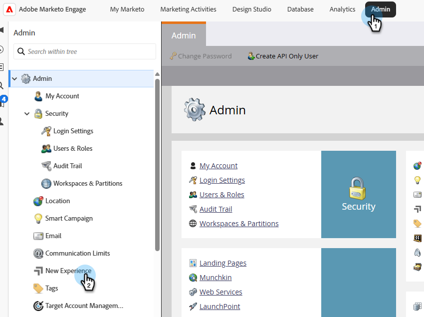
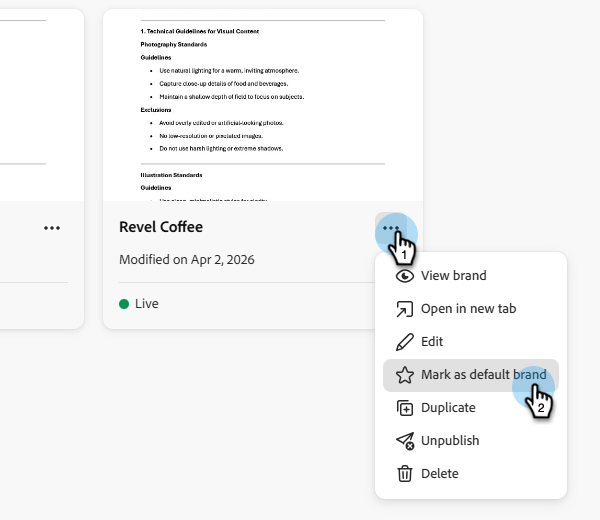

# 브랜드 생성 및 관리 {#create-and-manage-brands}

브랜드 지침은 브랜드의 시각적 및 언어적 정체성을 확립하는 상세한 규칙 및 표준 세트입니다. 모든 마케팅 및 커뮤니케이션 플랫폼에서 일관된 브랜드 표현을 유지하는 참조 역할을 합니다.

브랜드 세부 사항을 수동으로 입력 및 구성하거나 자동 정보 추출을 위해 브랜드 가이드라인 문서를 업로드하십시오.

>[!AVAILABILITY]
>
>Adobe Marketo Engage에서 AI 도우미를 사용하려면 먼저 [사용자 동의](https://www.adobe.com/kr/legal/licenses-terms/adobe-dx-gen-ai-user-guidelines.html){target="_blank"}에 동의해야 합니다. 자세한 내용은 Adobe 계정 관리자에게 문의하십시오.

## 브랜드 액세스 {#access}

**[!UICONTROL brands]**&#x200B;의 [!DNL Adobe Marketo Engage] 메뉴에 액세스하려면 사용자에게 관련 권한이 부여되어야 합니다.

+++  브랜드 관련 권한을 할당하는 방법을 알아봅니다.

### 사용자 및 역할 {#users-and-roles}

1. _관리자_&#x200B;에서 **사용자 및 역할**&#x200B;을 선택하세요.

1. 원하는 역할을 선택합니다.

1. **Access Design Studio** 메뉴를 확장하려면 클릭하세요.

1. **AI Assistant 액세스**&#x200B;를 선택하고 **저장**&#x200B;을 클릭합니다.

+++

## 브랜드 생성 및 관리 {#create-brand-kit}

브랜드 지침을 만들고 관리하기 위해 직접 세부 정보를 입력하거나 브랜드 지침 문서를 업로드하여 정보를 자동으로 추출할 수 있습니다.

1. _관리자_&#x200B;에서 **새 경험**&#x200B;을 선택하세요.

   

1. _브랜드 관리_ 옆에 있는 **편집**&#x200B;을 클릭하세요.

   

1. **[!UICONTROL Create brand]**&#x200B;를 클릭합니다.

1. 내 브랜드의 **[!UICONTROL Name]**&#x200B;을(를) 입력하십시오.

1. PDF을 드래그 앤 드롭하거나 선택하여 브랜드 지침을 업로드하고 자동으로 관련 브랜드 정보를 추출합니다. **[!UICONTROL Create]**&#x200B;를 클릭합니다.

   정보 추출 프로세스가 시작됩니다. 완료하는 데 몇 분 정도 걸릴 수 있습니다.

   

1. 이제 콘텐츠 및 시각적 만들기 표준이 자동으로 채워집니다. 다양한 탭을 탐색하여 필요에 따라 정보를 조정합니다.

1. 각 섹션 또는 범주의 고급 메뉴에서 참조를 추가하여 관련 브랜드 정보를 자동으로 추출할 수 있습니다.

   기존 콘텐츠를 제거하려면 **[!UICONTROL Clear section]** 또는 **[!UICONTROL Clear category]** 옵션을 사용하십시오.

   {width="800" zoomable="yes"}

   {width="800" zoomable="yes"}

1. 채널 또는 요소 유형별로 지침을 필터링하려면 **필터**&#x200B;를 클릭하십시오.

   

1. 구성이 완료되면 **[!UICONTROL Save]**&#x200B;을(를) 클릭한 다음 **[!UICONTROL Publish]**&#x200B;을(를) 클릭하여 브랜드 지침을 AI Assistant에서 사용할 수 있도록 합니다.

1. 게시된 브랜드를 수정하려면 **[!UICONTROL Edit brand]**&#x200B;을(를) 클릭하십시오.

   >[!NOTE]
   >
   >이렇게 하면 편집 모드에서 임시 복사본이 만들어지고 게시된 후 라이브 버전이 바뀝니다.

   

1. **[!UICONTROL Brands]** 대시보드에서 세 점 아이콘을 클릭하여 고급 메뉴를 열어 다음 작업을 수행합니다.

* 브랜드 보기
* 편집
* 복제
* 게시
* 게시 취소
* 삭제

  

이제 AI Assistant 메뉴의 **[!UICONTROL Brand]** 드롭다운에서 브랜드 지침에 액세스할 수 있으므로 사양에 맞게 정렬된 콘텐츠 및 에셋을 생성할 수 있습니다.

### 기본 브랜드 설정 {#default-brand}

콘텐츠를 생성하고 캠페인 생성 중 정렬 점수를 계산할 때 자동으로 적용할 기본 브랜드로 게시된 브랜드를 지정할 수 있습니다.

기본 브랜드를 설정하려면 **[!UICONTROL Brands]** 대시보드로 이동하십시오. 세 점 아이콘을 클릭하고 **[!UICONTROL Mark as default brand]**&#x200B;을(를) 선택하여 고급 메뉴를 엽니다.

