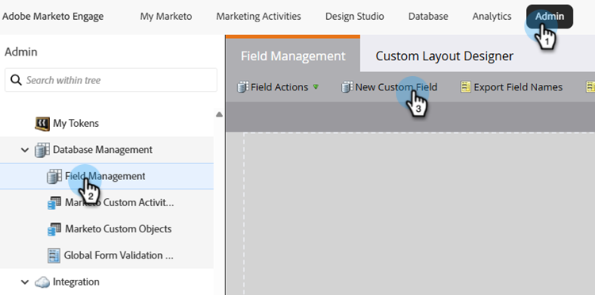
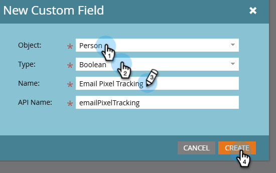
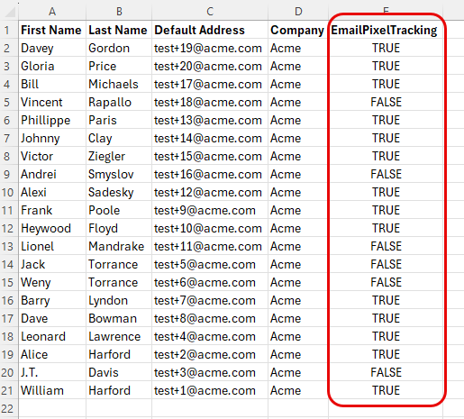
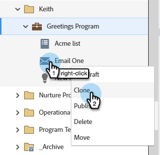
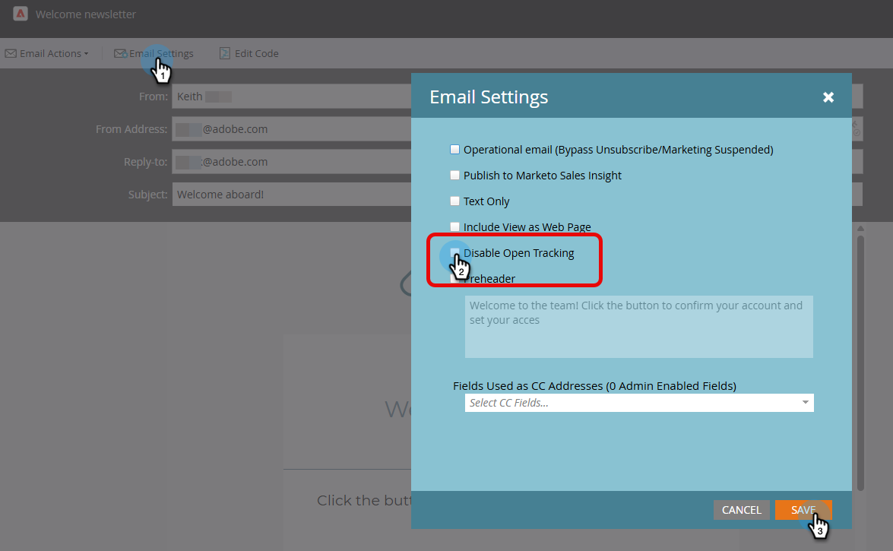

# CNIL 지침: 조건부 이메일 열기 추적 {#cnil}

[CNIL 지침](https://experienceleaguecommunities.adobe.com/adobe-marketo-engage-27/understanding-cnil-s-updated-guidance-on-email-open-tracking-251632?profile.language=ko){target="_blank"}에 따라 이메일 열기(픽셀) 추적에 대한 최종 사용자 동의를 준수하도록 Marketo Engage을 구성하는 방법을 알아봅니다. 이 접근 방법에서는 사용자 지정 부울 필드를 사용하여 개인이 받는 이메일 변형, 즉 공개 추적이 활성화된 이메일 변형 또는 비활성화된 이메일 변형을 확인합니다.

## 1단계: 사용자 지정 부울 필드 만들기 {#custom-field}

1. **관리자** 영역에서 **필드 관리**&#x200B;를 클릭하고 **새 사용자 지정 필드**&#x200B;를 선택합니다.

   

1. _개체_&#x200B;의 경우 **개인**&#x200B;을(를) 선택하십시오. _Type_&#x200B;에 대해 **부울**&#x200B;을 선택하세요. _Name_&#x200B;에 대해 &quot;전자 메일 픽셀 추적&quot;을 입력하십시오(API 이름이 자동으로 채워짐). **만들기**&#x200B;를 클릭합니다.

   

## 2단계: 동의 필드 채우기 {#populate}

1. 데이터 가져오기(API 동기화 또는 [CSV 업로드](https://experienceleague.adobe.com/en/docs/marketo/using/getting-started/quick-wins/import-a-list-of-people){target="_blank"})를 통해 각 사용자에 대한 이메일 픽셀 추적 필드 값을 설정하십시오.

   

1. 사용자 정의 필드가 올바르게 매핑되었는지 확인합니다.

   

>[!NOTE]
>
>앞으로는 양식 작성 중에 데이터를 직접 캡처하여 이메일 열기 추적을 옵트인하거나 옵트아웃할 수 있습니다.

## 3단계: 이메일 변형 만들기 {#variants}

두 개의 이메일을 만듭니다. 이메일 열기 추적은 이메일 Designer 및 기존 이메일 편집기 모두에 대해 기본적으로 활성화됩니다.

* **전자 메일 1(열기 추적 사용)**: 전자 메일을 만든 후에는 추가 작업이 필요하지 않습니다. 진행 중 추적 활성화 유지

* **전자 메일 2(열기 추적 사용 안 함)**: 전자 메일 1을 복제하고 열기 추적을 사용하지 않도록 설정합니다.

  

이메일 Designer에서 **열린 추적 사용 안 함** 확인란은 이메일 오른쪽에 있는 _요약_ 창의 _세부 정보_ 탭에서 찾을 수 있습니다. 기존 전자 메일 편집기에서 **열린 추적 사용 안 함** 확인란은 _전자 메일 설정_ 메뉴에서 찾을 수 있습니다.

**이메일 디자이너**

{width="800" zoomable="yes"}

**기존 전자 메일 편집기**

{width="800" zoomable="yes"}

## 4단계: 스마트 캠페인 구성 {#smart-campaign}

[스마트 캠페인을 만들기](https://experienceleague.adobe.com/ko/docs/marketo/using/product-docs/core-marketo-concepts/smart-campaigns/creating-a-smart-campaign/create-a-new-smart-campaign){target="_blank"}하여 각 사용자가 받는 전자 메일을 확인합니다.

1. Smart Campaign의 _흐름_ 탭에서 **전자 메일 보내기** 흐름 단계를 삽입합니다.

   {width="800" zoomable="yes"}

1. 흐름 단계에서 **선택 항목 추가**&#x200B;를 클릭합니다. 선택 항목 1에서 **if**&#x200B;을(를) _전자 메일 픽셀 추적_(으)로 설정하고, 연산자를 _is_(으)로 설정하고, 값을 _false_(으)로 설정하십시오. **이메일**&#x200B;에 대해 _이메일 2_&#x200B;을(를) 선택하십시오.

1. 기본 설정에서 **전자 메일**&#x200B;을(를) _전자 메일 1_(으)로 설정합니다.

   

이렇게 하면 추적을 여는 데 동의하지 않은 사람은 추적되지 않은 이메일을 수신하는 반면, 동의하는 사람은 표준 추적 이메일을 받게 됩니다.
