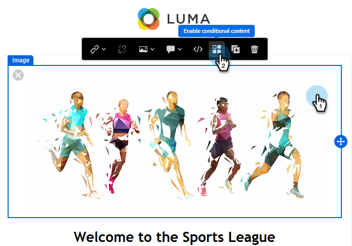
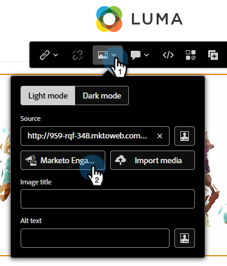
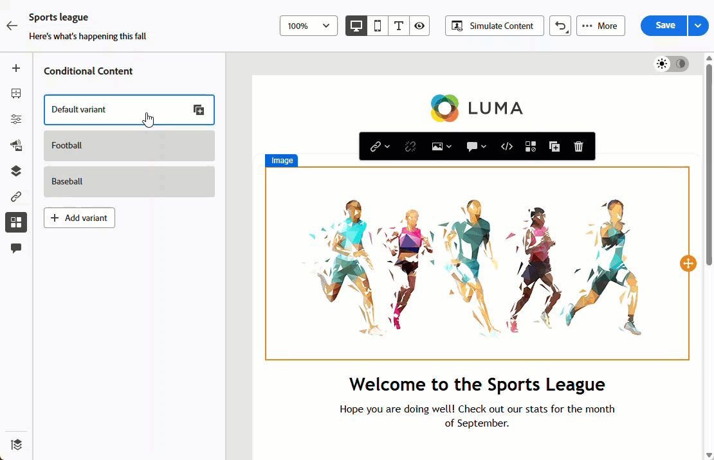

# 조건부 콘텐츠 {#conditional-content}

조건부 콘텐츠를 사용하면 대상자에게 표시되는 콘텐츠를 동적으로 제어할 수 있습니다. 기존 세그먼트를 사용하여 미리 정의된 기준에 따라 수신자에게 표시되는 내용을 결정합니다.

>[!PREREQUISITES]
>
>하나 이상의 세분화 [생성](/help/marketo/product-docs/personalization/segmentation-and-snippets/segmentation/create-a-segmentation.md) 및 [승인](/help/marketo/product-docs/personalization/segmentation-and-snippets/segmentation/approve-a-segmentation.md)이 있습니다.

## 조건부 콘텐츠 추가 {#add-conditional-content}

1. 원하는 전자 메일을 열고 **전자 메일 콘텐츠 편집**&#x200B;을 클릭합니다.

   

1. 조건을 지정할 콘텐츠를 선택합니다(이 예제에서는 헤더 이미지를 선택함). _조건부 콘텐츠 사용_ 아이콘을 클릭합니다.

   

1. 강조 상자가 주황색으로 바뀝니다. 왼쪽에서 _조건 선택_ 아이콘()을 클릭하여 변형을 정의합니다.

   {width="700" zoomable="yes"}

1. 원하는 세그먼트를 선택하고 **선택**&#x200B;을 클릭합니다.

   

1. 변형에 대한 기존 이미지를 바꾸려면 _이미지 편집_ 아이콘을 클릭하십시오. 새 이미지의 소스를 선택합니다. 이 예제에서는 Marketo Engage 구독에서 _이미지 및 파일_ 라이브러리를 선택합니다.

   

1. 적용 가능한 이미지를 선택하고 **선택**&#x200B;을 클릭합니다.

   {width="600" zoomable="yes"}

1. 새 이미지가 나타납니다. 식별이 쉽도록 변형 이름을 바꾸는 것이 좋습니다. 줄임표를 클릭하고 **이름 바꾸기**&#x200B;를 선택합니다.

   >[!NOTE]
   >
   >줄임표를 클릭하면 변형의 정의된 조건을 확인하고 복제할 수도 있습니다. 변형이 두 개 이상 있는 경우 삭제 옵션을 사용할 수 있습니다. 변형이 한 개만 있는 경우 삭제하는 방법은 _조건부 콘텐츠 활성화_ 아이콘을 다시 클릭하는 것입니다(이제 마우스로 가리키면 _조건부 콘텐츠 비활성화_&#x200B;라고 표시됨).

   {width="600" zoomable="yes"}

1. 추가 변형(선택 사항)을 추가하려면 **변형 추가**&#x200B;를 클릭하고 동일한 단계를 수행합니다.

   

1. 이 작업을 완료하면 각 변형에 선택한 콘텐츠가 표시됩니다.

   

1. 수신자는 각 세그먼트에 정의된 규칙에 따라 콘텐츠를 볼 수 있습니다. 위의 예에서는 Marketo Engage 필드 _좋아하는 스포츠_&#x200B;에 &quot;축구&quot;가 나열되어 있는 모든 사용자가 축구 이미지를 볼 수 있습니다.

>[!MORELIKETHIS]
>
>* [세그먼트 규칙 정의](/help/marketo/product-docs/personalization/segmentation-and-snippets/segmentation/define-segment-rules.md)
>* [Marketo에서 사용자 지정 필드 만들기](/help/marketo/product-docs/administration/field-management/create-a-custom-field-in-marketo.md)
