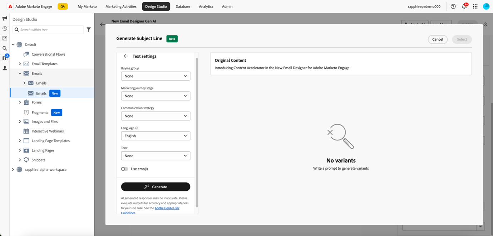
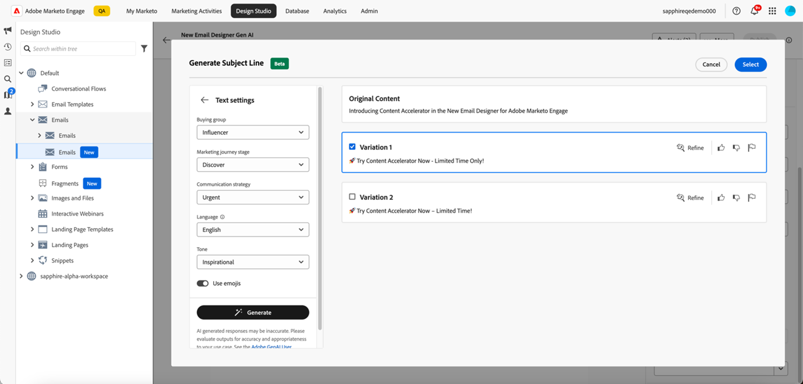
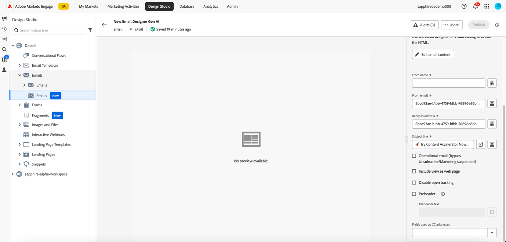
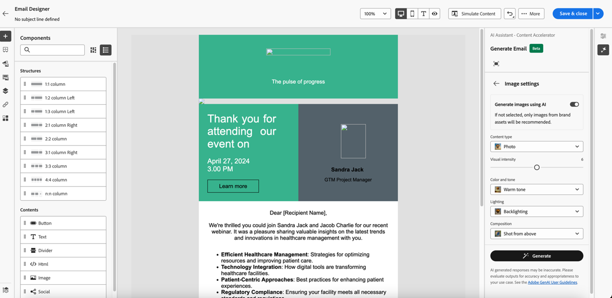

# AI Assistant Content Accelerator 사용 {#use-the-ai-assistant-content-accelerator}

Marketo Engage 이메일 Designer 내의 AI Assistant Content Accelerator를 사용하면 현대적이고 성능이 뛰어나며 직관적인 이메일을 만들 수 있습니다. 이는 특정 성향/구매 그룹에 적합한 콘텐츠를 만드는 데 도움이 되는 이미지 생성 Firefly, 마케팅 여정 단계, 커뮤니케이션 전략, 톤 등과 함께 Adobe의 생성 AI 기술 및 프롬프트 라이브러리를 통해 수행됩니다. 특정 브랜드 자산을 활용하여 콘텐츠를 만들 수도 있습니다.

>[!PREREQUISITES]
>
>AI Assistant Content Accelerator는 기본적으로 활성화되어 있지 않습니다. 먼저 이메일 Designer에서 Gen-AI 기능을 사용하기 위한 핵심 Gen-AI 약관 및 보충 약관에 동의해야 합니다. 자세한 내용은 Adobe 계정 팀(계정 관리자)에 문의하십시오.

AI Assistant Content Accelerator에는 다음과 같은 세 가지 주요 사용 사례가 있습니다.

* 전자 메일에 대해 [제목 줄 만들기](#create-a-subject-line)
* 전자 메일의 [특정 섹션에 대한 콘텐츠 만들기](#create-content-for-a-specific-section)
* 선택한 템플릿에서 [전체 전자 메일 만들기](#create-an-entire-email)

## 제목 줄 만들기 {#create-a-subject-line}

새 이메일 Designer을 사용하여 이메일을 만들었을 때 임시 제목 줄을 입력합니다.

전자 메일이 만들어지면 제목 줄이 오른쪽의 _세부 정보_ 열에 있습니다. Gen AI 기능을 사용하여 새 제목 줄을 만드는 데 도움이 필요하면 옆에 있는 AI 지원 단추()를 클릭합니다.

AI Assistant Content Accelerator에서 **참조 콘텐츠 사용** 옵션을 활성화하여 선택한 콘텐츠를 기반으로 새 콘텐츠를 개인화할 수 있습니다.

제목 줄을 사용자 지정하라는 메시지를 입력합니다. 적절한 제목 줄을 만들기 위해 관련 텍스트 설정을 입력하고 참조로 사용할 브랜드 에셋을 업로드합니다.

텍스트 설정에는 다음이 포함됩니다.

<table><tbody>
  <tr>
    <td style="width:25%"><b>구매 그룹</b></td>
    <td>타깃팅하는 특정 구매 그룹(예: 실무자, 인플루언서, 의사 결정자).</td>
  </tr>
  <tr>
    <td style="width:25%"><b>마케팅 여정 단계</b></td>
    <td>특정 마케팅 여정 단계(예: 검색, 평가, 커밋)의 수신자.</td>
  </tr>
  <tr>
    <td style="width:25%"><b>커뮤니케이션 전략</b></td>
    <td>커뮤니케이션의 목적(예: 긴급, 소셜 증명, 정보 제공).</td>
  </tr>
  <tr>
    <td style="width:25%"><b>언어</b></td>
    <td>제목란을 생성할 언어입니다.</td>
  </tr>
  <tr>
    <td style="width:25%"><b>톤</b></td>
    <td>콘텐츠를 생성할 톤(예: 영감, 흥미, 유머).</td>
  </tr>
  <tr>
    <td style="width:25%"><b>이모티콘</b></td>
    <td>생성된 콘텐츠에 이모지를 포함할 수 있습니다.</td>
  </tr>
</tbody>
</table>

**생성**&#x200B;을 클릭하면 다음 중에서 선택할 수 있는 샘플이 나타납니다.

브랜드 에셋을 업로드하여 에셋 내의 콘텐츠를 참조용으로 사용하여 제목 줄을 만들 수도 있습니다.

변형을 선택하려면 해당 확인란을 선택하고 **선택**&#x200B;을 클릭합니다. **세분화**&#x200B;를 클릭하여 조정할 수도 있습니다. 또한, 엄지손가락 위로 또는 엄지손가락 아래로 아이콘을 클릭하여 피드백을 제공할 수 있으므로 Gen-AI 기술이 사용자의 선호도를 학습할 수 있습니다.

을 선택하면 제목 줄이 이메일 세부 정보에 채워집니다.

## 이메일의 특정 섹션에 대한 콘텐츠 만들기 {#create-content-for-a-specific-section}

이메일이 만들어지면 특정 섹션, 이미지 또는 텍스트를 수정할 수 있습니다.

이 예제에서는 의료 템플릿을 사용하고 있습니다. 기존 헬스케어 전문가 이미지가 본인의 요구를 충족하지 못할 경우 AI 비서로 하여금 헬스케어 전문가 이미지를 직접 만들도록 지도할 수 있다. 이미지 콘텐츠를 선택한 다음 AI 도우미를 클릭하면 됩니다.

프롬프트에 &quot;의료 전문가를 위한 이미지 생성&quot;과 같은 관련 세부 정보를 입력하고 원하는 사용자 정의를 추가합니다. 입력할 내용을 잘 모르는 경우 프롬프트 라이브러리(프롬프트 오른쪽)를 사용할 수도 있습니다.

**생성**&#x200B;을 클릭하면 선택할 수 있도록 여러 변형이 만들어집니다.

이미지와 유사하게 이메일의 텍스트 부분도 수정할 수 있습니다.

## 선택한 템플릿에서 전체 이메일 만들기 {#create-an-entire-email}

이 옵션은 기존 템플릿을 사용하여 이메일을 만드는 경우에만 사용할 수 있습니다. 이메일 Designer에서 제공하는 표준 템플릿, 이미 만든 저장된 템플릿 또는 HTML 가져오기 옵션을 사용하여 가져온 템플릿일 수 있습니다. 전자 메일에 대해 [처음부터 디자인](/help/marketo/product-docs/email-marketing/email-designer/email-authoring.md#design-from-scratch)을 선택한 경우에는 이 옵션을 사용할 수 없습니다.

템플릿 내의 구성 요소를 선택하지 않고 템플릿을 선택한 다음 이메일 Designer에서 AI 도우미 버튼을 클릭합니다.

관련 프롬프트를 입력하고 이메일에 사용할 텍스트 설정, 브랜드 에셋 및 이미지 설정을 선택합니다.

Firefly을 사용하여 이미지를 생성하려면 이미지 설정을 선택하고 **AI를 사용하여 이미지 생성**&#x200B;에 대한 토글을 선택합니다.

원하는 _콘텐츠 형식_, _색상 및 톤_, _조명_ 및 _컴포지션_&#x200B;을 선택하여 전자 메일의 Gen-AI 이미지를 만드십시오. 완료되면 **생성**&#x200B;을 클릭하세요.

**미리 보기**&#x200B;를 클릭하여 전자 메일에 변형이 어떻게 표시되는지 확인하세요. **적용**&#x200B;을 클릭하여 변형을 선택하세요.
