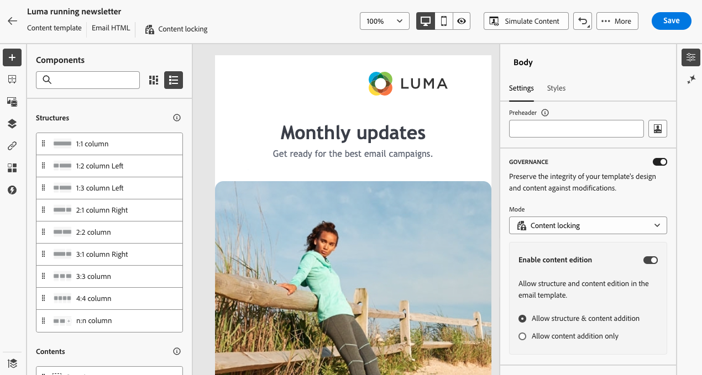
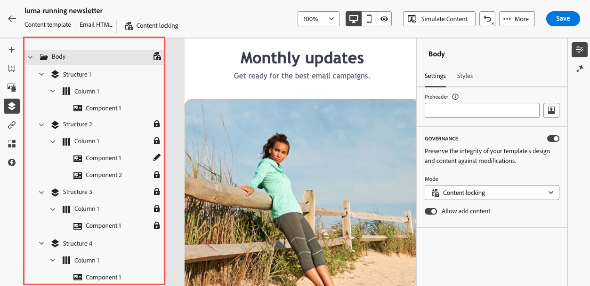
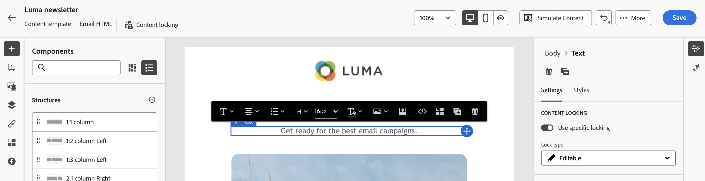

# 이메일 템플릿의 콘텐츠 잠금 {#lock-content-email-templates}

Marketo Engage을 사용하면 전체 템플릿 또는 특정 구조/구성 요소를 잠궈 이메일 템플릿의 콘텐츠를 잠글 수 있습니다. 이를 통해 의도하지 않은 편집 또는 삭제를 방지할 수 있으므로 템플릿의 사용자 정의 기능을 더욱 강력하게 제어하고 이메일 캠페인의 효율성과 안정성을 향상시킬 수 있습니다.

>[!AVAILABILITY]
>
>콘텐츠 템플릿을 만들 수 있는 권한이 있는 사용자가 콘텐츠 잠금을 활성화할 수 있습니다.

콘텐츠 잠금은 **구조** 수준 또는 **구성 요소** 수준에서 적용할 수 있습니다.

* 구조가 잠긴 경우:

   * 해당 구조 내의 모든 콘텐츠도 잠겨 있습니다.
   * 구조에 컨텐츠를 추가할 수 없습니다.
   * 기본적으로 구조를 삭제할 수 없습니다. &quot;삭제 허용&quot; 옵션을 활성화하여 이 제한을 재정의할 수 있습니다.
   * 잠긴 구조 내의 개별 콘텐츠 구성 요소를 편집 가능한 것으로 설정할 수 있습니다.

* 구조를 편집할 수 있을 때(구조가 잠기지 않음):

   * 개별 콘텐츠 구성 요소를 해당 구조 내에서 잠글 수 있습니다.
   * 기본적으로 구성 요소가 잠겨 있거나 &quot;편집 가능한 컨텐츠 잠금만&quot;이 선택되어 있으면 삭제할 수 없습니다. &quot;삭제 허용&quot; 옵션을 활성화하여 이 제한을 재정의할 수 있습니다.

## 이메일 템플릿 잠금 {#lock-an-email-template}

### 컨텐츠 잠금 활성화 {#enable-content-locking}

새 템플릿을 만들거나 기존 템플릿을 편집하든 상관없이 이메일 Designer에서 직접 이메일 템플릿에 대한 컨텐츠 잠금을 활성화할 수 있습니다.

1. 이메일 템플릿을 열거나 만들고 이메일 Designer의 콘텐츠 편집 화면에 액세스합니다.

1. 오른쪽의 **[!UICONTROL Body]** 창에서 **[!UICONTROL Governance]** 옵션을 활성화합니다.

1. **[!UICONTROL Mode]** 드롭다운 목록에서 템플릿에 대해 원하는 잠금 모드를 선택합니다.

   * **[!UICONTROL Content locking]**: 템플릿 내의 특정 콘텐츠 섹션을 잠급니다. 기본적으로 모든 구조 및 구성 요소를 편집할 수 있습니다. 그런 다음 개별 요소를 선택적으로 잠글 수 있습니다.
   * **[!UICONTROL Read only]**: 템플릿의 전체 콘텐츠를 잠가서 수정할 수 없도록 합니다.

   {width="800" zoomable="yes"}

1. **[!UICONTROL Content locking]** 모드를 선택한 경우 사용자가 템플릿과 상호 작용하는 방법을 추가로 정의할 수 있습니다. **[!UICONTROL Enable content edition]** 옵션을 활성화하고 다음 중 하나를 선택하십시오.

   * **[!UICONTROL Allow structure & content addition]**: 사용자는 기존 구조 사이에 구조를 추가하고 콘텐츠 구성 요소 또는 조각을 편집 가능한 구조 내에 추가할 수 있습니다.

   * **[!UICONTROL Allow content addition only]**: 사용자는 편집 가능한 구조 내에 콘텐츠 구성 요소 또는 조각을 추가할 수 있지만 구조를 추가하거나 복제할 수는 없습니다.

1. 잠금 모드를 선택한 후 **[!UICONTROL Content locking]** 모드를 선택한 경우 잠글 구조 및/또는 구성 요소를 정의할 수 있습니다.

   * [구조를 잠그는 방법에 대해 알아보기](#lock-structures)
   * [구성 요소 잠금 방법 알아보기](#lock-components)

   **[!UICONTROL Read only]** 모드를 선택한 경우 템플릿을 완성하고 저장하는 작업을 진행할 수 있습니다.

템플릿 본문을 선택하여 템플릿을 디자인할 때 언제든지 **[!UICONTROL Governance]** 설정을 조정할 수 있습니다. 이렇게 하려면 오른쪽 창 위쪽에 있는 탐색 레일에서 **[!UICONTROL Body]** 링크를 클릭합니다.

{width="800" zoomable="yes"}

### 구조 잠금 {#lock-structures}

템플릿 내의 구조를 잠그려면 다음을 수행합니다.

1. 잠글 구조를 선택합니다.

1. **[!UICONTROL Lock type]** 드롭다운 목록에서 **[!UICONTROL Locked]**&#x200B;을(를) 선택합니다.

   {width="800" zoomable="yes"}

   >[!NOTE]
   >
   >기본적으로 사용자는 잠긴 구조를 삭제할 수 없습니다. **[!UICONTROL Allow delete]** 옵션을 활성화하여 이 제한을 재정의할 수 있습니다.

구조를 잠근 후에는 추가적인 콘텐츠 구성 요소 또는 조각을 복제하거나 그 내부에 추가할 수 없습니다. 잠긴 구조 내의 모든 구성 요소도 기본적으로 잠깁니다. 잠긴 구조 내에서 구성 요소를 편집할 수 있게 하려면 다음 작업을 수행하십시오.

1. 잠금을 해제할 구성 요소를 선택합니다.

1. **[!UICONTROL Use specific locking]** 옵션을 사용하도록 설정합니다.

1. **[!UICONTROL Lock type]** 드롭다운 목록에서 **[!UICONTROL Editable]**&#x200B;을(를) 선택합니다. 스타일을 잠그는 동안 콘텐츠를 편집하려면 **[!UICONTROL Editable content only]**&#x200B;을(를) 선택하십시오. [구성 요소를 잠그는 방법을 알아봅니다](#lock-components)

   {width="800" zoomable="yes"}

### 구성 요소 잠금 {#lock-components}

구조 내의 특정 구성 요소를 잠그려면 다음을 수행합니다.

1. 구성 요소를 선택하고 오른쪽 창에서 **[!UICONTROL Use specific locking]** 옵션을 활성화합니다.

1. **[!UICONTROL Lock type]** 드롭다운 목록에서 원하는 잠금 옵션을 선택합니다.

   {width="800" zoomable="yes"}

   * **[!UICONTROL Editable content lock only]**: 구성 요소의 스타일을 잠그되 콘텐츠를 편집할 수 있도록 허용합니다.
   * **[!UICONTROL Locked]**: 구성 요소의 콘텐츠와 스타일을 모두 완전히 잠급니다.

   >[!NOTE]
   >
   >**[!UICONTROL Editable]** 잠금 형식을 사용하면 잠긴 구조 내에서도 구성 요소를 편집할 수 있습니다. [구조를 잠그는 방법을 알아보세요](#lock-structures)

1. 기본적으로 사용자는 잠긴 구성 요소를 삭제할 수 없습니다. **[!UICONTROL Allow delete]** 옵션을 활성화하여 삭제를 활성화할 수 있습니다.

### 잠긴 콘텐츠 식별 {#identify-locked-content}

템플릿 내에서 잠긴 구조와 구성 요소를 쉽게 식별하려면 왼쪽 메뉴에 있는 **[!UICONTROL Navigation tree]**&#x200B;을(를) 사용하십시오. 이 메뉴는 모든 템플릿 요소에 대한 시각적 개요를 제공하며, 잠금 아이콘으로 잠긴 항목과 연필 아이콘으로 편집 가능한 항목을 강조 표시합니다.

아래 예에서는 템플릿 본문에 대해 거버넌스를 활성화합니다. *구조 2*&#x200B;이(가) 편집 가능한 *구성 요소 1*(으)로 잠겨 있지만 *구조 3*&#x200B;은(는) 완전히 잠겨 있습니다.

{width="800" zoomable="yes"}

## 잠긴 콘텐츠가 있는 템플릿 사용 {#use-templates-with-locked-content}

콘텐츠가 잠긴 템플릿을 사용할 때 **[!UICONTROL Governance enabled]** 메시지가 오른쪽 창에 표시됩니다.

템플릿에 적용된 잠금 유형에 따라 템플릿의 구조 및 구성 요소에 다양한 작업을 수행할 수 있습니다. 템플릿 내의 모든 편집 가능한 영역을 빠르게 식별하려면 **[!UICONTROL Highlight editable areas]** 옵션을 활성화합니다.

예를 들어 아래 템플릿에서는 잠겨진 상단 이미지를 제외한 모든 영역을 편집할 수 있으므로 편집하거나 제거할 수 없습니다.

{width="800" zoomable="yes"}

다음은 설정된 이메일 편집 및 관련 컨텐츠 잠금 구성의 몇 가지 예입니다.

<table>
<thead>
  <tr>
    <th>컨텐츠 잠금 유형</th>
    <th>템플릿 구성</th>
    <th>이메일 에디션</th>
  </tr></thead>
<tbody>
  <tr>
    <td>읽기 전용 콘텐츠 템플릿</td>
    <td></td>
    <td></td>
  </tr>
  <tr>
    <td>전체 콘텐츠를 편집할 수 있지만 구조나 구성 요소를 추가할 수는 없습니다.</td>
    <td></td>
    <td></td>
  </tr>
  <tr>
    <td>삭제할 수 없는 잠긴 구조</td>
    <td></td>
    <td></td>
  </tr>
  <tr>
    <td>스타일이 잠겨 있으며 삭제할 수 없는 구성 요소입니다. 사용자는 콘텐츠만 수정할 수 있습니다.</td>
    <td></td>
    <td></td>
  </tr>
  <tr>
    <td>잠긴 구조 내에서 구성 요소를 편집할 수 있습니다.</td>
    <td></td>
    <td></td>
  </tr>
</tbody>
</table>
