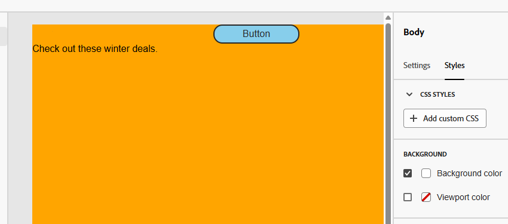

# 이메일 콘텐츠에 사용자 정의 CSS 추가 {#custom-css}

고급 특정 스타일을 위해 Marketo Engage 이메일 Designer 내에 직접 사용자 지정 CSS를 추가합니다.

## 사용자 지정 CSS 정의 {#define-custom-css}

1. 구성 요소를 하나 이상 추가하여 이메일 Designer에 정의된 컨텐츠가 있는지 확인합니다.

1. 왼쪽 **[!UICONTROL Body]** 또는 오른쪽 창에서 **[!UICONTROL Navigation tree]**&#x200B;을(를) 선택합니다. **[!UICONTROL CSS styles]**&#x200B;이(가) 오른쪽에 표시됩니다.

   {width="800" zoomable="yes"}

   >[!NOTE]
   >
   >**[!UICONTROL CSS styles]** 섹션은 편집기에 콘텐츠가 있는 경우에만 사용할 수 있습니다.

1. **[!UICONTROL + Add custom CSS]** 단추를 클릭합니다.

   >[!NOTE]
   >
   >**[!UICONTROL Add custom CSS]** 단추는 **[!UICONTROL Body]**&#x200B;을(를) 선택한 경우에만 사용할 수 있습니다. 하지만 사용자 지정 CSS 스타일을 콘텐츠 내의 모든 구성 요소에 적용할 수 있습니다.

1. 표시되는 전용 텍스트 영역에 CSS 코드를 입력합니다. 사용자 지정 CSS [이(가) 유효하고 올바른 구문](#use-valid-css)을(를) 따르는지 확인하십시오. 완료되면 **저장**&#x200B;을 클릭합니다.

   

   >[!NOTE]
   >
   >잠긴 컨텐츠가 있는 [템플릿](/help/marketo/product-docs/email-marketing/email-designer/content-locking.md)을 사용할 때는 사용자 지정 CSS를 컨텐츠에 추가할 수 없습니다. 단추 레이블이 **[!UICONTROL View custom CSS]**(으)로 변경되고 표시된 모든 사용자 지정 CSS가 읽기 전용입니다.

1. CSS가 콘텐츠에 적용되는지 확인합니다. 그렇지 않으면 [문제 해결](#troubleshooting) 섹션을 확인하십시오.

   

   >[!NOTE]
   >
   >모든 콘텐츠를 제거하면 섹션이 사라지고 이전에 정의한 사용자 지정 CSS가 더 이상 적용되지 않습니다. **[!UICONTROL CSS styles]** 섹션을 다시 표시하려면 콘텐츠를 다시 추가하십시오. 사용자 지정 CSS가 다시 적용됩니다.

## 유효한 CSS 사용 {#using-valid-css}

**[!UICONTROL Add custom CSS]** 텍스트 영역에 올바른 CSS 문자열을 입력할 수 있습니다. 적절한 포맷의 CSS가 즉시 콘텐츠에 적용됩니다.

>[!CAUTION]
>
>사용자 지정 CSS의 보안을 책임집니다. CSS에 취약성이 도입되거나 기존 콘텐츠와 충돌하지 않는지 확인하십시오.
>
>의도하지 않게 컨텐츠의 레이아웃이나 기능을 손상시킬 수 있는 CSS를 사용하지 마십시오.

+++ 유효한 CSS 샘플

다음은 유효한 CSS의 예입니다.

```css
.acr-component[data-component-id="form"] {
  display: flex;
  justify-content: center;
  background: none;
}

.acr-Form {
  width: 100%;
  padding: 20px 100px;
  border-spacing: 0px 8px;
  box-sizing: border-box;
  margin: 0;
}

.acr-Form .spectrum-FieldLabel {
  width: 20%;
}

.acr-Form.spectrum-Form--labelsAbove .spectrum-FieldLabel,
.acr-Form [data-form-item="checkbox"] .spectrum-FieldLabel {
  width: auto;
}

.acr-Form .spectrum-Textfield {
  width: 100%;
}

#acr-form-error,
#acr-form-confirmation {
  width: 100%;
  padding: var(--spectrum-global-dimension-static-size-500);
  display: flex;
  align-items: center;
  flex-direction: column;
  justify-content: center;
  gap: var(--spectrum-global-dimension-static-size-200);
}

.spectrum-Form-item.is-required .spectrum-FieldLabel:after{
  content: '*';
  font-size: 1.25rem;
  margin-left: 5px;
  position: absolute;
}

/* Error field placeholder */
.spectrum-HelpText {
  display: none !important;
}

.spectrum-HelpText.is-invalid,
.is-invalid ~ .spectrum-HelpText {
  display: flex !important;
}
```

```css
@media only screen and (min-width: 600px) {
  .acr-paragraph-1 {
    width: 100% !important;
  }
}
```

+++


+++ 잘못된 CSS 샘플

잘못된 CSS를 입력하면 CSS를 저장할 수 없음을 나타내는 오류 메시지가 표시됩니다. 다음은 잘못된 CSS의 예입니다.

`<style>` 태그를 사용할 수 없습니다.

```html
<style type="text/css">
  .acr-Form {
    width: 100%;
    padding: 20px 100px;
    border-spacing: 0px 8px;
    box-sizing: border-box;
    margin: 0;
  }
</style>
```

중괄호 누락과 같은 잘못된 구문은 허용되지 않습니다.

```css
body {
  background: red;
```

+++

## 기술 구현 {#implementation}

사용자 지정 CSS는 아래 예와 같이 `<head>` 특성이 있는 `<style>` 태그의 일부로 `data-name="global-custom"` 섹션의 끝에 추가됩니다. 이렇게 하면 사용자 지정 스타일이 콘텐츠에 전체적으로 적용됩니다.

+++ 샘플 참조

```html
<!DOCTYPE html>
<html>
  <head>
    <meta charset="utf-8">
    <meta name="content-version" content="3.3.31">
    <meta name="x-apple-disable-message-reformatting">
    <meta name="viewport" content="width=device-width,initial-scale=1.0">
    <style data-name="default" type="text/css">
      td { padding: 0; }
      th { font-weight: normal; }
    </style>
    <style data-name="grid" type="text/css">
      .acr-grid-table { width: 100%; }
    </style>
    <style data-name="acr-theme" type="text/css" data-theme="default" data-variant="0">
      body { margin: 0; font-family: Arial; }
    </style>
    <style data-name="media-default-max-width-500px" type="text/css">
      @media screen and (max-width: 500px) {
        body { width: 100% !important; }
      }
    </style>
    <style data-name="global-custom" type="text/css">
      /* Add you custom CSS here */
    </style>
  </head>
  <body>
    <!-- Minimal content -->
  </body>
</html>
```

+++


사용자 지정 CSS는 이메일 Designer의 **[!UICONTROL Settings]** 창에서 해석되거나 확인되지 않습니다. 완전히 독립적이며 **[!UICONTROL Add Custom CSS]** 옵션을 통해서만 수정할 수 있습니다.

### 보호 기능 - 가져온 콘텐츠 {#guardrails}

이메일 Designer으로 가져온 콘텐츠와 함께 사용자 지정 CSS를 사용하려면 다음을 고려하십시오.

* CSS를 포함한 [외부 HTML 가져오기](/help/marketo/product-docs/email-marketing/email-designer/email-authoring.md#import-html) 콘텐츠를 변환하지 않으면 해당 콘텐츠는 **[!UICONTROL Compatibility mode]** 섹션을 사용할 수 없는 **[!UICONTROL CSS styles]**&#x200B;에 있습니다.

* 이메일 Designer으로 만든 콘텐츠를 가져올 때 **[!UICONTROL Add custom CSS]** 옵션을 통해 적용된 CSS가 포함된 경우 이전에 적용된 CSS가 동일한 옵션에서 표시되고 편집할 수 있습니다.

## 문제 해결 {#troubleshooting}

사용자 지정 CSS가 적용되지 않은 경우 아래의 제안을 시도해 보십시오.

* CSS가 올바르고 구문 오류(예: 중괄호 누락, 잘못된 속성 이름)가 없는지 확인합니다. [방법 알아보기](#use-valid-css)

* CSS가 `<style>` 특성이 있는 `data-name="global-custom"` 태그에 추가되고 있는지 확인하십시오.

* `global-custom` 스타일 태그에 `data-disabled` 특성이 `true`(으)로 설정되어 있는지 확인하십시오. 이 경우 사용자 지정 CSS는 적용되지 않습니다.

+++ 예:

  ```html
  <style data-name="global-custom" type="text/css" data-disabled="true"> body: { color: red; } </style>
  ```

+++

* CSS가 다른 CSS 규칙에 의해 재정의되지 않았는지 확인하십시오.

   * 브라우저 개발자 도구를 사용하여 콘텐츠를 검사하고 CSS가 올바른 선택기를 타깃팅하는지 확인하십시오.

   * 선언이 우선하도록 선언에 `!important`을(를) 추가해 보십시오.

+++ 예:

     ```css
     .acr-Form {
       background: red !important;
     }
     ```

+++

>[!NOTE]
>
>사용자 지정 CSS 문제를 해결하기 위해 Marketo Engage 지원이 설정되지 않았습니다. CSS 지원이 필요한 경우 웹 개발자에게 문의하십시오.
