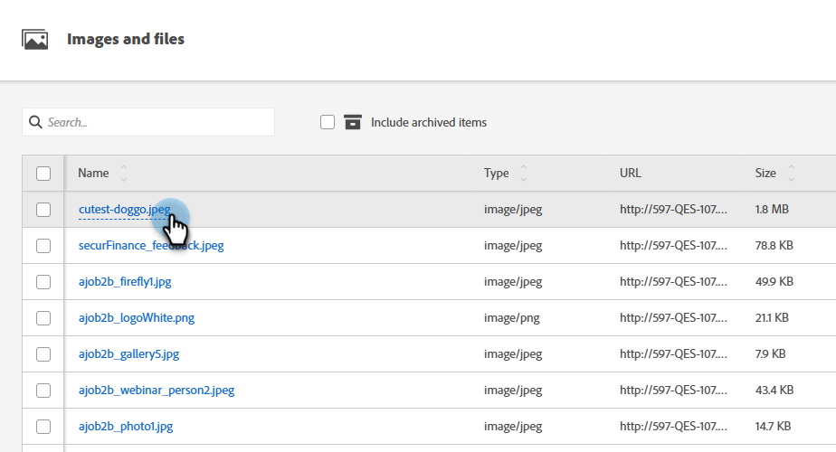
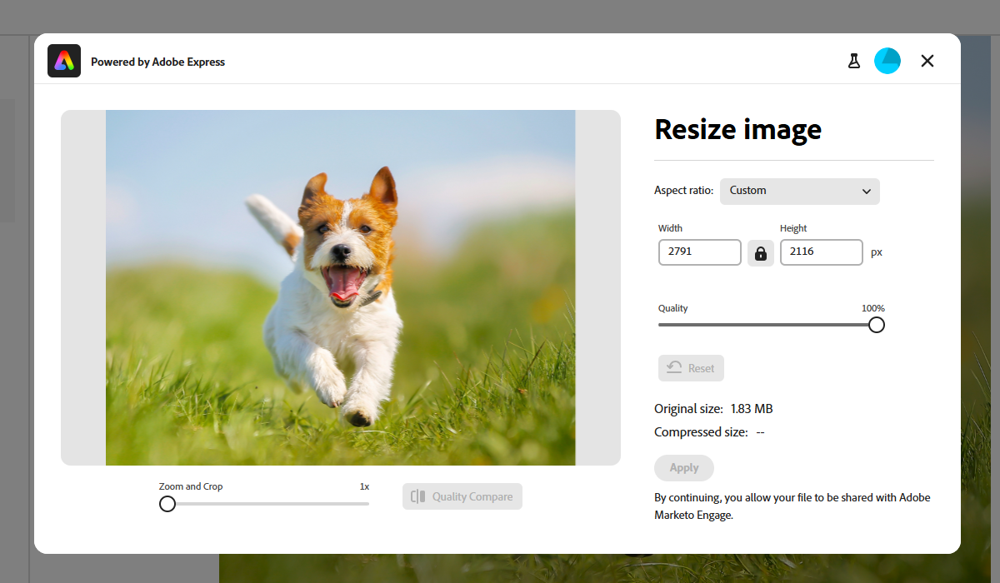

# Adobe Express를 사용하여 이미지 편집 {#edit-images-with-adobe-express}

Adobe Marketo Engage은 기본적으로 Adobe Express과 통합되어 있으므로 다양한 이미지 편집 도구에 액세스할 수 있습니다. 이러한 도구를 사용하여 Marketo Engage Design Studio에서 이미지를 수정할 수 있습니다. 통합은 다음과 같은 주요 이점을 제공합니다.

* Marketo Engage에서 새 이미지를 편집하고 저장하여 콘텐츠 재사용을 개선했습니다.

* 이미지를 업데이트하거나 기존 이미지의 새 버전을 만드는 데 드는 시간과 노력을 줄일 수 있습니다.

>[!NOTE]
>
>Adobe Express은 현재 PNG 및 JPEG 이미지 파일 형식만 지원합니다.

## Adobe Express 편집기 액세스 {#access-the-adobe-express-editor}

Adobe Express 편집기에 액세스하는 방법에는 두 가지가 있습니다.

* 이미지 이름을 클릭합니다.
* _이미지 및 파일 작업_ 드롭다운 메뉴

>[!BEGINTABS]

>[!TAB 이미지 이름을 클릭합니다]

1. Marketo Engage에서 **[!UICONTROL Design Studio]**(으)로 이동하여 **[!UICONTROL Images and Files]**&#x200B;을(를) 선택합니다.

   {width="600" zoomable="yes"}

1. 편집할 이미지를 선택합니다.

   {width="600" zoomable="yes"}

   >[!NOTE]
   >
   >* 작업 영역 및 폴더별 자산을 보려면 왼쪽 상단의 **[!UICONTROL Show Folders]** 아이콘을 클릭하여 구조를 엽니다.
   >
   >* 열을 기준으로 테이블을 정렬하려면 열 제목을 누릅니다. 제목 행의 화살표는 현재 정렬 열 및 순서를 나타냅니다.

1. _세부 정보_ 탭에서 **[!UICONTROL Edit in Adobe Express]**&#x200B;을(를) 클릭합니다.

   {width="600" zoomable="yes"}

   >[!CAUTION]
   >
   >이미지가 이메일 또는 이메일 템플릿에서 이미 참조된 경우 편집하면 현재 사용 중인 모든 위치에서 해당 이미지가 업데이트됩니다.

>[!TAB 이미지 및 파일 작업]

1. Marketo Engage에서 **[!UICONTROL Design Studio]**(으)로 이동하여 **[!UICONTROL Images and Files]**&#x200B;을(를) 선택합니다.

   {width="600" zoomable="yes"}

   >[!NOTE]
   >
   >* 작업 영역 및 폴더별 자산을 보려면 왼쪽 상단의 **[!UICONTROL Show Folders]** 아이콘을 클릭하여 구조를 엽니다.
   >
   >* 열을 기준으로 테이블을 정렬하려면 열 제목을 누릅니다. 제목 행의 화살표는 현재 정렬 열 및 순서를 나타냅니다.

1. 편집할 이미지 옆에 있는 확인란을 선택합니다. **[!UICONTROL Image and file actions]** 드롭다운에서 **[!UICONTROL Edit in Adobe Express]**&#x200B;을(를) 선택합니다.

   {width="600" zoomable="yes"}

   >[!CAUTION]
   >
   >이미지가 이메일 또는 이메일 템플릿에서 이미 참조된 경우 편집하면 현재 사용 중인 모든 위치에서 해당 이미지가 업데이트됩니다.

>[!ENDTABS]

## Adobe Express Enterprise 라이선스 {#adobe-express-enterprise-license}

### Enterprise 라이선스가 있는 사용자 {#users-with-an-enterprise-license}

Adobe Express에 대한 엔터프라이즈 라이센스가 있는 경우 전체 Express 편집기에 액세스할 수 있습니다. 색상, 밝기, 선명도, 대비, 크기 등과 같은 이미지 설정을 조정할 수 있습니다. AI 매직 옵션을 사용하면 배경을 제거하고, 오브젝트를 삽입 및 제거하고, 이미지의 일부를 지울 수 있습니다. 각 설정에 대해 알아보려면 [Adobe Express 사용 안내서](https://helpx.adobe.com/kr/express/user-guide.html){target="_blank"}를 참조하세요.

>[!IMPORTANT]
>
>모든 Adobe Express 편집 기능에 액세스하려면 구입한 라이선스는 Marketo Engage 구독과 동일한 IMS 조직 아래에 있어야 합니다. 또한 각 개별 사용자는 Adobe Express에 라이센스가 있어야 합니다. [라이선스가 없는](#users-without-an-enterprise-license) 사용자는 Adobe Express의 빠른 작업에만 액세스할 수 있습니다.

### Enterprise 라이선스가 없는 사용자 {#users-without-an-enterprise-license}

Enterprise 라이선스가 없는 사용자의 경우 여전히 몇 가지 빠른 작업 편집 기능에 액세스할 수 있습니다. 이러한 기능은 다음과 같습니다.

* [이미지 크기 조정](#resize-image)
* [배경 제거](#remove-background)
* [이미지 자르기](#crop-image)
* [PNG/JPEG으로 변환](#convert-to-png-jpeg)

기능은 이미지 페이지 왼쪽에서 액세스할 수 있습니다.

{width="800" zoomable="yes"}

#### 이미지 크기 조정 {#resize-image}

1. **이미지 크기 조정**&#x200B;을 클릭합니다.

1. 원하는 대로 변경하고 완료되면 **적용**&#x200B;을 클릭하세요.

{width="800" zoomable="yes"}

<table><tbody>
  <tr>
    <td style="width:25%"><b>종횡비</b></td>
    <td><b>종횡비</b> 드롭다운에서 <b>표준</b>을 선택하여 미리 계산된 일반적인 사진 크기를 선택하거나 <b>사용자 지정</b>을 선택하여 너비와 높이를 설정하십시오. 특정 소셜 미디어 플랫폼의 표준 크기(Pinterest, Snapchat 등)를 선택할 수도 있습니다.</td>
  </tr>
  <tr>
    <td style="width:25%"><b>너비 및 높이</b></td>
    <td>기본적으로 종횡비는 잠겨 있으며 크기를 조정할 때 이미지 비율을 동일하게 유지합니다. 원하는 경우 고정 버튼을 선택하여 종횡비의 잠금을 해제할 수 있습니다.</td>
  </tr>
  <tr>
    <td style="width:25%"><b>재설정</b></td>
    <td>이미지에 대한 편집 내용을 제거하고 원래 상태로 되돌리려면 <b>재설정</b>을 클릭합니다.</td>
  </tr>
  <tr>
    <td style="width:25%"><b>확대/축소 및 자르기</b></td>
    <td>이미지의 특정 영역을 확대하려면 <b>확대/축소 및 자르기</b>를 클릭하십시오. 이미지를 현재 표시된 내용으로 자른 후 <b>적용</b>을 클릭합니다.</td>
  </tr>
</tbody>
</table>

#### 배경 제거 {#remove-background}

1. **배경 제거**&#x200B;를 클릭합니다.

1. Adobe Express은 배경 없이 이미지를 표시합니다. 필요한 경우 **적용**&#x200B;을 클릭하세요.

{width="800" zoomable="yes"}

>[!TIP]
>
>결과가 만족스럽지 않으면 **X**&#x200B;을 클릭하여 창을 닫으면 됩니다.

#### 이미지 자르기 {#crop-image}

1. **[!UICONTROL Crop Image]**&#x200B;를 클릭합니다.

1. 이미지의 모서리를 드래그하여 원하는 자르기를 만듭니다.

{width="800" zoomable="yes"}

1. 완료되면 **[!UICONTROL Apply]**&#x200B;을(를) 클릭합니다.

#### PNG/JPEG으로 변환 {#convert-to-png-jpeg}

PNG 파일을 JPEG 파일로 변환하거나 JPEG 파일을 PNG 파일로 변환합니다.

1. **[!UICONTROL Convert to PNG/JPEG]**&#x200B;를 클릭합니다.

{width="800" zoomable="yes"}

1. **[!UICONTROL Apply]**&#x200B;를 클릭합니다.

## 작업 내용 저장 {#save-your-work}

모든 편집 작업이 완료되면 **저장**&#x200B;을 클릭하여 작업 내용을 저장합니다.

{width="800" zoomable="yes"}

편집된 이미지는 원본 이미지와 동일한 폴더에 저장됩니다.
