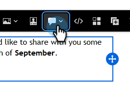
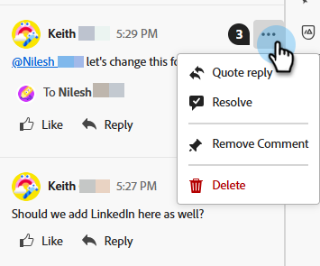

# 이메일 공동 작업 {#email-collaboration}

이메일 공동 작업 및 댓글 달기 를 사용하면 마케팅 팀이 Adobe Marketo Engage 이메일 Designer 내에서 이메일 자산을 원활하게 검토, 토론 및 완료할 수 있습니다. 외부 도구(채팅, 이메일 스레드, 스프레드시트 등)를 통해 초안을 공유하는 대신 실시간으로 댓글을 달거나 편집 내용을 제안하고 피드백을 해결할 수 있습니다. 이를 통해 워크플로우를 간소화하고 오류를 줄이며 이메일 캠페인이 전송되기 전에 관련자가 일치하는지 확인합니다.

## 권한 {#permissions}

이메일 에셋에 대한 편집 권한이 있는 사용자는 댓글을 달고, 태그를 지정하고, 댓글을 볼 수 있습니다. 이메일 에셋에 대한 읽기 전용 권한이 있는 사용자는 **댓글을 추가하거나 볼 수 없습니다**.

## 댓글 추가 {#add-comments}

1. 이메일 Designer에서 이메일을 만들거나 편집할 때 편집 가능한 섹션에서 구조, 열 또는 컨텐츠(텍스트, 이미지, 단추 등)를 클릭합니다.

   

1. 주석 아이콘을 클릭합니다.

   

1. 피드백, 질문 또는 제안을 입력합니다.

   

>[!NOTE]
>
>팀원을 사용하여 @mentions에 태그를 지정합니다(예: &quot;@John, 겨울 뉴스레터를 업데이트하십시오&quot;).

## 댓글 모두 보기 {#view-all-comments}

1. 오른쪽의 _Collaboration_ 아이콘을 클릭합니다.

   

1. 댓글에 빠르게 답글을 달거나 좋아요.

   

1. 추가 작업을 보려면 **..** 아이콘을 클릭하십시오.

   

## 댓글 확인 {#resolve-comments}

각 주석 스레드에는 다음이 포함됩니다.

* 답변: 토론을 계속합니다.
* 해결: 주석을 해결됨으로 표시
* 확인 안 함: 추가 편집이 필요한 경우
* 제거: 디자인 요소에서 주석을 제거합니다.
* 삭제: 댓글을 영구적으로 삭제합니다.

>[!NOTE]
>
>해결된 스레드는 기본적으로 숨겨져 있지만 필터에서 원하는 스레드를 선택하여 다시 방문할 수 있습니다.

## 알림 {#notifications}

태그가 지정된 팀원은 이메일 및/또는 Pulse 알림을 통해 알림을 받습니다.

알림은 다음에 대해 트리거됩니다.

* 새 댓글
* 언급(@username)
* 해상도

## 모범 사례 {#best-practices}

* 피드백을 @mentions 적합한 팀원에게 빠르게 전달하려면 JavaScript를 사용하십시오.

* 여러 개의 흩어져 있는 메모 대신 하나의 댓글 스레드로 관련 피드백을 그룹화합니다.

* 해결되면 항상 댓글을 해결하여 깔끔한 워크플로우를 유지하십시오.

* 준수/감사 목적으로 최종 승인된 버전을 저장합니다.
