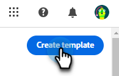

# 이메일 템플릿 작성 {#email-template-authoring}

디자인 프로세스를 가속화하고 개선하기 위해 독립 실행형 이메일 템플릿을 만들어 사용자 정의 콘텐츠를 쉽게 재사용할 수 있습니다.

>[!PREREQUISITES]
>
>새 이메일 디자이너에 액세스하려면 Marketo Engage 구독을 [Adobe IMS(Identity Management System)](https://experienceleague.adobe.com/ko/docs/marketo/using/product-docs/administration/marketo-with-adobe-identity/adobe-identity-management-overview)&#x200B;(으)로 마이그레이션해야 합니다. 아직 실행되지 않았으며 신속 처리를 요청하려면 Adobe 계정 팀(계정 관리자) 또는 [Marketo 지원](https://nation.marketo.com/t5/support/ct-p/Support)에 문의하십시오.

>[!NOTE]
>
>새 이메일 디자이너의 이메일 템플릿은 새 이메일 디자이너에서 이메일을 만드는 데만 사용할 수 있습니다. 이전 이메일 편집기에서 참조할 수 없습니다.

## 이메일 템플릿 만들기 {#create-an-email-template}

1. [Adobe Experience Cloud](https://experiencecloud.adobe.com/){target="_blank"}을(를) 통해 Marketo Engage에 로그인합니다.

1. 내 Marketo에서 **Design Studio**&#x200B;를 선택합니다.

   

1. 트리에서 **전자 메일 템플릿(새 편집기)**&#x200B;을 선택합니다.

   

1. **템플릿 만들기** 단추를 클릭합니다.

   

1. 템플릿 이름과 설명(선택 사항)을 입력합니다. **만들기**&#x200B;를 클릭합니다.

   

## 템플릿 디자인 {#design-your-template}

_템플릿 디자인_ 페이지에서 몇 가지 옵션 중에서 선택할 수 있습니다. [처음부터 디자인](#design-from-scratch), [자신의 HTML 가져오기](#import-html) 또는 [기존 템플릿을 선택](#choose-a-template)(샘플 중 하나 또는 이미 저장한 템플릿 중 하나).

### 처음부터 디자인 {#design-from-scratch}

간단한 드래그 앤 드롭 작업으로 구조 요소를 추가 및 이동하여 콘텐츠를 정의합니다.

1. _템플릿 디자인_ 페이지에서 **처음부터 디자인**&#x200B;을 선택합니다.

1. [구조 및 콘텐츠](#add-structure-and-content)를 추가합니다.

### HTML 가져오기 {#import-your-html}

기존 HTML 콘텐츠를 가져와서 이메일 템플릿을 디자인할 수 있습니다. 콘텐츠는 다음과 같을 수 있습니다.

* 통합 스타일시트가 있는 HTML 파일

* HTML 파일, 스타일 시트(.css) 및 이미지가 포함된 .zip 파일

>[!NOTE]
>
>.zip 파일 구조에는 제약 조건이 없습니다. 그러나 참조는 상대적이어야 하며 .zip 폴더의 트리 구조와 일치해야 합니다.

1. _템플릿 디자인_ 페이지에서 **HTML 가져오기**&#x200B;를 선택합니다.

1. 원하는 HTML 또는 .zip 파일을 끌어다 놓고(또는 컴퓨터에서 파일 선택) **가져오기**&#x200B;를 클릭합니다.

   

   >[!NOTE]
   >
   >HTML 콘텐츠가 업로드되면 콘텐츠는 호환성 모드에 있게 됩니다. 이 모드에서는 텍스트를 개인화하거나, 링크를 추가하거나, 콘텐츠에 자산을 추가할 수만 있습니다.

1. 이메일 Designer 콘텐츠 구성 요소를 활용하려면 **HTML 변환기** 탭을 클릭하고 **변환**&#x200B;을 클릭합니다.

   >[!CAUTION]
   >
   >`<table>` 태그를 HTML 파일의 첫 번째 레이어로 사용하면 맨 위 레이어 태그의 배경 및 너비 설정을 포함하여 스타일이 손실될 수 있습니다.

이제 시각적 이메일 편집기를 사용하여 필요에 따라 가져온 파일을 개인화할 수 있습니다.

### 템플릿 선택 {#choose-a-template}

선택할 수 있는 템플릿에는 두 가지 유형이 있습니다.

* **샘플 템플릿**: Marketo Engage에서는 4개의 기본 전자 메일 템플릿을 제공합니다.

* **저장된 서식 파일**: 서식 파일 메뉴를 사용하여 처음부터 만든 서식 파일 또는 서식 파일로 저장하기 위해 만든 전자 메일입니다.

>[!BEGINTABS]

>[!TAB 샘플 템플릿]

이메일 템플릿 디자인에서 바로 시작할 수 있도록 기본 제공 템플릿 중 하나를 선택합니다.

1. 기본적으로 샘플 템플릿 탭이 열려 있습니다.

1. 사용할 템플릿을 선택합니다.

   

1. **이 서식 파일 사용**&#x200B;을 클릭합니다.

   

1. 시각적 콘텐츠 디자이너를 사용하여 원하는 대로 콘텐츠를 편집합니다.

>[!TAB 저장된 템플릿]

1. **저장된 템플릿** 탭을 클릭하고 원하는 템플릿을 선택합니다.

   

1. **이 서식 파일 사용**&#x200B;을 클릭합니다.

   

1. 시각적 콘텐츠 디자이너를 사용하여 원하는 대로 콘텐츠를 편집합니다.

>[!ENDTABS]

## 구조 및 콘텐츠 추가 {#add-structure-and-content}

1. 콘텐츠를 만들거나 수정하려면 구조에서 캔버스로 항목을 끌어다 놓습니다. 오른쪽 창에서 설정을 편집합니다.

   >[!TIP]
   >
   >n:n 열 구성 요소를 선택하여 선택한 열 수(3개에서 10개 사이)를 정의합니다. 열 아래로 화살표를 이동하여 각 열의 너비를 정의할 수도 있습니다.

   

   >[!NOTE]
   >
   >각 열 크기는 구조 구성 요소의 전체 너비의 10%보다 작을 수 없습니다. 빈 열만 제거할 수 있습니다.

1. 콘텐츠 섹션에서 원하는 항목 위로 끌어서 하나 이상의 구조 구성 요소에 놓습니다.

   

1. 설정 또는 스타일 탭을 통해 각 구성 요소를 사용자 지정할 수 있습니다. 글꼴, 텍스트 스타일, 여백 등을 변경합니다.

### 조각 추가 {#add-fragments}

1. 조각에 액세스하려면 왼쪽 탐색에서 _조각_ 아이콘()을 선택하십시오.

   {width="700" zoomable="yes"}

1. 조각을 구조 구성 요소 자리 표시자로 끌어서 놓습니다.

편집기는 이메일 구조의 섹션/요소 내에서 조각을 렌더링합니다. 조각의 콘텐츠는 구조 내에서 동적으로 업데이트되어 이메일에 콘텐츠가 표시되는 방식을 보여 줍니다.

>[!TIP]
>
>조각이 이메일 내의 전체 수평 레이아웃을 차지하도록 하려면 1:1 열 구조를 추가한 다음 조각을 끌어서 놓습니다.

전자 메일이 저장되면 조각 세부 정보 페이지의 _[!UICONTROL Used By]_&#x200B;탭에 나타납니다. 이메일 템플릿에 추가된 조각은 템플릿 내에서 편집할 수 없습니다. 소스 조각은 콘텐츠를 정의합니다.

### 에셋 추가 {#add-assets}

Marketo Engage 인스턴스의 [이미지 및 파일](/help/marketo/product-docs/demand-generation/images-and-files/add-images-and-files-to-marketo.md){target="_blank"} 섹션에 저장된 이미지를 추가합니다.

>[!NOTE]
>
>현재 다른 파일 형식은 추가할 수 없으며 새 디자이너에서만 이미지를 추가할 수 있습니다.

1. 이미지에 액세스하려면 에셋 선택기 아이콘을 클릭합니다.

   

1. 원하는 이미지를 구조 구성 요소로 끌어다 놓습니다.

   

   >[!NOTE]
   >
   >기존 이미지를 바꾸려면 이미지를 선택한 다음 오른쪽의 설정 탭에서 **자산 선택**&#x200B;을 클릭합니다.

### 레이어, 설정 및 스타일 {#layers-settings-styles}

탐색 트리를 열어 특정 구조 및 해당 열/구성 요소에 액세스하여 보다 세분화된 편집을 수행할 수 있습니다. 액세스하려면 탐색 트리 아이콘을 클릭합니다.

아래 예에서는 열로 구성된 구조 구성 요소 내에서 패딩 및 수직 정렬을 조정하는 단계를 간략하게 설명합니다.

1. 캔버스에서 구조 구성 요소의 열을 직접 선택하거나 왼쪽에 표시된 _탐색 트리_&#x200B;를 사용합니다.

1. 열 도구 모음에서 _[!UICONTROL Select a column]_&#x200B;도구를 클릭하고 편집할 도구를 선택합니다.

   구조 트리에서 선택할 수도 있습니다. 해당 열에 대해 편집 가능한 매개 변수가 오른쪽의 _[!UICONTROL Settings]_&#x200B;및_[!UICONTROL Styles]_ 탭에 표시됩니다.

   

1. 열 속성을 편집하려면 오른쪽의 _[!UICONTROL Styles]_&#x200B;탭을 클릭하고 필요에 따라 변경합니다.

   * **[!UICONTROL Background]**&#x200B;의 경우 필요에 따라 배경색을 변경합니다.

     투명 배경에 대한 확인란 선택을 취소합니다. 단색 대신 이미지를 배경으로 사용하려면 **[!UICONTROL Background image]** 설정을 활성화하십시오.

   * **[!UICONTROL Alignment]**&#x200B;의 경우 _위쪽_, _중간_ 또는 _아래쪽_ 아이콘을 선택하십시오.
   * **[!UICONTROL Padding]**&#x200B;의 경우 모든 면에 대한 패딩을 정의합니다.

     패딩을 조정하려면 **[!UICONTROL Different padding for each side]**&#x200B;을(를) 선택하세요. 동기화를 중단하려면 _잠금_ 아이콘을 클릭하십시오.

   * **[!UICONTROL Advanced]** 섹션을 확장하여 열의 인라인 스타일을 정의합니다.

   

1. 필요에 따라 이 단계를 반복하여 구성 요소의 다른 열에 대한 정렬 및 패딩을 조정합니다.

1. 변경 내용을 저장합니다.

### 콘텐츠 개인화 {#personalize-content}

토큰은 이전 버전에서 작동하는 것과 동일한 방식으로 새 편집기에서 작동하지만 아이콘은 다르게 보입니다. 아래 예에서는 대체 텍스트가 있는 이름 토큰을 추가하는 방법을 간략하게 설명합니다.

1. 텍스트 구성 요소를 선택합니다. 토큰을 표시할 위치에 커서를 놓고 **개인화 추가** 아이콘을 클릭합니다.

   

1. 원하는 [토큰 형식](/help/marketo/product-docs/demand-generation/landing-pages/personalizing-landing-pages/tokens-overview.md){target="_blank"}을 클릭합니다.

   

1. 원하는 토큰을 찾고 **..** 아이콘을 클릭합니다(+ 아이콘을 클릭하면 대체 텍스트가 없는 토큰이 추가됨).

   

   >[!NOTE]
   >
   >&quot;대체 텍스트&quot;는 기본값에 대한 새로운 편집기 용어입니다. 예: ``{{lead.First Name:default=Friend}}`` 선택한 필드에 사용자에 대한 값이 없는 경우 사용하는 것이 좋습니다.

1. 대체 텍스트를 설정하고 **추가**&#x200B;를 클릭합니다.

   

1. **저장**&#x200B;을 클릭합니다.

### URL 추적 편집 {#edit-url-tracking}

이메일의 링크에서 Marketo 추적 URL을 활성화하지 않으려는 경우가 있습니다. 이 기능은 대상 페이지가 URL 매개 변수를 지원하지 않아 링크가 끊어질 수 있는 경우에 유용합니다.

1. 링크 아이콘을 클릭하면 이메일의 모든 URL이 표시됩니다.

   

1. 원하는 링크에 대한 추적을 편집하려면 연필 아이콘을 클릭합니다.

1. **추적 유형** 드롭다운을 클릭하고 선택하십시오.

   

   <table><tbody>
     <tr>
       <td><b>mkt_tok 없이 추적</b></td>
       <td>대상 URL에서 mkt_tok 쿼리 문자열 매개 변수를 사용하지 않고 URL에 대한 추적을 활성화합니다</td>
     </tr>
     <tr>
       <td><b>mkt_tok로 추적</b></td>
       <td>대상 URL에서 mkt_tok 쿼리 문자열 매개 변수를 사용하여 URL에 대한 추적을 활성화합니다</td>
     </tr>
     <tr>
       <td><b>추적 안 함</b></td>
       <td>URL 추적을 비활성화합니다</td>
     </tr>
   </tbody>
   </table>

1. 선택적으로 URL에 레이블을 지정하거나 태그를 추가할 수 있습니다.

1. 완료되면 **저장**&#x200B;을 클릭합니다.

### 옵션 보기 {#view-options}

시각적 이메일 편집기에서 사용할 수 있는 보기 및 콘텐츠 유효성 검사 옵션을 활용합니다.

* 사전 설정된 확대/축소 옵션을 사용하여 컨텐츠를 확대/축소합니다.

* 데스크탑, 모바일 또는 텍스트 전용/일반 텍스트에서 컨텐츠를 볼 수 있습니다.

   * 여러 장치에서 콘텐츠 미리보기에 대한 실시간 보기(눈) 아이콘을 클릭합니다.

   * 기본 제공 장치 중 하나를 선택하거나 사용자 지정 차원을 입력하여 콘텐츠를 미리 봅니다.

### 추가 옵션 {#more-options}

콘텐츠 편집기의 **자세히** 옵션에서 다음 작업을 수행할 수 있습니다.

* **템플릿 재설정**: 시각적 이메일 디자이너 캔버스를 빈 슬레이트로 지우고 빌드 콘텐츠를 다시 시작하려면 이 옵션을 선택하십시오.

* **디자인 변경**: _템플릿 디자인_ 페이지로 돌아갑니다. 여기에서 [템플릿 디자인](#design-your-template) 섹션에 설명된 대로 모든 조치를 취할 수 있습니다.

* **HTML 내보내기**: zip 파일로 패키지된 HTML 형식의 로컬 시스템에 시각적 캔버스의 콘텐츠를 다운로드합니다.

## 템플릿 세부 정보 보기 {#view-template-details}

_전자 메일 서식 파일_ 목록 페이지에서 전자 메일 서식 파일의 이름을 클릭하여 세부 정보를 확인합니다.

이름 및 설명과 같은 기본 세부 정보를 편집할 수 있습니다. 변경 사항을 저장하기 위해 편집한 필드 외부를 클릭합니다.

템플릿을 빠르게 삭제하거나 복제하려면 **자세히**&#x200B;를 클릭하세요.

활성 경고(이메일 템플릿에 대한 오류/경고)가 있는 경우 경고 를 클릭하여 정보를 확인합니다.

>[!NOTE]
>
>이러한 경고는 이메일 작성을 위한 이메일 템플릿 사용을 금지하지 않지만, 이 정보는 작동하지 않을 수 있는 내용과 이메일을 게재에 사용하기 전에 필요한 업데이트에 대한 가시성을 제공합니다.

## 참조에서 사용하는 이메일 템플릿 보기 {#email-template-used-by-references}

이메일 템플릿 요약에서 **사용한 사람** 탭을 클릭하여 Marketo Engage 내에서 이 이메일 템플릿이 사용된 위치에 대한 세부 정보를 확인합니다.

## 이메일 템플릿 편집 {#edit-email-templates}

이 작업은 다음 위치에서 수행할 수 있습니다.

* 세부 정보 탭 - **전자 메일 템플릿 편집**&#x200B;을 클릭합니다.

이 작업을 수행하면 전자 메일 템플릿의 마지막으로 저장된 상태를 기반으로 _템플릿 디자인_ 페이지 또는 시각적 콘텐츠 편집기 페이지로 이동합니다. 여기에서 필요에 따라 이메일 템플릿 콘텐츠를 편집할 수 있습니다. 편집 옵션에 대한 자세한 내용은 이메일 템플릿 만들기 를 참조하십시오.

## 중복 이메일 템플릿 {#duplicate-email-templates}

이메일 템플릿을 복제하는 방법에는 두 가지가 있습니다.

* 오른쪽의 전자 메일 템플릿 세부 정보에서 **자세히**&#x200B;를 클릭하고 **복제**&#x200B;를 선택합니다.

  

* _전자 메일 템플릿_ 목록 페이지에서 원하는 전자 메일 템플릿의 추가 작업 아이콘(세 점)을 클릭하고 **복제**&#x200B;를 선택합니다.

대화 상자에서 고유한 이름과 설명(선택 사항)을 입력합니다. 완료되면 **복제**&#x200B;를 클릭합니다.

그러면 복제된 전자 메일 템플릿이 _전자 메일 템플릿_ 목록 페이지에 나타납니다.

## 이메일 템플릿 삭제 {#delete-email-templates}

이메일 템플릿을 삭제하는 방법에는 두 가지가 있습니다.

>[!CAUTION]
>
>이메일 템플릿 삭제는 실행 취소할 수 없습니다.

* 오른쪽의 전자 메일 템플릿 세부 정보에서 **자세히**&#x200B;를 클릭하고 **삭제**&#x200B;를 선택합니다.

  

* _전자 메일 템플릿_ 목록 페이지에서 원하는 전자 메일 템플릿의 추가 작업 아이콘(세 점)을 클릭하고 **삭제**&#x200B;를 선택합니다.

## 일괄 액션 {#bulk-actions}

_전자 메일 서식 파일_ 목록 페이지에서 왼쪽의 확인란을 선택하여 여러 서식 파일을 선택하십시오. 맨 아래에 배너가 나타납니다.

**삭제**: 한 번에 최대 20개의 템플릿을 삭제할 수 있습니다. 확인 대화 상자를 통해 작업을 중단하거나 삭제를 확인할 수 있습니다.

>[!MORELIKETHIS]
>
>[전자 메일 작성](/help/marketo/product-docs/email-marketing/email-designer/email-authoring.md){target="_blank"}: 새 디자이너에서 전자 메일을 만들고 디자인하고 참조하는 방법에 대해 알아봅니다.
