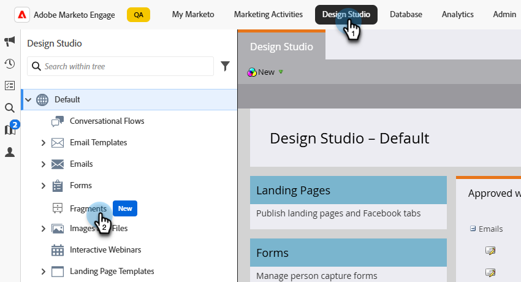

# 조각

조각은 하나 이상의 이메일 및 이메일 템플릿에서 참조할 수 있는 재사용 가능한 구성 요소입니다. 일반적으로 프로젝트에 신속하게 삽입할 수 있는 콘텐츠 블록(텍스트, 이미지 또는 둘 다)입니다. 이 기능을 사용하면 여러 사용자 지정 콘텐츠 블록을 사전 빌드하여 이메일 콘텐츠를 취합함으로써 디자인 프로세스를 향상시킬 수 있습니다. 일반적인 사용 사례에는 이메일, 이벤트 초대 배너, 시즌 메시지 등에 대한 머리글/바닥글 콘텐츠 블록이 포함됩니다.

워크플로우에서 조각을 최대한 활용하려면 다음 작업을 수행하십시오.

* _조각 만들기_ - 처음부터 만들거나 시각적 콘텐츠 편집기에서 조각으로 콘텐츠를 저장하여 시각적 조각을 만듭니다.
* _조각 재사용_ - 콘텐츠에서 필요한 횟수만큼 조각을 사용합니다.

## 시각적 조각 {#visual-fragments}

시각적 조각은 여러 이메일 또는 이메일 템플릿에서 재사용할 수 있도록 빌드된 사전 정의된 시각적 블록(시각적 콘텐츠 편집기 사용)입니다.

## 조각 액세스 및 관리 {#access-and-manage-fragments}

시각적 조각에 액세스하려면 Marketo Engage의 **Design Studio**(으)로 이동하십시오. 왼쪽의 트리에서 **[!UICONTROL 조각(새로 만들기)]**&#x200B;을 클릭합니다.

{width="600" zoomable="yes"}

기본적으로 테이블은 _[!UICONTROL 수정됨]_ 열을 기준으로 정렬됩니다. 테이블 정렬 기준을 변경하려면 다른 열 제목을 클릭합니다. 오름차순과 내림차순 간을 전환하려면 동일한 제목을 다시 클릭합니다.

### 찾기 및 필터링

검색 창을 사용하여 이름별로 조각을 찾습니다. _필터_ 아이콘(  )을 클릭하여 사용 가능한 필터 옵션을 표시하고 원하는 설정을 선택합니다.

{width="700" zoomable="yes"}

### 열 사용자 지정 {#customize-the-column-display}

오른쪽 상단의 _표 사용자 지정_ 아이콘()을 클릭하여 표에 표시할 열을 사용자 지정합니다.

원하는 열을 선택하고 **[!UICONTROL 적용]**&#x200B;을 클릭합니다.

{width="400" zoomable="yes"}

### 조각 상태 {#fragment-status}

조각 상태는 이메일 또는 이메일 템플릿에서 사용할 수 있는 가용성과 해당 조각에 적용할 수 있는 변경 사항을 결정합니다.

<table>
<tbody>
  <tr>
    <td><b>초안</b></td>
    <td>조각을 만들면 초안 상태가 됩니다. 이메일 또는 이메일 템플릿에 사용하기 위해 게시하기 전까지 초안으로 유지됩니다.
    
사용 가능한 작업:
    <li>모든 세부 정보 편집</li>
    <li>비주얼 디자이너에서 편집</li>
    <li>게시</li>
    <li>복제</li>
    <li>삭제</li>
  </td>
  <tr>
    <td><b>게시일</b></td>
    <td>조각을 게시하면 이메일 또는 이메일 템플릿에서 사용할 수 있습니다. 게시된 조각 콘텐츠는 비주얼 디자이너에서 수정할 수 없습니다.
    
사용 가능한 작업:
    <li>설명 편집</li>
    <li>이메일 또는 템플릿에 추가</li>
    <li>초안 버전 만들기</li>
    <li>복제</li>
    <li>삭제(사용하지 않는 경우)</li>
    </td>
  </tr>
  <tr>
    <td><b>초안과 함께 게시됨</b></td>
    <td>게시된 조각에서 초안을 만들 때 게시된 버전은 이메일 또는 이메일 템플릿에서 사용할 수 있으며 비주얼 디자이너에서 초안 콘텐츠를 수정할 수 있습니다. 초안 버전을 게시하면 현재 게시된 버전이 대체되며 사용 중인 전자 메일 및 전자 메일 템플릿에서 <i>모두</i>의 콘텐츠가 업데이트됩니다. 
    
사용 가능한 작업:
    <li>설명 편집</li>
    <li>이메일 또는 템플릿에 추가</li>
    <li>비주얼 디자이너에서 초안 버전 편집</li>
    <li>Publish 초안 버전</li>
    <li>복제</li>
    <li>삭제(사용하지 않는 경우)</li>
    </td>
  </tr>
</tbody></table>

## 조각 만들기 {#create-fragments}

1. 새 시각적 조각을 만들려면 조각 목록 페이지의 오른쪽 상단에 있는 **[!UICONTROL 조각 만들기]**&#x200B;를 클릭합니다.

   {width="700" zoomable="yes"}

1. 조각에 **[!UICONTROL 이름]** 및 선택적 **[!UICONTROL 설명]**&#x200B;을 지정하십시오.

   _조각 요구 사항_

   * 이름: 최대 100자, 대/소문자를 구분하지 않고 고유해야 함
   * 설명: 최대 300자
   * 문자: 영문자, 숫자 및 특수 문자 사용 가능
   * 예약된 문자가 **_허용되지 않음_**: `\ / : * ? " < > |`

   {width="400" zoomable="yes"}

1. **[!UICONTROL 만들기]**&#x200B;를 클릭합니다.

   {width="400" zoomable="yes"}

   >[!NOTE]
   >
   >지금은 조각의 **Type**&#x200B;을(를) 수정할 수 없습니다.

   비주얼 디자이너가 빈 캔버스로 열립니다.

1. 콘텐츠 디자인 도구를 사용하여 시각적 조각 콘텐츠를 만듭니다.

   * [구조 및 콘텐츠 추가](#add-structure-and-content)
   * [Assets 추가](#add-assets)
   * [레이어, 설정 및 스타일 탐색](#navigate-the-layers-settings-and-styles)
   * [콘텐츠 개인화](#personalize-content)
   * [연결된 URL 추적 편집](#edit-linked-url-tracking)

1. 언제든지 **[!UICONTROL 저장]**&#x200B;을 클릭하여 초안 조각을 저장합니다.

1. 전자 메일 또는 전자 메일 템플릿에서 사용할 수 있는 조각을 만들 준비가 되면 **[!UICONTROL Publish]**&#x200B;을(를) 클릭합니다.

### 구조 및 콘텐츠 추가 {#add-structure-and-content}

{{$include /help/marketo/_includes/content-design-components.md}}

### 에셋 추가

{{$include /help/_includes/content-design-assets.md}}

### 레이어, 설정 및 스타일 탐색

{{$include /help/_includes/content-design-navigation.md}}

### 콘텐츠 개인화

{{$include /help/_includes/content-design-personalization.md}}

### 연결된 URL 추적 편집

{{$include /help/_includes/content-design-links.md}}

## 조각 세부 사항 보기 {#view-fragment-details}

목록 페이지에서 조각 이름을 클릭하여 조각 세부 사항 페이지를 엽니다. 조각을 편집하거나, 이름을 바꾸거나, 설명을 업데이트하도록 선택할 수 있습니다. 업데이트하고 이름 또는 설명 필드 외부를 클릭하여 변경 사항을 저장합니다.

>[!NOTE]
>
>게시된 조각을 이메일 또는 이메일 템플릿에서 사용 중인 경우 해당 이름을 변경하거나 콘텐츠를 편집할 수 없습니다. 조각을 변경하려는 경우 초안 버전을 생성할 수 있습니다.

{width="600" zoomable="yes"}

**[!UICONTROL 조각 편집]**&#x200B;을 클릭하여 시각적 콘텐츠 편집기에서 조각을 엽니다.

왼쪽 상단의 _뒤로_ 화살표를 클릭하여 언제든지 보기를 종료하십시오. 그러면 _조각_ 목록 페이지로 돌아갑니다.

## 참조에서 사용하는 조각 보기 {#view-fragment-used-by-references}

조각 세부 정보 페이지에서 **[!UICONTROL 사용한 사람]** 탭을 클릭하여 Marketo Engage 내에서 조각이 사용되는 위치에 대한 세부 정보를 봅니다.

>[!IMPORTANT]
>
>현재 이메일 또는 이메일 템플릿에서 사용 중인 조각은 삭제할 수 없습니다.

{width="600" zoomable="yes"}

링크를 클릭하여 조각이 사용되는 해당 이메일 또는 이메일 템플릿을 엽니다.

## 조각 삭제 {#delete-fragments}

현재 전자 메일 또는 전자 메일 템플릿에서 사용 중인 조각은 삭제할 수 없으므로 조각 제거를 시작하기 전에 _used-by_ 참조를 확인하십시오. 또한 제거 작업은 실행 취소할 수 없으므로 삭제 작업을 시작하기 전에 확인하십시오.

다음 방법 중 하나를 사용하여 조각을 삭제할 수 있습니다.

* 오른쪽의 조각 세부 정보에서 **[!UICONTROL 삭제]**&#x200B;를 클릭합니다.
* _[!UICONTROL 조각]_ 목록 페이지에서 조각 옆에 있는 줄임표를 클릭하고 **[!UICONTROL 삭제]**&#x200B;를 선택합니다.

이 작업을 수행하면 확인 대화 상자가 열립니다. **[!UICONTROL 취소]**&#x200B;를 클릭하여 프로세스를 중단하거나 **[!UICONTROL 삭제]**&#x200B;를 클릭하여 삭제를 확인할 수 있습니다.

{width="400"}

## 조각 편집 {#edit-fragments}

조각에 대한 편집은 현재 상태에 따라 다릅니다.

* 조각이 _초안_ 상태일 때 조각의 세부 정보와 시각적 콘텐츠를 편집할 수 있습니다.
* 조각이 _게시됨_ 상태일 때 조각 설명을 편집할 수 있지만 이름은 편집할 수 없습니다. 시각적 컨텐츠는 편집할 수 없습니다.
* 조각이 _초안으로 게시됨_ 상태일 때 세부 정보 편집은 설명으로 제한됩니다. 초안 버전의 시각적 콘텐츠를 편집할 수도 있습니다.

>[!BEGINTABS]

>[!TAB 초안]

1. _[!UICONTROL 조각]_ 목록 페이지에서 조각 이름을 클릭하여 엽니다.

   오른쪽에 조각 세부 사항이 있는 시각적 콘텐츠의 미리보기가 표시됩니다.

1. 원하는 대로 편집합니다.

   {width="600" zoomable="yes"}

1. 비주얼 디자이너에서 콘텐츠를 변경하려면 **[!UICONTROL 조각 편집]**&#x200B;을 클릭하세요.

   필요에 따라 비주얼 디자이너 도구를 사용합니다.

   * [구조 및 콘텐츠 추가](#add-structure-and-content)
   * [Assets 추가](#add-assets)
   * [레이어, 설정 및 스타일 탐색](#navigate-the-layers-settings-and-styles)
   * [콘텐츠 개인화](#personalize-content)
   * [연결된 URL 추적 편집](#edit-linked-url-tracking)

   조각 세부 정보로 돌아가려면 **[!UICONTROL 저장]** 또는 **[!UICONTROL 저장 및 닫기]**&#x200B;를 클릭하십시오.

1. 조각이 조건을 충족하고 전자 메일 또는 전자 메일 템플릿에서 사용할 수 있도록 하려면 **[!UICONTROL Publish]**&#x200B;을(를) 클릭합니다.

>[!TAB 게시됨]

1. _[!UICONTROL 조각]_ 목록 페이지에서 조각 이름을 클릭하여 엽니다.

   오른쪽에 조각 세부 사항이 있는 시각적 콘텐츠의 미리보기가 표시됩니다.

1. 필요한 경우 설명을 수정합니다.

   게시된 조각의 경우 다른 모든 세부 사항을 변경할 수 없습니다.

1. 콘텐츠를 업데이트하려면 오른쪽 상단의 **[!UICONTROL 초안 버전 만들기]**&#x200B;를 클릭하십시오.

   대화 상자에서 **[!UICONTROL 확인]**&#x200B;을 클릭하여 비주얼 디자이너에서 초안 버전을 엽니다. 필요한 경우 `image source`KG을 변경할 수 있습니다. 여기에서 링크를 클릭하세요.

   {width="300"}

   필요에 따라 비주얼 디자이너 도구를 사용합니다.

   * [구조 및 콘텐츠 추가](#add-structure-and-content)
   * [Assets 추가](#add-assets)
   * [레이어, 설정 및 스타일 탐색](#navigate-the-layers-settings-and-styles)
   * [콘텐츠 개인화](#personalize-content)
   * [연결된 URL 추적 편집](#edit-linked-url-tracking)

   조각 세부 정보로 돌아가려면 **[!UICONTROL 저장]** 또는 **[!UICONTROL 저장 및 닫기]**&#x200B;를 클릭하십시오.

1. 초안 조각이 조건에 맞고 변경 사항을 전자 메일 또는 전자 메일 템플릿에서 사용할 수 있도록 하려면 **[!UICONTROL Publish]**&#x200B;을(를) 클릭합니다.

   초안 버전을 게시하면 현재 게시된 버전이 대체되며 콘텐츠는 이미 사용 중인 이메일 및 이메일 템플릿에서 업데이트됩니다.

>[!TAB 초안으로 게시됨]

_[!UICONTROL 조각]_ 목록 페이지에서 편집할 초안 버전을 여는 방법에는 두 가지가 있습니다.

* 조각 이름 옆의 _자세히_ 아이콘(**...**)을 클릭하고 **[!UICONTROL 초안 버전 열기]**&#x200B;를 선택합니다.

  {width="300"}

* 조각 이름을 클릭하여 엽니다. 그런 다음 오른쪽 상단의 **[!UICONTROL 초안 버전 열기]**&#x200B;를 클릭합니다.

  오른쪽에 조각 세부 사항이 있는 초안 버전의 시각적 콘텐츠 미리보기가 표시됩니다.

콘텐츠를 업데이트하려면:

1. 오른쪽 상단의 **[!UICONTROL 조각 편집]**&#x200B;을 클릭합니다. 필요에 따라 비주얼 디자이너 도구를 사용합니다.

   * [구조 및 콘텐츠 추가](#add-structure-and-content)
   * [Assets 추가](#add-assets)
   * [레이어, 설정 및 스타일 탐색](#navigate-the-layers-settings-and-styles)
   * [콘텐츠 개인화](#personalize-content)
   * [연결된 URL 추적 편집](#edit-linked-url-tracking)

   조각 세부 정보로 돌아가려면 **[!UICONTROL 저장]** 또는 **[!UICONTROL 저장 및 닫기]**&#x200B;를 클릭하십시오.

1. 초안 조각이 조건에 맞고 변경 사항을 전자 메일 또는 전자 메일 템플릿에서 사용할 수 있도록 하려면 **[!UICONTROL Publish]**&#x200B;을(를) 클릭합니다.

   초안 버전을 게시하면 현재 게시된 버전이 대체되며 콘텐츠는 이미 사용 중인 이메일 및 이메일 템플릿에서 업데이트됩니다.

>[!ENDTABS]

## 중복 조각 {#duplicate-fragments}

다음 방법 중 하나를 사용하여 조각을 복제할 수 있습니다.

* _[!UICONTROL 조각]_ 목록 페이지에서 조각 이름 옆의 _자세히_ 아이콘(**...**)을 클릭하고 **[!UICONTROL 복제]**&#x200B;를 선택합니다.
* 조각 세부 정보 페이지의 오른쪽 상단에서 **[!UICONTROL ...을 클릭합니다. 추가]**&#x200B;하고 **[!UICONTROL 복제]**&#x200B;를 선택하세요.

{width="600" zoomable="yes"}

대화 상자에서 고유한 이름과 설명(선택 사항)을 입력합니다. 작업을 완료하려면 **[!UICONTROL 복제]**&#x200B;를 클릭하십시오.

{width="400"}

그러면 복제된 조각이 _조각_ 목록에 나타납니다.

## 이메일 또는 템플릿 콘텐츠에서 새 조각 저장 {#save-a-new-fragment-from-email-or-template-content}

시각적 콘텐츠 편집기에서 이메일 또는 이메일 템플릿을 만들거나 편집할 때 콘텐츠를 재사용할 수 있도록 전부 또는 일부를 조각으로 저장할 수 있습니다.

1. 콘텐츠를 조각으로 저장하려면 **[!UICONTROL 자세히]**&#x200B;를 클릭하고 **[!UICONTROL 조각으로 저장]**&#x200B;을 선택하세요.

1. 조각에 포함할 다른 요소를 선택합니다.

   Shift 또는 Control 단추를 눌러 여러 구조를 선택합니다.

   서로 인접한 구조만 선택할 수 있으며 인터페이스에서는 인접하지 않은 요소를 선택할 수 없습니다.

1. 콘텐츠를 선택한 상태에서 오른쪽 상단의 **[!UICONTROL 만들기]**&#x200B;를 클릭합니다.

1. 대화 상자에서 조각의 이름과 선택적 설명을 입력하고 **[!UICONTROL 만들기]**&#x200B;를 클릭합니다.

   그런 다음 조각이 _조각_ 목록 페이지에 표시되고 전자 메일 및 전자 메일 템플릿에서도 사용할 수 있습니다.

## 이메일 또는 템플릿 콘텐츠에 시각적 조각 추가 {#add-visual-fragments-to-your-email-or-template-content}

조각은 재사용을 위해 디자인되었습니다. 이메일 또는 이메일 템플릿에 최대 30개를 추가할 수 있으며, 최대 한 수준까지만 중첩할 수 있습니다.

* [이메일에 조각 추가](/help/marketo/product-docs/email-marketing/email-designer/email-authoring.md#add-fragments)

* [이메일 템플릿에 조각 추가](/help/marketo/product-docs/email-marketing/email-designer/email-template-authoring.md#add-fragments)

조각의 콘텐츠는 구조 내에서 동적으로 업데이트되어 이메일에 콘텐츠가 표시되는 방식을 시각적으로 렌더링합니다.

>[!TIP]
>
>조각이 전자 메일 내의 전체 가로 레이아웃을 차지하도록 하려면 [!UICONTROL 1:1 열] 구조를 추가한 다음 조각을 끌어서 놓습니다.

전자 메일/전자 메일 템플릿이 저장되면 _[!UICONTROL 사용 사용자]_ 탭을 선택하면 조각 세부 정보 페이지에 표시됩니다. 추가된 조각은 이메일 또는 템플릿 내에서 편집할 수 없습니다. 게시된 소스 조각은 콘텐츠를 정의합니다.

## 이메일 및 템플릿 작성 중 조각 작업 {#fragment-actions-during-email-and-template-authoring}

조각이 이메일 또는 이메일 템플릿에 추가되면 이메일 또는 템플릿 내에서 해당 콘텐츠를 편집할 수 없습니다. 하지만 다음 작업을 적용할 수 있습니다.

* **[!UICONTROL 삭제]** - 현재 전자 메일 또는 전자 메일 템플릿 콘텐츠에서 조각을 제거합니다(조각 소스는 영향을 받지 않음).
* **[!UICONTROL 새로 고침]** - 현재 전자 메일 또는 전자 메일 템플릿의 조각 콘텐츠를 새로 고칩니다. 새로 고침은 이메일 또는 이메일 템플릿에 추가한 후 조각에 대한 최근 편집 내용을 반영하려는 경우에 유용합니다.
* **[!UICONTROL 복제]** - 편집기 내의 동일한 전자 메일 또는 전자 메일 템플릿에 있는 조각을 복제합니다. 복제된 조각은 원본 바로 아래에 추가됩니다.
* **[!UICONTROL 조각 열기]** - 조각 편집기 페이지와 세부 정보가 있는 새 브라우저 탭이 열립니다.
* **[!UICONTROL 상속 중단]** - 소스에서 조각의 상속(및 변경 내용)을 중단합니다. 이 작업을 사용하여 조각 콘텐츠를 이메일 또는 이메일 템플릿 내에서 독립적이고 편집 가능한 콘텐츠로 사용할 수 있도록 합니다. 이 작업은 원본 조각에 대한 _사용한 사람_ 참조에서 전자 메일 또는 전자 메일 템플릿도 제거합니다.

편집기 페이지에서 조각을 선택하면 이러한 작업은 컨텍스트 도구 모음과 오른쪽의 속성 패널에서 사용할 수 있습니다.

{width="600" zoomable="yes"}
