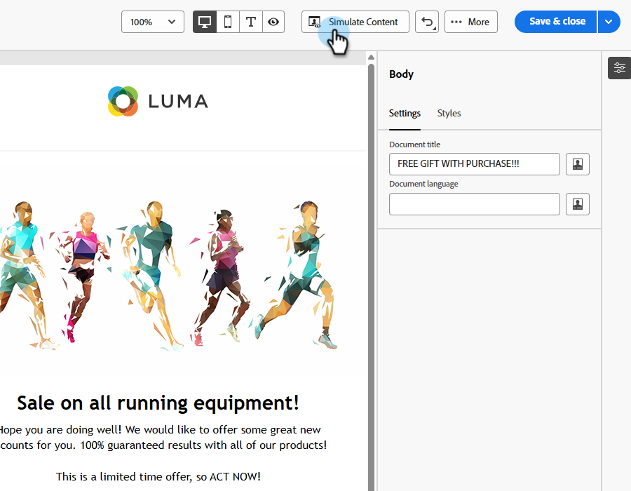

# 이메일 스팸 신고 {#email-spam-report}

Marketo Engage에서 SpamAssassin을 사용하여 이메일 콘텐츠를 테스트하고 ISP/사서함 공급자가 이를 스팸으로 표시할 가능성을 볼 수 있습니다.

SpamAssassin은 콘텐츠를 분석하고 다양한 기준에 따라 점수를 할당합니다. 점수가 낮을수록 좋습니다. 점수가 높은 이메일을 보내면 전체 게재 가능성에 부정적인 영향을 줄 수 있으므로 낮은 점수를 유지하는 것이 중요합니다.

## 스팸 보고서 액세스 {#access-the-spam-report}

1. 전자 메일에서 **콘텐츠 시뮬레이션**&#x200B;을 클릭합니다.

   {width="600" zoomable="yes"}

   >[!NOTE]
   >
   >테스트 프로필을 아직 추가하지 않은 경우 1단계 직후에 추가해야 합니다.

1. **스팸 보고서** 단추를 클릭합니다.

   

1. 스팸 보고서가 생성됩니다.

   {width="600" zoomable="yes"}

1. 각 항목에 대한 점수와 설명을 확인합니다.

   >[!IMPORTANT]
   >
   >전체 점수가 5점보다 높으면 게재 시 이메일이 차단되거나 스팸으로 표시될 수 있습니다.

1. 점수가 너무 높다고 판단되는 경우 보고서의 검색 결과를 기반으로 이메일 Designer에서 콘텐츠를 편집한 다음 **스팸 보고서**&#x200B;를 다시 실행하십시오.

   {width="800" zoomable="yes"}

점수가 마음에 들면 보낼 준비가 되었습니다.

{width="800" zoomable="yes"}

>[!NOTE]
>
>스팸 점수는 SpamAssassin을 통해 파생되며, 규칙은 Adobe이 소유하지 않습니다. 이러한 규칙에 대한 자세한 내용은 [SpamAssassin 설명서](https://spamassassin.apache.org/#_blank){target="_blank"}에서 확인할 수 있습니다. [오류 전체 목록이 ](https://spamassassin.apache.org/old/tests_3_0_x.html){target="_blank"}에 표시됩니다.
