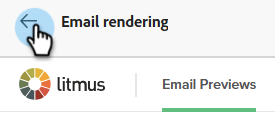
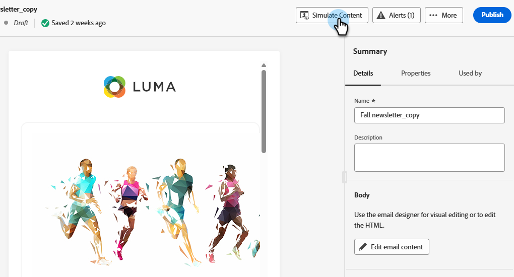
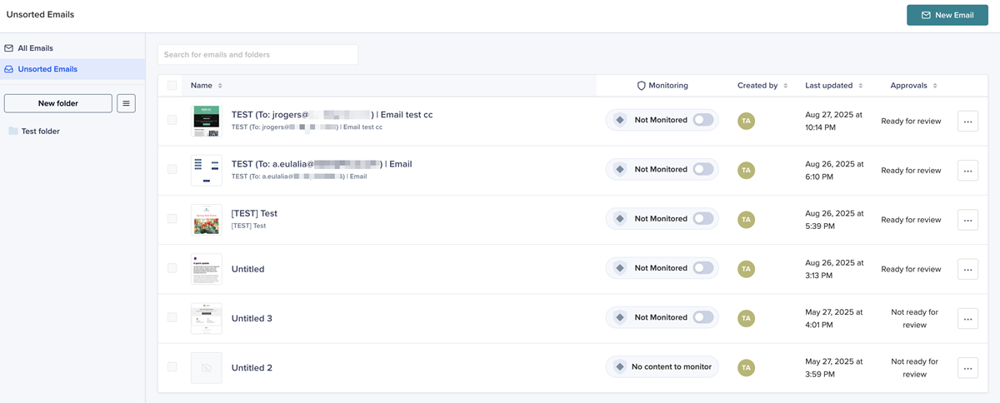

# Litmus로 이메일 렌더링 테스트 {#test-email-rendering-with-litmus}

Marketo Engage에서 [Litmus](https://www.litmus.com/email-testing) 계정을 활용하여 인기 있는 이메일 클라이언트에서 이메일이 어떻게 렌더링되는지 즉시 확인할 수 있습니다.

>[!AVAILABILITY]
>
>이 기능은 활성 Litmus 계정이 있는 모든 Marketo Engage 사용자가 사용할 수 있습니다.

## Litmus Enterprise 사용자 {#litmus-enterprise}

다음 단계는 [Litmus Enterprise 플랜](https://www.litmus.com/pricing/enterprise){target="_blank"}의 사용자를 위한 것입니다.

1. _전자 메일 콘텐츠 편집_ 화면에서 **콘텐츠 시뮬레이션** 단추를 클릭합니다.

   

1. 테스트 받는 사람을 선택하고 **전자 메일 렌더링** 단추를 클릭합니다.

   {width="800" zoomable="yes"}

1. 아직 통화하지 않았다면 **Litmus 계정을 연결**&#x200B;하세요. 이 작업을 이미 수행한 경우 6단계로 건너뜁니다.

   {width="800" zoomable="yes"}

1. Litmus 자격 증명을 입력하고 **로그인**&#x200B;을 클릭합니다.

   >[!IMPORTANT]
   >
   >Litmus 계정을 Marketo Engage에 연결할 때 테스트 이메일이 Litmus로 전송되는 것에 동의합니다. 전송 후 이러한 테스트 이메일은 더 이상 Adobe에서 관리되지 않습니다. 따라서 Litmus 데이터 보존 이메일 정책은 해당 이메일에 포함될 수 있는 개인화 데이터를 포함하여 해당 이메일에 적용됩니다.

1. 통합을 완료하려면 **연결**&#x200B;을 클릭하세요.

   

1. 전자 메일 미리 보기를 생성하려면 **테스트 실행** 단추를 클릭하십시오.

1. 인기 있는 데스크탑, 모바일 및 웹 기반 이메일 클라이언트에서 콘텐츠의 디자인을 확인할 수 있습니다. 미리 보려는 썸네일 수를 클릭합니다.

   {width="800" zoomable="yes"}

   >[!NOTE]
   >
   >[기본 전자 메일 클라이언트 목록을 사용자 지정](https://help.litmus.com/article/227-change-your-default-email-clients-list)하는 방법에 대해 알아봅니다.

1. 테스트를 마치면 왼쪽 상단의 뒤로 화살표를 클릭하여 _콘텐츠 시뮬레이션_ 화면으로 돌아갑니다.

   

**선택적 단계**: 전자 메일을 변경하기로 결정한 경우 **전자 메일 렌더링**&#x200B;을 클릭하여 전자 메일을 확인한 후 Litmus **전자 메일 미리 보기** 화면의 오른쪽 상단에 있는 _다시 테스트_ 단추를 클릭해야 합니다.

## Litmus 핵심 사용자 {#litmus-core}

다음 단계는 [Litmus 핵심 플랜](https://www.litmus.com/pricing/){target="_blank"}의 사용자를 위한 것입니다.

1. Litmus 계정에서 **테스트** 화면에서 _테스트 주소 복사_ 단추를 클릭하여 테스트 전자 메일 주소를 검색합니다.

   {width="800" zoomable="yes"}

1. Marketo Engage에서 원하는 전자 메일의 _전자 메일 콘텐츠 편집_ 화면으로 이동하고 **콘텐츠 시뮬레이션** 단추를 클릭합니다.

   {width="600" zoomable="yes"}

1. 테스트 수신자를 선택하고 **증명 보내기** 단추를 클릭합니다.

   {width="800" zoomable="yes"}

1. 1단계에서 복사한 Litmus 이메일 주소를 입력하고 **증명 보내기**&#x200B;를 다시 클릭합니다.

   

1. Litmus 계정(Litmus에서 복사한 이메일 주소에 해당하는 폴더)의 이메일을 검토합니다.

   {width="800" zoomable="yes"}
