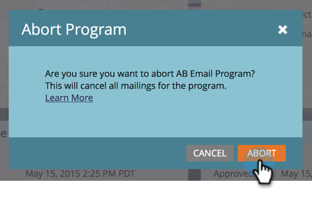

# 이메일 프로그램 중단 {#abort-email-program}

죄송합니다! 브레이크를 밟아요! 이 이메일 프로그램은 나가지 않아야 합니다.

>[!NOTE]
>
>이 문서는 이메일을 보내기 전에 외부로 나가는 것을 방지하기 위한 것입니다. 보낸 이메일을 회수할 방법이 없습니다.

1. 전자 메일 프로그램에서 **[!UICONTROL Abort Program]**&#x200B;을(를) 클릭합니다.

   

1. 전체 확인을 위해 **[!UICONTROL Abort]**&#x200B;을(를) 클릭합니다.

   

1. 이 이메일 프로그램이 중단되었다는 경고 헤더가 표시됩니다.

   

   >[!CAUTION]
   >
   >이메일 프로그램이 중단되면 다시 예약할 수 없습니다.

휴! 그 값비싼 실수를 피할 수 있어서 기쁘지 않니?
