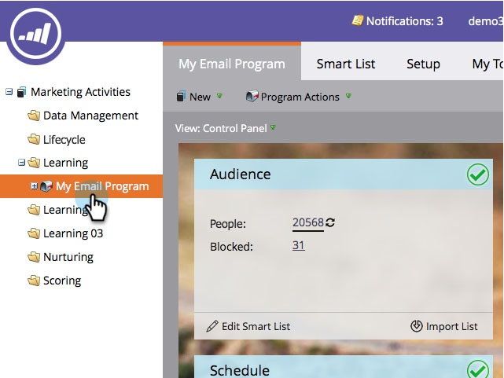

# 기존 이메일 {#choose-an-existing-email} 선택

>[!PREREQUISITES]
>
>* [이메일 프로그램 만들기](../../../../product-docs/email-marketing/email-programs/creating-an-email-program/create-an-email-program.md)
>* [Smart List를 사용하여 대상 ](../../../../product-docs/email-marketing/email-programs/managing-people-in-email-programs/define-an-audience-with-a-smart-list.md) 정의 또는 목록 [을 가져와 대상 정의](../../../../product-docs/email-marketing/email-programs/managing-people-in-email-programs/define-an-audience-by-importing-a-list.md)

>

[이(가) 이메일 프로그램](../../../../product-docs/email-marketing/email-programs/creating-an-email-program/create-an-email-program.md)을(를) 만들고 대상을 정의하면 어떤 이메일을 전송할지 결정해야 합니다. [이메일 프로그램](create-an-email-for-an-email-program.md)에 대한 이메일을 처음부터 만들거나 이미 존재하는 이메일을 선택할 수 있습니다. 이미 존재하는 것을 선택하는 방법은 다음과 같습니다.

1. **마케팅 활동**&#x200B;으로 이동합니다.

   

1. 이메일 프로그램을 찾아 선택합니다.

   

1. **이메일** 타일 아래에서 보낼 이메일을 선택합니다.

   &#39; 

   &#39;

   >[!NOTE]
   >
   >로컬 이메일만 선택할 수 있습니다. 하나의 프로그램에서 다른 프로그램으로 이메일을 이동해야 합니까? [여기에서](move-an-email.md) 자세히 알아보십시오.

   달콤해!   

이제 보낼 이메일을 결정했으므로 A/B 테스트를 설정하거나 건너뛰고 이메일 프로그램을 예약할 수 있습니다.

>[!MORELIKETHIS]
>
>* [A/B 테스트 추가](email-test-a-b-test/add-an-a-b-test.md)
>* [이메일 프로그램 예약](schedule-your-email-program.md)

>

