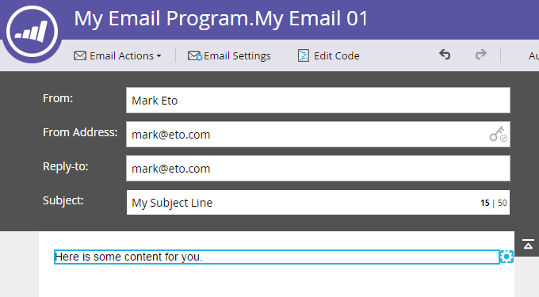

# 이메일 프로그램 {#create-an-email-for-an-email-program}에 대한 이메일 만들기

>[!PREREQUISITES]
>
>* [이메일 프로그램 만들기](/help/marketo/product-docs/email-marketing/email-programs/creating-an-email-program/create-an-email-program.md)
>* [Smart List를 사용하여 대상 ](/help/marketo/product-docs/email-marketing/email-programs/managing-people-in-email-programs/define-an-audience-with-a-smart-list.md) 정의 또는 목록 [을 가져와 대상 정의](/help/marketo/product-docs/email-marketing/email-programs/managing-people-in-email-programs/define-an-audience-by-importing-a-list.md)

이메일 프로그램을 만들고 고객을 정의하면 어떤 이메일을 전송할지 결정해야 합니다. [기존 이메일](/help/marketo/product-docs/email-marketing/email-programs/email-program-actions/choose-an-existing-email.md)을 선택하거나 이메일을 처음부터 만들 수 있습니다. 새 이메일을 만드는 방법은 다음과 같습니다.

1. **마케팅 활동**&#x200B;으로 이동합니다.

   

1. 이메일 프로그램을 선택합니다. **이메일** 타일에서 **새 이메일**&#x200B;을 클릭합니다.

   

1. **이름**&#x200B;을 입력하고 원하는 템플릿을 선택하고 **만들기**&#x200B;를 클릭합니다.

   

1. 원하는 모든 변경 작업을 수행하고 편집기를 닫습니다.

   

   >[!NOTE]
   >
   >[이메일](/help/marketo/product-docs/email-marketing/general/email-editor-2/edit-elements-in-an-email.md)에서 요소를 편집하는 방법을 알아봅니다.

1. 이메일 승인을 잊지 마십시오.

   

좋아요! 보내려는 전자 메일을 만들었으므로 이제 [A/B 테스트](/help/marketo/product-docs/email-marketing/email-programs/email-program-actions/email-test-a-b-test/add-an-a-b-test.md)를 추가하거나 [이메일 프로그램](/help/marketo/product-docs/email-marketing/email-programs/email-program-actions/schedule-your-email-program.md)을(를) 예약하는 즉시 건너뛰어 보겠습니다.
