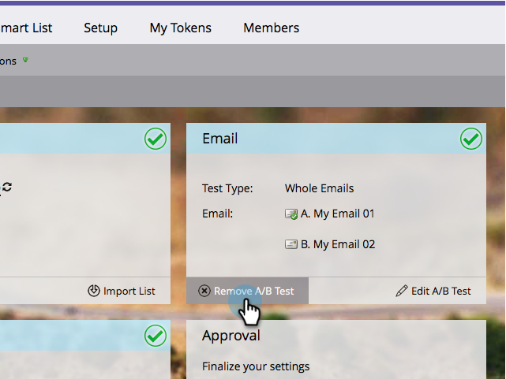

# A/B 테스트 {#cancel-the-a-b-test} 취소

이메일 프로그램에 [A/B 테스트](/help/marketo/product-docs/email-marketing/email-programs/email-program-actions/email-test-a-b-test/add-an-a-b-test.md)를 추가했으나 더 이상 원하지 않기로 결정했다면 손쉽게 실행 취소할 수 있습니다. 방법

1. **마케팅 활동**&#x200B;으로 이동합니다.

   

1. 이메일 프로그램을 선택합니다.

   

1. **이메일** 타일에서 **A/B 테스트 제거**&#x200B;를 클릭합니다.

   

   >[!NOTE]
   >
   >A/B 테스트를 제거하려면 먼저 이메일 프로그램의 승인을 취소해야 합니다. 자세한 내용은 [이메일 프로그램 승인/승인 취소](/help/marketo/product-docs/email-marketing/email-programs/email-program-actions/approve-unapprove-an-email-program.md)를 참조하십시오.

쉬운 사람!
