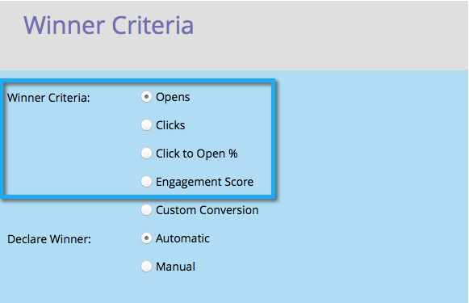

# A/B 테스트 우승자 기준 정의 {#define-the-a-b-test-winner-criteria}

이메일 프로그램에 [A/B 테스트를](add-an-a-b-test.md) 추가할 때 테스트 유형을 선택하고 A/B 테스트를 [예약한 다음 우승자 기준을 정의해야](schedule-the-a-b-test.md)합니다. 성공적인 이메일 마케팅을 위한 방법

>[!PREREQUISITES]
>
>* [A/B 테스트 추가](add-an-a-b-test.md)

>

## 우승자 기준 {#winner-criteria}

1. 기본 **우승자 기준** 옵션이 먼저 나열됩니다.

   

   | **열기** | 이미지가 이메일에 다운로드되면 열린 상태로 등록됩니다. 이미지를 포함하지 않더라도 기본적으로 모든 HTML 이메일에 단일 추적 픽셀을 삽입합니다. |
   |---|---|
   | **클릭 수** | 기본적으로 이메일에 포함된 링크는 어느 링크를 클릭했는지, 클릭된 총 링크 수 등을 확인할 수 있도록 포함된 추적을 포함하고 있습니다. |
   | **클릭하여 % 열기** | 이메일에서 열었으며 링크를 클릭한 이메일의 비율입니다. 이 값은 고유한 클릭 수를 고유 열기 횟수로 나눈 다음 100을 곱하여 이메일의 관련성 및 컨텍스트를 측정합니다. |
   | **참여 점수** | 참여 점수  는 컨텐츠의 효과를 결정하는 데 도움이 됩니다. |

   >[!TIP]
   >
   >관여 점수를 선택하는 경우 최소 24시간 동안 테스트를 실행해야 합니다. 참여 점수 [이해에 대한 자세한 내용을 살펴보십시오](../../../../../product-docs/email-marketing/drip-nurturing/reports-and-notifications/understanding-the-engagement-score.md).

   사용자 지정 변환을 선택하고 편집을 클릭하여 기준을 사용자 정의할 수도 있습니다.
   

   >[!NOTE]
   >
   >사용자 지정 전환을 사용하면 트리거와 필터를 사용하여 모든 이벤트를 전환으로 선택할 수 있습니다.

   창문이 터진다. 원하는 트리거를 찾아 캔버스로 드래그합니다.
   

   >[!NOTE]
   >
   >**딥 다이브**
   >
   >
   >스마트 목록 및 [정적 목록에 대해 자세히 알아보십시오](http://docs.marketo.com/display/docs/smart+lists+and+static+lists).

   트리거를 정의합니다.
   

   >[!NOTE]
   >
   >Marketing will only allow triggers for people who have been sent from this email program. &quot;보낸 이메일&quot; 필터를 추가할 필요가 없습니다.

   닫기를 클릭합니다.
   

   좋아요! 이제 승자가 어떻게 결정되는지를 결정할 차례입니다.

## 우승자 선언 {#declare-winner}

1. 사용 가능한 두 옵션 중 하나를 선택합니다.

   

   >[!NOTE]
   >
   >**미리 알림**
   >
   >
   >날짜/ **시간** A/B 테스트를 수행하는 경우 **수동만 선택할 수 있습니다**.

   A/B 테스트가 완료되면 Marketing에서 예약된 시간에 우승 이메일을 자동으로 보내거나 결과를 검토하고 이메일 발송을 결정할 수 있습니다.

1. 자동은 굉장하며 기본 옵션입니다. 다음을 **클릭하면 됩니다**.

   

   >[!TIP]
   >
   >[ **수동** ]을 선택하면 테스트가 전송되고 우승자를 선언할 때까지 기다립니다. 결과를 보고받게 됩니다.

   [A/B 테스트 예약](schedule-the-a-b-test.md)

완벽해! 자.