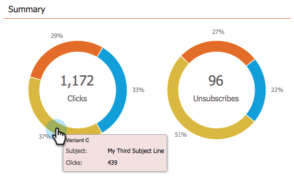

# 이메일 프로그램 대시보드 - A/B 테스트 보기 사용 {#use-the-email-program-dashboard-a-b-test-view}

이 대시보드에서 [이메일 프로그램 A/B 테스트](http://docs.marketo.com/pages/viewpage.action?pageid=2359480) 성과를 확인하십시오.

## 테스트 보내기 {#send-test}

여기에서 배달된 총 수와 변형별 분류를 확인할 수 있습니다.

## 클릭 수 {#clicks}

각 변형이 몇 번 클릭하는지 확인할 수 있습니다.

## 클릭하여 열기 {#click-to-open}

이 차트에는 클릭대 열림 비율이 표시됩니다. (#clicks / #opens).

## 요약 {#summary}

간단한 비교를 위해 클릭 수와 변형별 가입 해지 분류를 확인할 수 있습니다.

멋진 대시보드라고 생각하지?

>[!MORELIKETHIS]
>
>* [이메일 프로그램 대시보드 사용](../../../../../product-docs/email-marketing/email-programs/email-program-data/use-the-email-program-dashboard.md)

>

