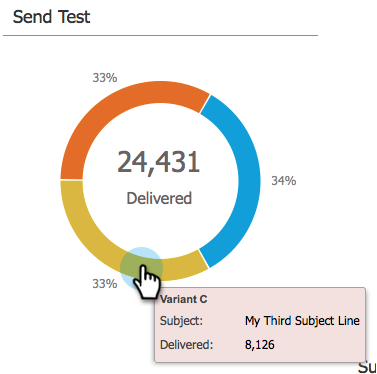

# 이메일 프로그램 대시보드 - A/B 테스트 보기 사용 {#use-the-email-program-dashboard-a-b-test-view}

사용 방법 확인 [이메일 프로그램 A/B 테스트](/help/marketo/product-docs/email-marketing/email-programs/email-program-actions/email-test-a-b-test/add-an-a-b-test.md) 이 대시보드를 사용하여 을 수행하고 있습니다.

## 테스트 보내기 {#send-test}

여기에서 전달된 총 수와 변형별 분류를 볼 수 있습니다.

## 클릭 수 {#clicks}

여기에서 각 변형이 갖는 클릭 수를 확인할 수 있습니다.

## 클릭하여 열기 {#click-to-open}

이 차트는 클릭대 오픈율을 보여줍니다. (# 클릭 / # 열기 ).

## 요약 {#summary}

쉽게 비교할 수 있도록 클릭과 변형별 가입 해지됨 분류를 확인할 수 있습니다.

멋진 대시보드라고 생각하지 않아?

>[!MORELIKETHIS]
>
>[이메일 프로그램 대시보드 사용](/help/marketo/product-docs/email-marketing/email-programs/email-program-data/use-the-email-program-dashboard.md)
