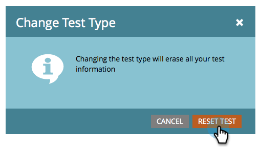

# &quot;전체 이메일&quot; A/B 테스트 사용 {#use-whole-email-a-b-testing}

이메일을 A/B로 손쉽게 테스트할 수 있습니다. 하나의 훌륭한 테스트는 **전체 이메일** 테스트입니다. 설정 방법

>[!PREREQUISITES]
>
>* [A/B 테스트 추가](add-an-a-b-test.md)

>

1. 이메일 타일에서 이메일이 선택된 상태로 A/B 테스트 추가를 클릭합니다.

&#39; 

&#39;

1. 새 창이 열립니다. **테스트 유형** 드롭다운을 클릭하고 **전체 이메일**&#x200B;을 선택합니다.

   

1. 이전 테스트 정보(예: 대상 테스트)가 있는 경우 **테스트 재설정**&#x200B;을 안전하게 클릭할 수 있습니다.

   

1. 첫 번째 이메일을 선택합니다.

   

1. **추가**&#x200B;를 클릭하여 이메일을 적용합니다.

   &#39; 

   &#39;

   >[!TIP]
   >
   >여러 개의 이메일을 추가할 수 있습니다. 그러나 너무 많이 추가하면 테스트 프로세스가 훨씬 느려질 수 있습니다.

1. 두 번째 이메일을 선택합니다.

   &#39; 

   &#39;

1. **추가**&#x200B;를 클릭하여 두 번째 이메일을 적용합니다. 슬라이더를 드래그하여 A/B 테스트를 받을 대상의 백분율을 선택하고 **다음**&#x200B;을 클릭합니다.

   &#39; 

   &#39;

   >[!NOTE]
   >
   >다른 변형이 선택한 **테스트 샘플 크기**&#x200B;의 동일한 부분으로 전송됩니다.

   >[!CAUTION]
   >
   >**샘플 크기를 100%로 설정하지 않는 것이 좋습니다**. 정적 목록을 사용하는 경우 샘플 크기를 100%로 설정하면 모든 참가자에게 이메일이 전송되고 우승자는 아무도 수신하지 않습니다. **스마트** 목록을 사용하는 경우 샘플 크기를 100%로 설정하면 해당 시간에 모든 사용자에게 이메일이 전송됩니다. *이메일 프로그램이 나중에 다시 실행되면 스마트 목록에 자격이 되는 모든 새로운 사람도 대상에 포함되기 때문에 이메일을 받게 됩니다.

   이제 거의 다 왔어 이제 [A/B 테스트 우승자 기준](define-the-a-b-test-winner-criteria.md)을 정의해야 합니다.

   >[!MORELIKETHIS]
   >
   >
   >    
   >    
   >    * [A/B 테스트 우승자 기준 정의](define-the-a-b-test-winner-criteria.md)

