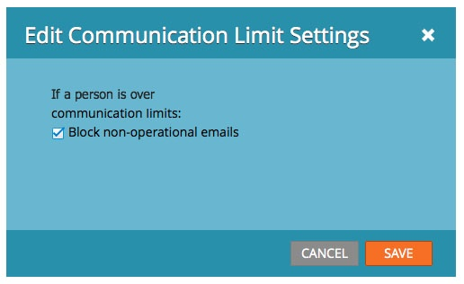

# 이메일 프로그램의 통신 제한 활성화/비활성화 {#enable-disable-communication-limits-in-an-email-program}

전자 메일 프로그램을 실행할 때 [관리자 수준의 통신 제한](/help/marketo/product-docs/administration/email-setup/enable-communication-limits.md)을 무시하거나 준수하도록 선택할 수 있습니다. 방법은 다음과 같습니다.

>[!NOTE]
>
>통신 제한은 [관리 섹션](/help/marketo/product-docs/administration/email-setup/enable-communication-limits.md)에 설정되어 있으므로 한 사람에게 너무 많은 전자 메일을 보내지 않도록 합니다.

1. **[!UICONTROL Marketing Activities]**(으)로 이동합니다.

   

1. 이메일 프로그램을 찾아 선택합니다.

   

1. **[!UICONTROL Setup]** 탭에서 통신 제한 줄 항목을 두 번 클릭합니다.

   

1. 통신 제한에 도달하면 기본적으로 작동하지 않는 전자 메일은 차단되지만 사용하지 않으려면 확인란의 선택을 취소하고 **[!UICONTROL Save]**&#x200B;을(를) 클릭합니다.

   

   **[!UICONTROL Block non-operational emails]**&#x200B;을(를) 선택된 상태로 두면 관리자 설정에서 허용하는 것보다 더 많은 전자 메일을 받은 사람에게 전자 메일을 보내지 못합니다.
