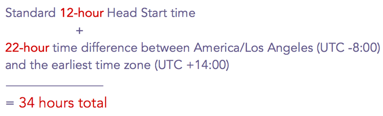

# 이메일 프로그램 {#head-start-for-email-programs} 헤드 시작

>[!PREREQUISITES]
>
>* [이메일 프로그램 만들기](../../../../product-docs/email-marketing/email-programs/creating-an-email-program/create-an-email-program.md)

>

이메일 프로그램의 날짜/시간을 선택하면 프로그램이 처리를 시작할 시기를 결정합니다. 선택한 시간에 이메일이 실행되도록 하려면 [헤드 시작]을 선택하면 프로그램을 미리 처리하여 해당 옵션이 제공됩니다.

## 표준 헤드 시작 {#standard-head-start}

1. **마케팅 활동**&#x200B;을 클릭합니다.

   

1. 이메일 프로그램을 찾아 선택합니다.

   

   >[!NOTE]
   >
   >A/B 테스트에는 헤드 시작을 사용할 수 없습니다.

1. 예약 타일에서 이메일을 예약한 다음 **헤드 시작** 상자를 선택합니다.

   

   [헤드 시작]을 선택하면 프로그램이 예약된 시간 약 12시간 전에 처리를 시작합니다. 처리가 시작되면 프로그램이 잠깁니다.

   >[!CAUTION]
   >
   >프로그램 잠금을 해제한 후 구독하지 않는 모든 사용자가 여전히 이메일을 수신하게 됩니다. 가입이 처리되지 않는 데 영업일 기준 1-2일이 걸릴 수 있음을 반영하도록 가입 해제 알림을 조정하는 것이 좋습니다.

1. **프로그램 승인**&#x200B;을 클릭합니다.

   

   프로그램 승인 후 승인 타일에 표시되는 4개의 다른 상태가 있습니다.

   * **실행 대기 중:** 프로그램이 승인되면.
   * **처리가 시작되어 실행 대기 중:** 처리가 진행 중입니다.
   * **처리가 완료됨, 실행 대기 중:** 처리가 완료되었으며, 예정된 시작 시간을 기다리고 있습니다.
   * **완료:** 프로그램이 완료되었습니다.

   >[!TIP]
   >
   >프로그램이 잠긴 후 이메일이 전송되기 전에 취소하시겠습니까? 문제 없어! 승인 타일의 오른쪽 아래에 있는 **프로그램 중단**&#x200B;을 클릭하면 됩니다.

   >[!NOTE]
   >
   >예약된 실행 시간 12시간 이전에 12시간 이내에 이메일 프로그램을 승인하지 않고 마음이 바뀌면 승인하기 12시간 전에 새로 날짜/시간을 선택해야 합니다.

## 받는 사람 표준 시간대 {#head-start-with-recipient-time-zone}로 시작 시작

기존의 헤드 시작 기능을 사용하려면 프로그램을 최소 12시간 전에 예약해야 합니다. 수신자 시간대에는 어떤 의미가 있습니까? 수신자 시간대가 활성화되면 가장 이른 시간대의 자정에 이메일 프로그램을 실행합니다(UTC +14:00). 따라서 **헤드 시작 및 수신자 시간대를 모두 활성화하려면, 프로그램은 가장 이른 시간보다 최소 12시간 전에**&#x200B;프로그램을 예약해야 합니다(UTC +14:00 **).**

즉, 미국/로스앤젤레스에 있으면서 헤드 시작 및 수신자 표준 시간대를 모두 활성화하려면 프로그램 **34시간**&#x200B;을 미리 예약해야 합니다. 어떻게 이 번호로 가셨어요?

[수신자 ](scheduling-with-recipient-time-zone/schedule-email-programs-with-recipient-time-zone.md) 시간대로 이메일 프로그램을 예약하는 방법에 대해 자세히 알아보십시오.

>[!MORELIKETHIS]
>
>* [이메일 프로그램 예약](schedule-your-email-program.md)
>* [받는 사람 시간대로 이메일 프로그램 예약](scheduling-with-recipient-time-zone/schedule-email-programs-with-recipient-time-zone.md)
>* [수신자 시간대 이해](scheduling-with-recipient-time-zone/understanding-recipient-time-zone.md)

>

