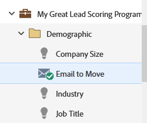

# 이메일 이동 {#move-an-email}

한 프로그램에서 다른 프로그램으로 이메일을 이동해야 합니까? 방법은 다음과 같습니다.

1. **[!UICONTROL Marketing Activities]**(으)로 이동합니다.

   

1. 이동할 전자 메일을 찾아 마우스 오른쪽 단추로 클릭한 다음 **[!UICONTROL Move]**&#x200B;을(를) 선택합니다.

   

1. **[!UICONTROL Destination]**, **[!UICONTROL Program]** 및 선택적 **[!UICONTROL Folder]**&#x200B;을(를) 선택하십시오. **[!UICONTROL Move]**&#x200B;를 선택합니다.

   

   >[!NOTE]
   >
   >이 예제에서는 전자 메일을 다른 프로그램으로 이동하지만 전자 메일을 [!UICONTROL Design Studio]의 폴더로 이동할 수도 있습니다.

   이제 이메일이 다른 프로그램에 있는 것을 볼 수 있습니다.

   

   >[!NOTE]
   >
   >이메일을 트리 내의 새 대상으로 간단히 드래그 앤 드롭할 수도 있습니다.
