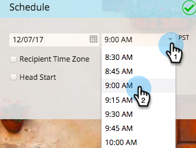

# 이메일 프로그램 예약 {#schedule-your-email-program}

>[!NOTE]
>
>**사전 요구 사항**
>
>* [이메일 프로그램 만들기](../../../../product-docs/email-marketing/email-programs/creating-an-email-program/create-an-email-program.md)
>* [스마트 목록으로 대상 정의](../../../../product-docs/email-marketing/email-programs/managing-people-in-email-programs/define-an-audience-with-a-smart-list.md) 또는 목록 [을 가져와서 대상 정의](../../../../product-docs/email-marketing/email-programs/managing-people-in-email-programs/define-an-audience-by-importing-a-list.md)

   >
   >
* [기존 이메일](choose-an-existing-email.md) 선택 [또는 이메일 프로그램용 이메일 만들기](create-an-email-for-an-email-program.md)

>

이메일 프로그램을 만들고, 대상을 정의하고, 이메일을 선택하면 프로그램에서 이메일을 보낼 *시기를* 알려 드립니다. 방법

1. 마케팅 활동 **으로 이동합니다**.

   

1. 이메일 프로그램을 선택합니다.

   

1. 예약 **타일** 아래에서 날짜를 설정합니다.

   

1. 그리고 시간

   

1. 수신자 [시간대](scheduling-with-recipient-time-zone/schedule-email-programs-with-recipient-time-zone.md) 및/또는 [헤드 시작 기능을 사용할 수도](head-start-for-email-programs.md) 있습니다.

   

   얼마나 쉬웠죠? 이메일 프로그램을 [승인하기만 하면](approve-unapprove-an-email-program.md) 됩니다.

>[!NOTE]
>
>**관련 문서**
>
>* [받는 사람 시간대에서 이메일 프로그램 예약](scheduling-with-recipient-time-zone/schedule-email-programs-with-recipient-time-zone.md)
>* [이메일 프로그램 시작](head-start-for-email-programs.md)
>* [이메일 프로그램 승인/승인 취소](approve-unapprove-an-email-program.md)

>

