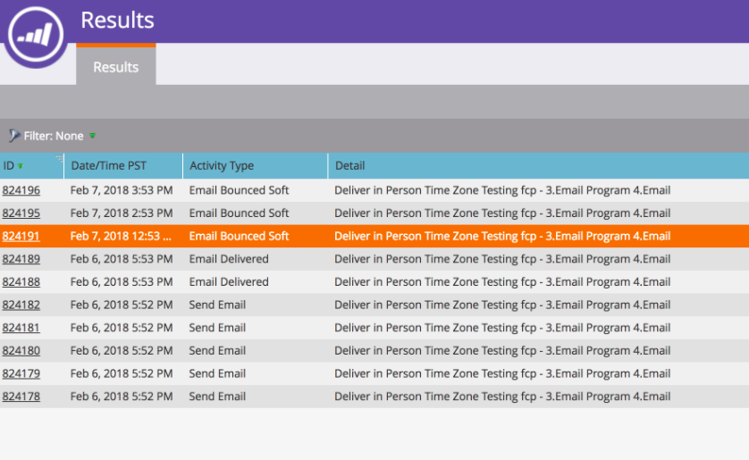

# 받는 사람 시간대로 예약된 이메일 프로그램 배달 중단 {#abort-delivery-of-email-programs-scheduled-with-recipient-time-zone}

긴급한 경우, 수신자 시간대가 활성화된 상태에서 이미 실행 중인 이메일 프로그램 배달을 중단할 수 있습니다.

받는 사람 시간대와 함께 예약된 이메일 프로그램은 최대 24시간 동안 실행할 수 있으므로 프로그램 배달을 중단하면 해당 시점부터 이후의 모든 전송이 취소됩니다.

1. 취소할 이메일 프로그램을 선택한 다음 제어판의 **승인 타일 아래에 있는 배달** 중단을 클릭합니다.

   

1. 중단을 클릭하여 배달을 취소할지 **확인합니다**.

   

1. 취소되면 이메일 프로그램의 **결과** 그리드가 아래 것과 같이 표시됩니다. 후속 전송이 모두 취소되고 **활동 유형** 열에 &quot;이메일 바운스된 소프트&quot;으로 표시됩니다.

   

   >[!NOTE]
   >
   >취소된 이메일은 원래 해당 시간대에서 배달되도록 예약된 **시간까지** 소프트 바운스로 표시되지 *않습니다* . 이 시점까지 &quot;이메일 보내기&quot;로 표시됩니다.

1. 그리드에서 이메일을 클릭하면 활동 세부 사항을 볼 수 있습니다. 취소된 전송의 경우 세부 사항 팝업은 다음과 같습니다.

   

>[!MORELIKETHIS]
>
>* [수신자 시간대 이해](understanding-recipient-time-zone.md)
>* [받는 사람 시간대에서 이메일 프로그램 예약](schedule-email-programs-with-recipient-time-zone.md)

>

