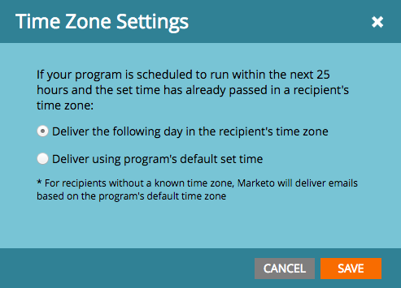

# 받는 사람 시간대가 {#schedule-email-programs-with-recipient-time-zone}인 이메일 프로그램 예약

수신자 시간대가 활성화된 상태에서 이메일 프로그램을 예약할 때 다음과 같은 2가지 가능한 시나리오가 있습니다.

1. 다음 25시간 내에 **을(를) 실행하도록 프로그램을 예약합니다.**
1. 프로그램을 25시간 이상(즉, 다음 주) **더 많은**&#x200B;을 실행하도록 예약합니다.

## 시나리오 1:25시간 이내 {#scenario-within-hours}

수신자 시간대가 활성화된 이메일 프로그램과 다음 25시간 내에 예약된 배달 시간을 승인한다고 가정합니다. 예약된 시간이 이미 경과한 시간대에 사는 스마트한 목록에 있는 사람을 둘 수 있습니다.

이러한 시나리오에서 우리는 이 자격 있는 사람들의 하위 집합으로 무엇을 할 것인지 결정하도록 허용합니다. 이메일 프로그램의 **일정** 타일에서 **수신자 시간대** 옆에 있는 톱니바퀴 아이콘을 클릭합니다.

다음과 같은 두 가지 옵션이 제공됩니다.

>[!NOTE]
>
>**정의**
>
>* **받는 사람의 표준 시간대로 다음 날을 제공합니다**.이메일이 화요일 오전 9시에 발송될 예정이면, 예약된 시간이 이미 경과한 시간대에 사는 자격이 있는 사람들이 수요일 오전 9시에  ** 이메일을 받게 될 것이다.
   >
   >
* **프로그램의 기본 설정 시간을 사용하여 제공**:이메일이 화요일 오전 9시에 발송될 예정인 경우, 예약된 시간이 이미 경과한 시간대에 사는 자격이 있는 사람은 사용자의 구독 시간대 설정을  *기준으로 이메일을 받게 됩니다*. 따라서 [s](../../../../../product-docs/administration/settings/select-your-language-locale-and-time-zone.md)[구독 시간대 설정](../../../../../product-docs/administration/settings/set-default-location-settings-for-a-subscription.md)이(가) PDT 미국/LA로 설정되어 있는 경우 이러한 수신자는 화요일 오전 9시(고유 시간대가 될 수 있는 시간)에도 여전히 이메일을 수신하게 됩니다.

>

>[!NOTE]
>
>[Marketing에서 받는 사람의 시간대를 계산하는 방법에 ](https://docs.marketo.com/display/DOCS/Understanding+Recipient+Time+Zone#UnderstandingRecipientTimeZone-CalculatingTimeZone) 대해 자세히 알아봅니다.

이 시나리오를 더 자세히 살펴보죠. 샌프란시스코를 방문 중인 경우 오전 7시에 **9:00am** 전송을 위해 이메일을 예약합니다. 스마트 목록에는 다음 지역의 사용자가 있습니다.

* 샌프란시스코
* 텍사스
* 뉴욕
* 이탈리아

9:00am은 이미 뉴욕과 이탈리아에 전달되었으므로 이 두 시간대의 자격 있는 사람은 **시간대 설정**&#x200B;을 기준으로 이메일을 받게 됩니다.

* **받는 사람의 시간대로 다음 날 제공:** 수요일 오전 9시(해당 시간대,  **OR)**

* **프로그램의 기본 설정 시간을 사용하여 제공**:화요일 오전 9시 0분 PDT(뉴욕 - 오후 12시 0분 EDT 및 이탈리아 - 오후 6시 00분 CET)에서.

프로그램을 승인하면 15분 이내에 실행을 시작합니다.

>[!NOTE]
>
>15분 후에 프로그램에서 이메일을 보내는 *프로세스*&#x200B;를 시작하지만, 이메일은 *배달된*&#x200B;이 아닙니다. 받는 사람은 선택한 **시간대 설정**&#x200B;을 기반으로 여전히 이메일을 수신하게 됩니다.

## 시나리오 2:25시간 초과 {#scenario-more-than-hours}

이 두 번째 시나리오에서는 **수신자 표준 시간대**&#x200B;가 활성화된 이메일 프로그램과 25시간 이상의 예약된 배달 시간을 승인할 수 있습니다. 이 경우 프로그램은 **가장 이른** 시간대(UTC + 14:00)에서 예약된 시간에 실행됩니다. 전 세계 모든 시간대에서 스마트 목록에 해당하는 사람이 있을 수 있으므로 가장 이른 시간대를 시작으로 각 시간대에 있는 모든 수신자에게 예약된 날짜/시간에 이메일을 전달할 수 있습니다.

헤드 시작

이제 [헤드 시작](../../../../../product-docs/email-marketing/email-programs/email-program-actions/head-start-for-email-programs.md)이 **수신자 시간대**&#x200B;에서 어떻게 작동하는지 살펴보겠습니다. 기존의 헤드 시작 기능을 사용하려면 프로그램을 최소 12시간 전에 예약해야 합니다. 그러면 그것이 수신자 시간대를 의미하는 것은 무엇일까요? 수신자 시간대가 활성화되면, 가장 이른 시간대의 예약된 시간에 이메일 프로그램을 실행합니다(UTC +14:00). 따라서 **헤드 시작 및 수신자 시간대를 모두 활성화하려면 이메일 프로그램을 UTC +14:00의 예약 시간보다 최소 12시간 전에**&#x200B;예약해야 합니다.****

즉, 미국/로스앤젤레스에 있으면서 헤드 시작 및 수신자 표준 시간대를 모두 활성화하려면 프로그램 **34시간**&#x200B;을 미리 예약해야 합니다. 어떻게 이 번호로 가셨어요?

  

간단히 말해, 수신자 시간대와 함께 예약된 이메일 프로그램은 모든 시간대를 수용하기 위해 가장 이른 시간대의 예약된 시간(즉, 자정이 가장 먼저 도착한 시간)에 실행되어야 합니다. 이메일 프로그램을 예약하면...

* **25시간  *내* 의** 배달 시간으로 인해 프로그램은 15분 이내에 실행됩니다. 예약된 시간에 이미 합격한 수신자는 선택한 표준 시간대 설정을 기준으로 전자 메일을 받습니다.
* **배달 시간이  ** *25시간 이상* 으로** 지연되면, 프로그램은 가장 이른 시간대의 예약 시간에(UTC +14:00) 시작됩니다.
* **헤드 시작을 사용하여** 프로그램은 가장 이른 시간대의 예약 시간 12시간 전에 처리를 시작합니다(UTC +14:00).

>[!CAUTION]
>
>이메일 전송을 시작한 시간과 실제로 배달된 시간 사이에 구독을 취소하는 사람은 여전히 이메일을 수신하게 됩니다. 가입이 처리되지 않는 데 영업일 기준 1-2일이 걸릴 수 있음을 반영하도록 가입 해제 알림을 조정하는 것이 좋습니다.

>[!MORELIKETHIS]
>
>* [수신자 시간대 이해](understanding-recipient-time-zone.md)
>* [이메일 프로그램의 즉각적인 시작](../../../../../product-docs/email-marketing/email-programs/email-program-actions/head-start-for-email-programs.md)
>* [받는 사람 시간대로 예약된 이메일 프로그램 배달 중단](abort-delivery-of-email-programs-scheduled-with-recipient-time-zone.md)

>

