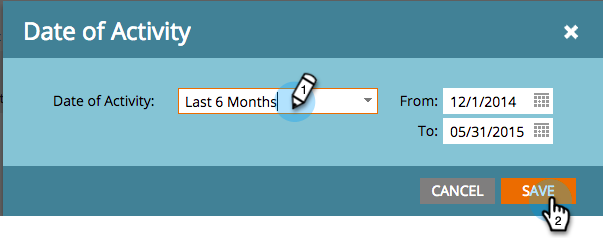

# 이메일 링크 성능 보고서 {#email-link-performance-report}

이메일 링크 성능 보고서를 작성하여 이메일의 링크가 얼마나 잘 작동하는지 확인합니다.

1. [프로그램에서 보고서를 만들고 ](../../../../product-docs/reporting/basic-reporting/creating-reports/create-a-report-in-a-program.md) 이메일 링크  **성능** 을 보고서 유형으로 선택합니다.

   

1. **설정**&#x200B;을 클릭합니다.

   

1. **설정**&#x200B;에서 **활동 날짜**&#x200B;를 두 번 클릭합니다.

   

1. 보고서에 적절한 기간을 설정합니다. ** 저장을 클릭합니다. **

   

1. **보고서**&#x200B;를 클릭합니다.

   

1. 좋아요! 이메일 링크 성능 보고서를 만들었습니다.

   

[이메일 ](../../../../product-docs/reporting/basic-reporting/editing-reports/select-report-columns.md) 링크 성능 보고서에 사용할 수 있는 열은 다음과 같습니다.

<table> 
 <thead> 
  <tr> 
   <th colspan="1" rowspan="1">열</th> 
   <th colspan="1" rowspan="1">설명</th> 
  </tr> 
 </thead> 
 <tbody> 
  <tr> 
   <td colspan="1" rowspan="1">링크</td> 
   <td colspan="1" rowspan="1">이메일 이름으로 그룹화됩니다. 해당 이메일에 포함된 모든 링크를 보려면 더하기(+)를 클릭합니다.</td> 
  </tr> 
  <tr> 
   <td colspan="1" rowspan="1">클릭 수</td> 
   <td colspan="1" rowspan="1">링크를 클릭한 횟수입니다.</td> 
  </tr> 
  <tr> 
   <td colspan="1" rowspan="1">클릭 %</td> 
   <td colspan="1" rowspan="1">해당 이메일의 모든 링크에 대한 총 클릭 수 중 이 링크에 대한 백분율입니다.</td> 
  </tr> 
  <tr> 
   <td colspan="1" rowspan="1">People</td> 
   <td colspan="1" rowspan="1">링크를 클릭한 고유한 사람의 수입니다.</td> 
  </tr> 
  <tr> 
   <td colspan="1" rowspan="1">사람 %</td> 
   <td colspan="1" rowspan="1">해당 이메일에서 링크를 클릭한 총 고유 사람 수(이 링크의 비율)입니다.</td> 
  </tr> 
 </tbody> 
</table>

>[!TIP]
>
>개인 사용자의 행동을 정확히 알려면 프로그램의 멤버 탭에서 [개인 세부 사항](../../../../product-docs/core-marketo-concepts/smart-lists-and-static-lists/managing-people-in-smart-lists/using-the-person-detail-page.md) 페이지에서 [활동 로그](../../../../product-docs/core-marketo-concepts/smart-lists-and-static-lists/managing-people-in-smart-lists/filter-activity-types-in-the-activity-log-of-a-person.md)를 열 수 있습니다.

>[!MORELIKETHIS]
>
>* [이메일 성능 보고서](email-performance-report.md)
>* [이메일 보고서의 자산 필터링](../../../../product-docs/reporting/basic-reporting/report-activity/filter-assets-in-an-email-report.md)

>

>[!NOTE]
>
>**자세히 알아보기**
>
>[기본 보고](http://docs.marketo.com/display/docs/basic+reporting)에 대해 자세히 알아보십시오.

