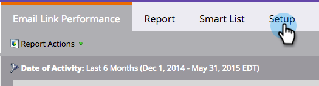

# 이메일 링크 성과 보고서 {#email-link-performance-report}

이메일 링크 성능 보고서를 만들어 이메일의 링크가 얼마나 잘 작동하는지 확인합니다.

1. [프로그램에서 보고서를 만들고](/help/marketo/product-docs/reporting/basic-reporting/creating-reports/create-a-report-in-a-program.md) 보고서 유형으로 **[!UICONTROL Email Link Performance]**&#x200B;을(를) 선택합니다.

   

1. **[!UICONTROL Setup]**&#x200B;을(를) 클릭합니다.

   

1. **[!UICONTROL Date of Activity]** 아래의 **[!UICONTROL Settings]**&#x200B;을(를) 두 번 클릭합니다.

   

1. 보고서에 적합한 시간대를 설정합니다. **[!UICONTROL Save]**&#x200B;을(를) 클릭합니다.

   

1. **[!UICONTROL Report]**&#x200B;을(를) 클릭합니다.

   

1. 잘됐네! 이제 이메일 링크 성능 보고서를 만들었습니다.

   

전자 메일 링크 성능 보고서에 사용할 수 있는 [열](/help/marketo/product-docs/reporting/basic-reporting/editing-reports/select-report-columns.md)은(는) 다음과 같습니다.

<table> 
 <thead> 
  <tr> 
   <th colspan="1" rowspan="1">[!UICONTROL Column]</th> 
   <th colspan="1" rowspan="1">설명</th> 
  </tr> 
 </thead> 
 <tbody> 
  <tr> 
   <td colspan="1" rowspan="1">[!UICONTROL Link]</td> 
   <td colspan="1" rowspan="1">이메일 이름별로 그룹화됩니다. 더하기(+)를 클릭하면 해당 전자 메일에 포함된 모든 링크를 볼 수 있습니다.</td> 
  </tr> 
  <tr> 
   <td colspan="1" rowspan="1">[!UICONTROL Clicks]</td> 
   <td colspan="1" rowspan="1">링크를 클릭한 횟수입니다.</td> 
  </tr> 
  <tr> 
   <td colspan="1" rowspan="1">% [!UICONTROL Clicks]</td> 
   <td colspan="1" rowspan="1">해당 이메일의 모든 링크에 대한 총 클릭 수 중, 이 링크에 대한 백분율입니다.</td> 
  </tr> 
  <tr> 
   <td colspan="1" rowspan="1">[!UICONTROL People]</td> 
   <td colspan="1" rowspan="1">링크를 클릭한 고유한 사람 수입니다.</td> 
  </tr> 
  <tr> 
   <td colspan="1" rowspan="1">% [!UICONTROL People]</td> 
   <td colspan="1" rowspan="1">해당 이메일에서 링크를 클릭한 총 고유 사용자 중 이 링크에 대한 비율.</td> 
  </tr> 
 </tbody> 
</table>

>[!NOTE]
>
>이메일에 유효하지 않거나 비어 있는 링크가 추가되면 이 보고서에 &quot;잘못된 링크&quot;가 표시됩니다. 이 메시지가 표시되면 전자 메일 편집기에서 [HTML 원본을 확인](/help/marketo/product-docs/email-marketing/general/functions-in-the-editor/edit-an-emails-html.md)하여 전체 링크를 채우지 않는 빈 링크나 토큰을 확인하세요.

>[!TIP]
>
>개별 사용자가 수행한 작업을 정확히 알고 싶다면 프로그램의 구성원 탭에서 [개인 정보](/help/marketo/product-docs/core-marketo-concepts/smart-lists-and-static-lists/managing-people-in-smart-lists/filter-activity-types-in-the-activity-log-of-a-person.md) 페이지의 [활동 로그](/help/marketo/product-docs/core-marketo-concepts/smart-lists-and-static-lists/managing-people-in-smart-lists/using-the-person-detail-page.md)를 열 수 있습니다.

>[!MORELIKETHIS]
>
>* [전자 메일 성능 보고서](/help/marketo/product-docs/email-marketing/email-programs/email-program-data/email-performance-report.md)
>* [전자 메일 보고서에서 Assets 필터링](/help/marketo/product-docs/reporting/basic-reporting/report-activity/filter-assets-in-an-email-report.md)
