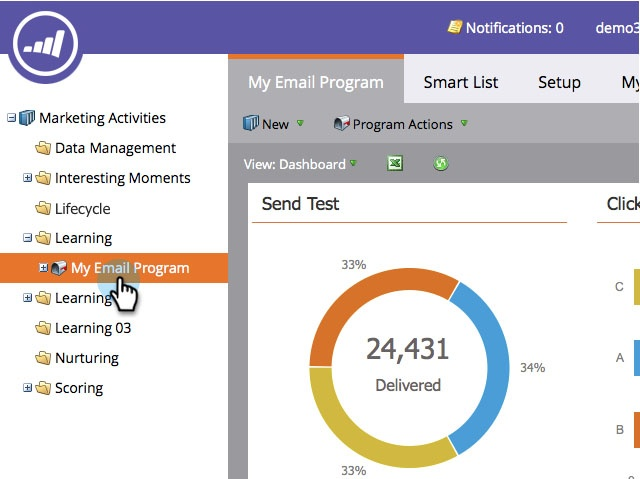

# 이메일 프로그램 대시보드를 Excel {#export-email-program-dashboard-to-excel}로 내보내기

이메일 프로그램을 실행하고 대시보드에 데이터가 있으면 추가 분석을 위해 해당 원시 데이터를 excel로 내보낼 수 있습니다. 방법

1. **마케팅 활동**&#x200B;으로 이동합니다.

   

1. 이메일 프로그램을 찾아 선택합니다.

   

   >[!NOTE]
   >
   >이메일 프로그램이 아직 시작되지 않은 경우 볼 데이터가 없으므로 대시보드가 표시되지 않습니다.

1. Excel 아이콘을 클릭하면 내보내기가 시작됩니다.

   

   아주 쉬운거지?
