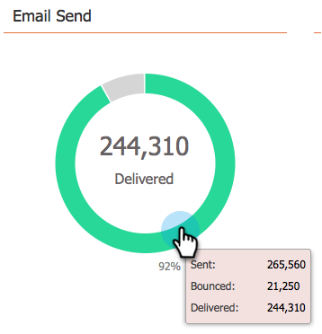

# 이메일 프로그램 대시보드 {#use-the-email-program-dashboard} 사용

이 대시보드 보기에서 이메일 프로그램의 성과를 확인합니다.

>[!NOTE]
>
>프로그램에 A/B 테스트가 있는 경우 [이메일 프로그램 대시보드 - A/B 테스트 보기](/help/marketo/product-docs/email-marketing/email-programs/email-program-actions/email-test-a-b-test/use-the-email-program-dashboard-a-b-test-view.md)를 확인하십시오.

>[!NOTE]
>
>이 보기의 모든 데이터는 집계(A/B 테스트와 최종 이메일 보내기 포함)입니다.

## 전자 메일 보내기 {#email-send}

보낸 이메일, 반송된 이메일 수를 확인할 수 있습니다.

>[!NOTE]
>
>Marketing의 제어 범위를 벗어나는 이메일 배달 가능성 표준으로 인해, 바운스된 수와 배달된 상태는 정확하지는 않지만 대략적으로 추정됩니다.

## {#opens-clicks} 열기/클릭

이 차트에는 이메일 프로그램을 실행한 후 특정 기간 동안 열리거나 클릭한 이메일의 수가 표시됩니다.

>[!TIP]
>
>시간이 지남에 따라 열기/클릭 수가 감소하는지 확인합니다.

## 요약 - 참여 {#summary-engagement}

전체 [참여 점수](/help/marketo/product-docs/email-marketing/drip-nurturing/reports-and-notifications/understanding-the-engagement-score.md)를 보여줍니다.

## 요약 - 나머지 {#summary-rest}

나머지 데이터에는 열기, 클릭 수, 클릭/열기 비율 및 가입 취소가 표시됩니다.

>[!TIP]
>
>위의 예에서 **가입 해지** 비율은 너무 작아서 Marketing에서 확대하여 좀 더 나은 모습을 볼 수 있습니다. 막대에 있는 두 번째 숫자는 단지 저울에 추가된다.

>[!NOTE]
>
>**정의**
>
>**이메일** 수신자가 이메일 이미지를 다운로드할 때 Marketing-to-inserted 추적 픽셀이 포함됩니다. 받는 사람이 이메일을 보고 이미지를 다운로드하지 않기로 선택하면 열린 이메일로 계산되지 않습니다. 받는 사람의 미리 보기 창에 이미지가 로드되는 경우 일반적으로 열려 있는 것으로 계산되지만 이메일 클라이언트에 따라 다릅니다.
>
>**[** 열기]를 클릭하면 이메일에서 열었으며 링크를 클릭했던 이메일의 백분율이 측정됩니다. 고유한 클릭 수를 고유 열기 수로 나눈 다음 100을 곱하여 백분율로 표시합니다.

## 대시보드 새로 고침 {#refresh-dashboard}

최신 데이터를 보려면 대시보드에서 새로 고침 아이콘을 클릭하면 됩니다.

>[!MORELIKETHIS]
>
>[이메일 프로그램 대시보드 - A/B 테스트 보기 사용](/help/marketo/product-docs/email-marketing/email-programs/email-program-actions/email-test-a-b-test/use-the-email-program-dashboard-a-b-test-view.md)
