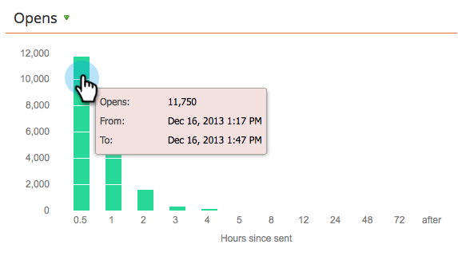

# 이메일 프로그램 대시보드 사용 {#use-the-email-program-dashboard}

이 대시보드 보기를 통해 [이메일](http://docs.marketo.com/display/docs/email+programs) 프로그램이 어떻게 수행되는지 확인하십시오.

>[!NOTE]
>
>프로그램에 A/B 테스트가 있는 경우 [이메일 프로그램 대시보드 - A/B 테스트 보기를 확인하십시오](../../../../product-docs/email-marketing/email-programs/email-program-actions/email-test-a-b-test/use-the-email-program-dashboard-a-b-test-view.md).

>[!NOTE]
>
>이 보기의 모든 데이터는 집계(A/B 테스트와 최종 이메일 보내기 포함)입니다.

## 이메일 보내기 {#email-send}

여기에서 얼마나 많은 이메일이 전송되고, 반송되고, 배달되었는지 확인할 수 있습니다.

>[!NOTE]
>
>Marketing의 통제 밖에 있는 이메일 전달 기준 때문에, 바운스된 통계 및 배달된 통계는 정확하지는 않지만 대략적인 수치입니다.

## 열기/클릭 {#opens-clicks}

이 차트는 이메일 프로그램이 실행된 후 특정 기간 동안 열리거나 클릭한 이메일 수를 보여줍니다.

>[!TIP]
>
>시간이 지남에 따라 열기/클릭 수가 감소하는지 확인하십시오.

## 요약 - 참여 {#summary-engagement}

전체 [참여 점수를 보여줍니다](../../../../product-docs/email-marketing/drip-nurturing/reports-and-notifications/understanding-the-engagement-score.md).

## 요약 - 나머지 {#summary-rest}

나머지 데이터에는 [열기], [클릭], [클릭/열기 비율] 및 [가입 취소]가 표시됩니다.

>[!TIP]
>
>위 예에서 **가입** 해지 비율은 매우 작아서 Marketing에서 확대한 후 자세히 확인할 수 있습니다. 막대에 있는 두 번째 숫자는 단지 저울에 더해진다.

>[!NOTE]
>
>**정의**
>
>**Opens **는 이메일 수신자가 이메일 이미지를 다운로드할 때 카운트되며 여기에는 마케터가 삽입한 추적 픽셀이 포함됩니다. 받는 사람이 이메일을 보고 이미지를 다운로드하지 않기로 선택하면 열린 것으로 계산되지 않습니다. 받는 사람의 미리 보기 창에 이미지가 로드되는 경우 일반적으로 열려 있는 것으로 계산되지만 이메일 클라이언트에 따라 달라집니다.
>
>**[열기** ]를 클릭하면 이메일에서 열었으며 링크를 클릭한 이메일이 백분율로 측정됩니다. 고유 클릭 수를 고유 열기 수로 나눈 다음 100을 곱하여 백분율로 표시합니다.

## 대시보드 새로 고침 {#refresh-dashboard}

최신 데이터를 보려면 대시보드에서 새로 고침 아이콘을 클릭하면 됩니다.

>[!MORELIKETHIS]
>
>* [이메일 프로그램 대시보드 - A/B 테스트 보기 사용](../../../../product-docs/email-marketing/email-programs/email-program-actions/email-test-a-b-test/use-the-email-program-dashboard-a-b-test-view.md)

>

