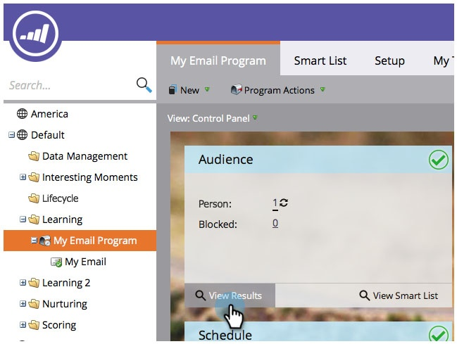

# 이메일 프로그램 결과 보기 {#view-email-program-results}

스마트 캠페인의 [!UICONTROL Results] 탭과 마찬가지로 전자 메일 프로그램에서도 동일한 정보를 볼 수 있습니다.

1. **[!UICONTROL Marketing Activities]** 으로 이동합니다.

   

1. 이메일 프로그램을 찾아 선택합니다.

   

   >[!NOTE]
   >
   >이메일 프로그램이 이미 실행된 경우 이메일 프로그램 대시보드로 바로 이동합니다.

1. **[!UICONTROL View]**&#x200B;에서 **[!UICONTROL Control Panel]**&#x200B;을(를) 선택합니다.

   

1. **[!UICONTROL Audience]** 타일 아래에서 **[!UICONTROL View Results]**&#x200B;을 클릭합니다.

   

   여기 있습니다!

   
