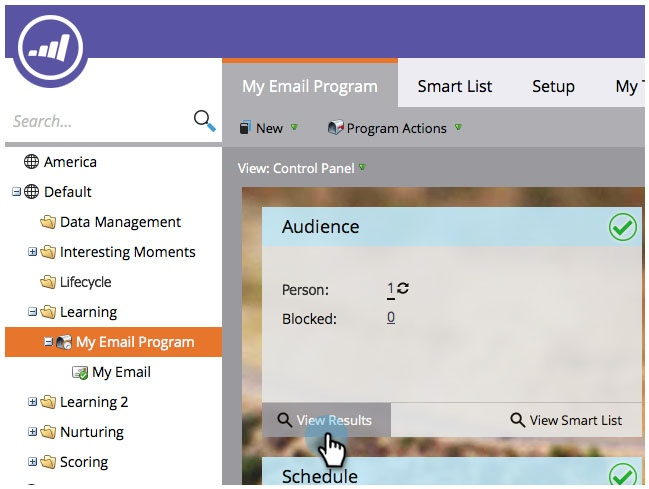

# 이메일 프로그램 결과 보기 {#view-email-program-results}

스마트 캠페인의 결과 탭과 마찬가지로 이메일 프로그램에서 동일한 정보를 볼 수 있습니다.

1. **마케팅 활동**&#x200B;으로 이동합니다.

   

1. 이메일 프로그램을 찾아 선택합니다.

   

   >[!NOTE]
   >
   >이메일 프로그램이 이미 실행된 경우 이메일 프로그램 대시보드로 바로 이동됩니다.

1. **보기**&#x200B;에서 **Campaign 컨트롤 패널**&#x200B;을 선택합니다.

   

1. **대상** 타일 아래에서 **결과 보기**&#x200B;를 클릭합니다.

   

   여기 있어요!

   

>[!NOTE]
>
>**자세히 알아보기**
>
>[이메일 프로그램](http://docs.marketo.com/display/docs/email+program+actions)에 대해 자세히 알고 싶으십니까?

