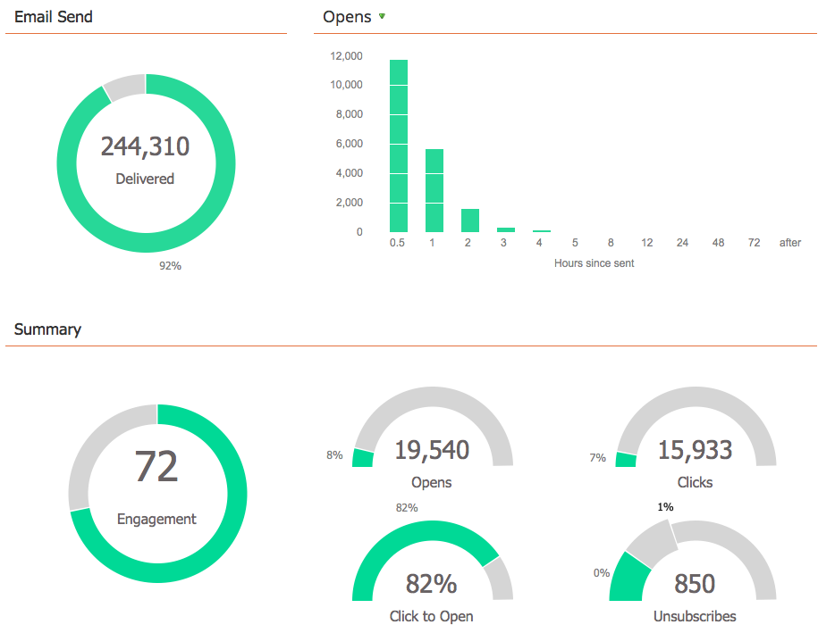

# 이메일 프로그램 대시보드 {#view-the-email-program-dashboard} 보기

A/B 테스트 유무와 상관없이 이메일 프로그램이 이 대시보드에서 어떻게 작동하는지 확인합니다.

## 이메일 프로그램 {#select-your-email-program} 선택

1. **마케팅 활동**&#x200B;으로 이동합니다.

   

1. 이메일 프로그램을 찾아 선택합니다.

   

   >[!CAUTION]
   >
   >A/B 테스트 또는 이메일 프로그램이 아직 시작되지 않은 경우 대시보드가 표시되지 않습니다.

## 이메일 프로그램 A/B 테스트 보기 {#email-program-a-b-test-view}

이메일 프로그램에 A/B 테스트를 추가했고 현재 테스트가 실행 중인 경우 다음을 볼 수 있습니다.

## 이메일 프로그램 보기 {#email-program-view}

또는 A/B 테스트 *또는*&#x200B;이(가) 테스트 종료되면 다음 내용이 표시됩니다.

>[!TIP]
>
>차트 위젯 위에 커서를 두면 원하는 대로 실험해 볼 수 있습니다. 추가 정보가 표시됩니다.

>[!MORELIKETHIS]
>
>* [이메일 프로그램 대시보드 - A/B 테스트 보기 사용](/help/marketo/product-docs/email-marketing/email-programs/email-program-actions/email-test-a-b-test/use-the-email-program-dashboard-a-b-test-view.md)
>* [이메일 프로그램 대시보드 사용](/help/marketo/product-docs/email-marketing/email-programs/email-program-data/use-the-email-program-dashboard.md)

