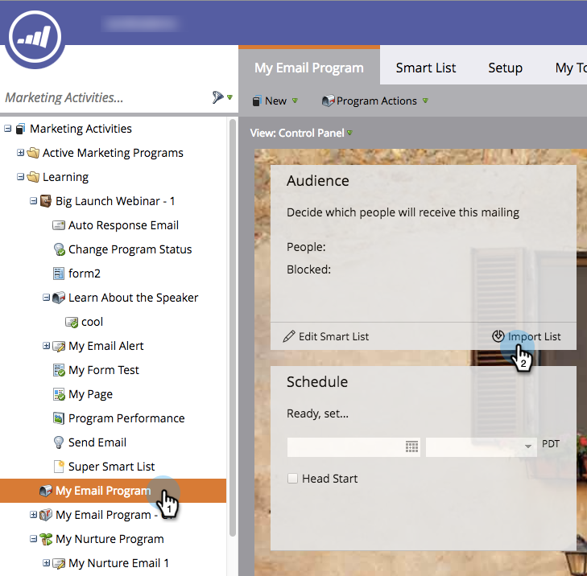
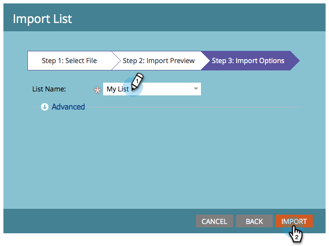

# 목록을 가져와서 대상 정의 {#define-an-audience-by-importing-a-list}

>[!PREREQUISITES]
>
>[이메일 프로그램용 이메일 만들기](/help/marketo/product-docs/email-marketing/email-programs/email-program-actions/create-an-email-for-an-email-program.md)

이메일 프로그램을 만들면 전자 메일을 보낼 사람을 알려주어야 합니다. 다음을 통해 이 작업을 수행할 수 있습니다. [스마트 목록 만들기](/help/marketo/product-docs/core-marketo-concepts/smart-lists-and-static-lists/creating-a-smart-list/create-a-smart-list.md) 또는 목록을 가져와서 목록을 가져와서 이를 수행하는 방법은 다음과 같습니다.

>[!NOTE]
>
>대상자 정의는 이메일 프로그램이 승인되지 않은 경우에만 작동합니다.
>
>가져오는 날짜/시간 필드는 모두 중부 시간으로 처리됩니다. 날짜/시간 필드가 다른 시간대에 있는 경우 Excel 공식을 사용하여 중부 표준시(미국/시카고)로 변환할 수 있습니다.

1. 이동 **마케팅 활동**.

   

1. 이메일 프로그램을 선택한 다음 대상 타일 아래의 목록 가져오기 를 클릭합니다.

   

1. 목록 가져오기 창이 열리면 을 클릭합니다. **찾아보기** 가져올 파일을 선택합니다. 사용자 목록을 선택하면 **다음**.

   

   >[!CAUTION]
   >
   >목록이 UTF-8, UTF-16, Shift-JIS 또는 EUC-JP로 인코딩되어 있고 파일 크기가 50MB를 초과하지 않는지 확인하십시오.

1. 파일의 필드가 올바르게 매핑되었는지 확인하고 를 클릭합니다 **다음**.

   

   >[!TIP]
   >
   >Marketo은 향후 가져오기에 대한 매핑을 기억하게 됩니다!

1. 을(를) 입력합니다. **이름** 목록을 보려면 **가져오기**.

   

1. 가져오기가 완료되면 기본 프로그램 탭으로 돌아갑니다. 당신은 얼마나 많은 사람들이 자격을 얻는지 볼 것입니다.

   

>[!NOTE]
>
>**정의**
>
>차단번호를 알고 계셨나요? 이 수는 자격이 있는 사람의 하위 집합이며 다음 사람이 아니므로 이 이메일을 보낼 수 없는 사람을 나타냅니다.
>
>* 주소 삭제
>* 마케팅 중단
>* 차단 목록에 추가된
>* 이메일이 잘못되었습니다.
>* 빈 이메일
>
>메일링 차단 대상자의 자세한 목록을 보려면 번호를 클릭하십시오.
>
>를 사용하십시오  단추 **Audience** 타일 을 통해 스마트 목록 기준에 따라 이메일을 받을 수 있는 자격이 있는 사람 수를 알아보십시오. 사람 번호에서 차단된 번호를 빼어 이메일을 받을 총 사람 수를 가져옵니다.

>[!TIP]
>
>목록 가져오기가 완료될 때까지 기다리지 않아도 됩니다. 원하신다면 계속 일을 하세요

환상적이에요! 이제 기존 이메일을 선택하거나 새 이메일을 만들어 이러한 사용자에게 보낼 차례입니다.

>[!MORELIKETHIS]
>
>* [기존 이메일 선택](/help/marketo/product-docs/email-marketing/email-programs/email-program-actions/choose-an-existing-email.md)
>* [이메일 프로그램용 이메일 만들기](/help/marketo/product-docs/email-marketing/email-programs/email-program-actions/create-an-email-for-an-email-program.md)

