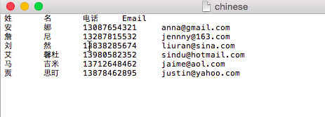

# 라틴 문자 목록 가져오기 {#import-a-non-latin-characters-list}

영어가 아닌 파일을 가져오려고 하십니까? Excel에서 목록을 열면 목록이 완벽해 보입니다.

그러나 Marketing To로 가져오면 영어가 아닌 문자가 올바르게 선택되지 않은 것을 볼 수 있습니다.

이것은 Marketing에서 라틴 문자 이외의 모든 문자를 인식할 수 있도록 파일이 제대로 저장되지 않기 때문입니다. 좋은 소식은, 그것을 고치기 위해 몇 가지 간단한 단계가 있다는 것이다.

1. **다른 이름으로 저장...을 선택합니다.Excel의**&#x200B;파일&#x200B;**메뉴에서**.

   

1. **형식** 옵션으로 **UTF-16 유니코드 텍스트(.txt)**&#x200B;을 선택합니다. 이렇게 하면 Marketing Cloud에서 파일을 표시하는 방식으로 파일이 인코딩됩니다.

   

   >[!NOTE]
   >
   >또한 Marketing은 UTF-8, Shift-JIS 또는 EUC-JP도 지원합니다.

1. Excel에서는 새 파일을 확장명이 .txt인 텍스트 파일로 저장합니다. 또한 파일에 있는 모든 쉼표를 탭으로 변환합니다. 다시 바꿔야 합니다.

   >[!TIP]
   >
   >Windows를 사용하는 경우 **메모장**&#x200B;을 사용하여 텍스트 파일을 열거나 Mac을 사용하는 경우 **TextEdit**&#x200B;을 사용할 수 있습니다.

   

1. 문서에서 탭을 선택하고 복사합니다.

   

1. **찾기 및 바꾸기...를 선택합니다.**&#x200B;편집&#x200B;**메뉴에서**.

   

   >[!TIP]
   >
   >Windows 사용자를 위한 동일한 작업은 다음과 같습니다.**편집 > 바꾸기...**

1. 4단계에서 복사한 탭을 첫 번째(바꿀 내용) 상자에 붙여 넣은 다음 두 번째(다음으로 바꾸기) 상자에 쉼표를 입력합니다. **모두**&#x200B;를 클릭합니다.

   

1. 그리고 Voila, 모든 쉼표가 돌아왔고 우리는 참여할 준비가 되었습니다.

   

1. 새 파일을 Marketing To로 가져오면, 이번에는 정보가 올바르게 표시됩니다.

   

   >[!NOTE]
   >
   >가져오는 모든 날짜/시간 필드는 중부 시간으로 처리됩니다. 날짜/시간 필드가 다른 시간대에 있는 경우 Excel 공식을 사용하여 중부 시간(미국/시카고)으로 변환할 수 있습니다.

이상하다는 건 알지만 효과가 있어요 가져오기 완료!
