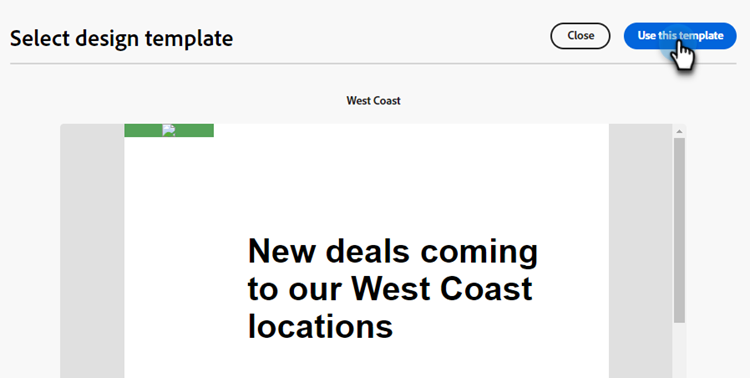
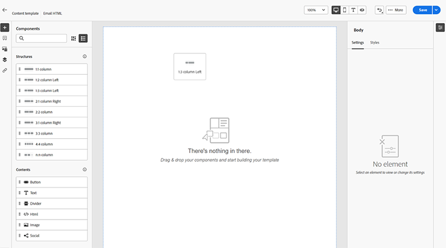

# 이메일 작성 {#email-authoring}

새로운 Marketo Engage 이메일 Designer에서 이메일을 만들고, 개인화하고, 미리 보는 방법에 대해 알아봅니다.

>[!IMPORTANT]
>
>이 문서는 새로운 Marketo Engage 이메일 Designer Beta 멤버만을 대상으로 합니다. 제발 유포하지 마세요.

>[!PREREQUISITES]
>
>새 이메일 디자이너에 액세스하려면 Marketo Engage 구독을 [Adobe IMS(Identity Management System)](https://experienceleague.adobe.com/ko/docs/marketo/using/product-docs/administration/marketo-with-adobe-identity/adobe-identity-management-overview)&#x200B;(으)로 마이그레이션해야 합니다. 아직 실행되지 않았으며 신속 처리를 요청하려면 Adobe 계정 팀(계정 관리자) 또는 [Marketo 지원](https://nation.marketo.com/t5/support/ct-p/Support)에 문의하십시오.

## 이메일 만들기 {#create-an-email}

1. [Adobe Experience Cloud](https://experiencecloud.adobe.com/){target="_blank"}를 통해 Marketo Engage에 로그인합니다.

1. 내 Marketo에서 **Design Studio**&#x200B;를 선택합니다.

   

1. 트리에서 **전자 메일(새 편집기)**&#x200B;을 선택합니다.

   

1. **전자 메일 만들기** 단추를 클릭합니다.

   

1. 이메일 이름과 제목 줄을 입력합니다. **만들기**&#x200B;를 클릭합니다.

   

다 됐습니다. 이제 이메일을 디자인할 차례입니다.

## 콘텐츠 유형 선택 {#choose-your-content-type}

1. 방금 만든 전자 메일에서 **전자 메일 콘텐츠 추가**&#x200B;를 클릭합니다.

   

1. _전자 메일 만들기_ 페이지가 로드됩니다. 다음과 같은 몇 가지 옵션 중에서 선택할 수 있습니다.

* 시각적 전자 메일 편집기를 사용하여 [처음부터 디자인](#design-from-scratch)

* HTML 또는 zip 파일을 통해 [자신의 HTML 가져오기](#import-html)

* [기존 템플릿을 선택하십시오](#choose-a-template)(샘플 중 하나 또는 이미 저장한 템플릿)

### 처음부터 디자인 {#design-from-scratch}

이메일 편집기에서 처음부터 시작할 때 아래 옵션을 사용하여 콘텐츠를 정의합니다.

1. _전자 메일 만들기_ 페이지에서 **처음부터 디자인**&#x200B;을 선택합니다.

1. 전자 메일에 [구조 및 콘텐츠](#add-structure-and-content)를 추가하십시오.

1. [이미지](#add-assets)을(를) 추가합니다.

1. 콘텐츠를 [개인 설정](#personalize-content)합니다.

1. 링크 검토 및 [추적 편집](#edit-url-tracking).

### HTML 가져오기 {#import-html}

기존 HTML 콘텐츠를 가져와서 이메일을 디자인할 수 있습니다. 콘텐츠는 다음과 같을 수 있습니다.

* 통합 스타일시트가 있는 HTML 파일

* HTML 파일, 스타일 시트(.css) 및 이미지가 포함된 .zip 파일

>[!NOTE]
>
>.zip 파일 구조에는 제약 조건이 없습니다. 그러나 참조는 상대적이어야 하며 .zip 폴더의 트리 구조와 일치해야 합니다.

1. 템플릿 디자인 페이지에서 **HTML 가져오기**&#x200B;를 선택합니다.

1. 원하는 HTML 또는 .zip 파일을 끌어다 놓고(또는 컴퓨터에서 파일 선택) **가져오기**&#x200B;를 클릭합니다.

   

>[!NOTE]
>
>HTML 콘텐츠가 업로드되면 콘텐츠는 호환성 모드에 있게 됩니다. 이 모드에서는 텍스트를 개인화하거나, 링크를 추가하거나, 콘텐츠에 자산을 추가할 수만 있습니다.

[시각적 전자 메일 편집기 도구](#add-structure-and-content)를 사용하여 가져온 콘텐츠를 원하는 대로 변경할 수 있습니다.

### 템플릿 선택 {#choose-a-template}

선택할 수 있는 템플릿에는 두 가지 유형이 있습니다.

* **샘플 템플릿**: Marketo Engage에서는 4개의 기본 전자 메일 템플릿을 제공합니다.

* **저장된 서식 파일**: 서식 파일 메뉴를 사용하여 처음부터 만든 서식 파일 또는 서식 파일로 저장하기 위해 만든 전자 메일입니다.

>[!BEGINTABS]

>[!TAB 샘플 템플릿]

이메일 템플릿 디자인에서 바로 시작할 수 있도록 기본 제공 템플릿 중 하나를 선택합니다.

1. 기본적으로 샘플 템플릿 탭이 열려 있습니다.

1. 사용할 템플릿을 선택합니다.

   

1. **이 서식 파일 사용**&#x200B;을 클릭합니다.

   

1. 시각적 콘텐츠 디자이너를 사용하여 원하는 대로 콘텐츠를 편집합니다.

>[!TAB 저장된 템플릿]

1. **저장된 템플릿** 탭을 클릭하고 원하는 템플릿을 선택합니다.

   

1. **이 서식 파일 사용**&#x200B;을 클릭합니다.

   

1. 시각적 콘텐츠 디자이너를 사용하여 원하는 대로 콘텐츠를 편집합니다.

>[!ENDTABS]

## 구조 및 콘텐츠 추가 {#add-structure-and-content}

1. 콘텐츠를 만들거나 수정하려면 구조에서 캔버스로 항목을 끌어다 놓습니다. 오른쪽 창에서 설정을 편집합니다.

   >[!TIP]
   >
   >n:n 열 구성 요소를 선택하여 선택한 열 수(3개에서 10개 사이)를 정의합니다. 열 아래로 화살표를 이동하여 각 열의 너비를 정의할 수도 있습니다.

   

   >[!NOTE]
   >
   >각 열 크기는 구조 구성 요소의 전체 너비의 10%보다 작을 수 없습니다. 빈 열만 제거할 수 있습니다.

1. 콘텐츠 섹션에서 원하는 항목 위로 끌어서 하나 이상의 구조 구성 요소에 놓습니다.

   

1. 설정 또는 스타일 탭을 통해 각 구성 요소를 사용자 지정할 수 있습니다. 글꼴, 텍스트 스타일, 여백 등을 변경합니다.

### Assets 추가 {#add-assets}

Marketo Engage 인스턴스의 [이미지 및 파일](/help/marketo/product-docs/demand-generation/images-and-files/add-images-and-files-to-marketo.md){target="_blank"} 섹션에 저장된 이미지를 추가합니다.

>[!NOTE]
>
>현재 다른 파일 형식은 추가할 수 없으며 새 디자이너에서만 이미지를 추가할 수 있습니다.

1. 이미지에 액세스하려면 에셋 선택기 아이콘을 클릭합니다.

   

1. 원하는 이미지를 구조 구성 요소로 끌어다 놓습니다.

   

   >[!NOTE]
   >
   >기존 이미지를 바꾸려면 이미지를 선택한 다음 오른쪽의 설정 탭에서 **자산 선택**&#x200B;을 클릭합니다.

### 레이어, 설정 및 스타일 {#layers-settings-styles}

탐색 트리를 열어 특정 구조 및 해당 열/구성 요소에 액세스하여 보다 세분화된 편집을 수행할 수 있습니다. 액세스하려면 탐색 트리 아이콘을 클릭합니다.

아래 예에서는 열로 구성된 구조 구성 요소 내에서 패딩 및 수직 정렬을 조정하는 단계를 간략하게 설명합니다.

1. 캔버스에서 구조 구성 요소의 열을 직접 선택하거나 왼쪽에 표시된 _탐색 트리_&#x200B;를 사용합니다.

1. 열 도구 모음에서 _[!UICONTROL Select a column]_&#x200B;도구를 클릭하고 편집할 도구를 선택합니다.

   구조 트리에서 선택할 수도 있습니다. 해당 열에 대해 편집 가능한 매개 변수가 오른쪽의 _[!UICONTROL Settings]_&#x200B;및_[!UICONTROL Styles]_ 탭에 표시됩니다.

   

1. 열 속성을 편집하려면 오른쪽의 _[!UICONTROL Styles]_&#x200B;탭을 클릭하고 필요에 따라 변경합니다.

   * **[!UICONTROL Background]**&#x200B;의 경우 필요에 따라 배경색을 변경합니다.

     투명 배경에 대한 확인란 선택을 취소합니다. 단색 대신 이미지를 배경으로 사용하려면 **[!UICONTROL Background image]** 설정을 활성화하십시오.

   * **[!UICONTROL Alignment]**&#x200B;의 경우 _위쪽_, _중간_ 또는 _아래쪽_ 아이콘을 선택하십시오.
   * **[!UICONTROL Padding]**&#x200B;의 경우 모든 면에 대한 패딩을 정의합니다.

     패딩을 조정하려면 **[!UICONTROL Different padding for each side]**&#x200B;을(를) 선택하세요. 동기화를 중단하려면 _잠금_ 아이콘을 클릭하십시오.

   * **[!UICONTROL Advanced]** 섹션을 확장하여 열의 인라인 스타일을 정의합니다.

   

1. 필요에 따라 이 단계를 반복하여 구성 요소의 다른 열에 대한 정렬 및 패딩을 조정합니다.

1. 변경 내용을 저장합니다.

### 콘텐츠 개인화 {#personalize-content}

토큰은 이전 버전에서 작동하는 것과 동일한 방식으로 새 편집기에서 작동하지만 아이콘은 다르게 보입니다. 아래 예에서는 대체 텍스트가 있는 이름 토큰을 추가하는 방법을 간략하게 설명합니다.

1. 텍스트 구성 요소를 선택합니다. 토큰을 표시할 위치에 커서를 놓고 **개인화 추가** 아이콘을 클릭합니다.

   

1. 원하는 [토큰 형식](/help/marketo/product-docs/demand-generation/landing-pages/personalizing-landing-pages/tokens-overview.md){target="_blank"}을 클릭합니다.

   

1. 원하는 토큰을 찾고 **..** 아이콘을 클릭합니다(+ 아이콘을 클릭하면 대체 텍스트가 없는 토큰이 추가됨).

   

   >[!NOTE]
   >
   >&quot;대체 텍스트&quot;는 기본값에 대한 새로운 편집기 용어입니다. 예: ``{{lead.First Name:default=Friend}}`` 선택한 필드에 사용자에 대한 값이 없는 경우 사용하는 것이 좋습니다.

1. 대체 텍스트를 설정하고 **추가**&#x200B;를 클릭합니다.

   

1. **저장**&#x200B;을 클릭합니다.

### URL 추적 편집 {#edit-url-tracking}

이메일의 링크에서 Marketo 추적 URL을 활성화하지 않으려는 경우가 있습니다. 이 기능은 대상 페이지가 URL 매개 변수를 지원하지 않아 링크가 끊어질 수 있는 경우에 유용합니다.

1. 링크 아이콘을 클릭하면 이메일의 모든 URL이 표시됩니다.

   

1. 원하는 링크에 대한 추적을 편집하려면 연필 아이콘을 클릭합니다.

1. **추적 유형** 드롭다운을 클릭하고 선택하십시오.

   

   <table><tbody>
     <tr>
       <td><b>mkt_tok 없이 추적</b></td>
       <td>대상 URL에서 mkt_tok 쿼리 문자열 매개 변수를 사용하지 않고 URL에 대한 추적을 활성화합니다</td>
     </tr>
     <tr>
       <td><b>mkt_tok로 추적</b></td>
       <td>대상 URL에서 mkt_tok 쿼리 문자열 매개 변수를 사용하여 URL에 대한 추적을 활성화합니다</td>
     </tr>
     <tr>
       <td><b>추적 안 함</b></td>
       <td>URL 추적을 비활성화합니다</td>
     </tr>
   </tbody>
   </table>

1. 선택적으로 URL에 레이블을 지정하거나 태그를 추가할 수 있습니다.

1. 완료되면 **저장**&#x200B;을 클릭합니다.

## 경고 확인 {#check-alerts}

콘텐츠를 디자인할 때 주요 설정이 누락된 경우 화면 오른쪽 상단에 경고가 표시됩니다.

경고에는 두 가지 유형이 있습니다.

**경고**

경고는 다음과 같은 권장 사항 및 모범 사례를 참조합니다.

* **옵트아웃 링크가 이메일 본문에 없습니다**: 구독 취소 링크는 필수 사항이지만 이메일 본문에 추가하는 것이 좋습니다.

>[!NOTE]
>
>[운영 전자 메일](/help/marketo/product-docs/email-marketing/general/functions-in-the-editor/make-an-email-operational.md)(비마케팅)에는 구독 취소 옵션을 추가할 필요가 없습니다.

* **HTML의 텍스트 버전이 비어 있습니다**: HTML 콘텐츠를 표시할 수 없는 경우 이메일 본문의 텍스트 버전을 정의해야 합니다.

* **전자 메일 본문에 빈 링크가 있습니다**: 전자 메일의 모든 링크가 올바른지 확인하십시오.

* **전자 메일 크기가 100KB의 제한을 초과했습니다**: 최적의 배달을 위해 전자 메일 크기가 100KB를 초과하지 않도록 하십시오.

**오류**

오류는 해결할 때까지 이메일을 보내거나 테스트하지 못하도록 합니다.

* **제목 줄이 없습니다**: 전자 메일 제목 줄이 필요합니다.

* **메시지의 전자 메일 버전이 비어 있습니다**: 이 오류는 전자 메일 콘텐츠가 구성되지 않은 경우에 발생합니다.

## 이메일 테스트 {#test-your-email}

메시지 콘텐츠가 정의된 경우 테스트 프로필을 사용하여 콘텐츠를 미리 보고, 증명을 보내고, 인기 있는 데스크탑, 모바일 및 웹 기반 클라이언트에서 렌더링하는 방법을 제어할 수 있습니다. 개인화된 콘텐츠를 삽입한 경우 테스트 프로필 데이터를 사용하여 메시지에 어떻게 표시되는지 확인할 수 있습니다.

전자 메일 콘텐츠를 미리 보려면 **콘텐츠 시뮬레이션**&#x200B;을 클릭한 다음 테스트 프로필을 추가하여 테스트 프로필 데이터를 사용하여 메시지를 확인하세요.

## 이메일 참조 {#reference-an-email}

새 편집기에서 이메일을 만든 후에는 다른 이메일과 마찬가지로 스마트 캠페인 및/또는 스마트 목록에서 이를 참조할 수 있습니다.

* [일반적인 단계에 따라](/help/marketo/product-docs/core-marketo-concepts/smart-lists-and-static-lists/creating-a-smart-list/create-a-smart-list.md)스마트 목록에서 참조합니다.

* [일반적인 단계에 따라](/help/marketo/product-docs/core-marketo-concepts/smart-campaigns/creating-a-smart-campaign/create-a-new-smart-campaign.md)스마트 캠페인에서 참조합니다.

>[!NOTE]
>
>저장된 이메일만 참조할 수 있습니다. 새 이메일 디자이너에 &quot;승인됨&quot; 상태가 없습니다.

>[!MORELIKETHIS]
>
>[전자 메일 템플릿](/help/marketo/product-docs/email-marketing/general/beta-new-email-designer/email-templates.md){target="_blank"}: 새 디자이너에서 전자 메일 템플릿을 만들고 디자인하고 액세스하는 방법을 알아봅니다.
