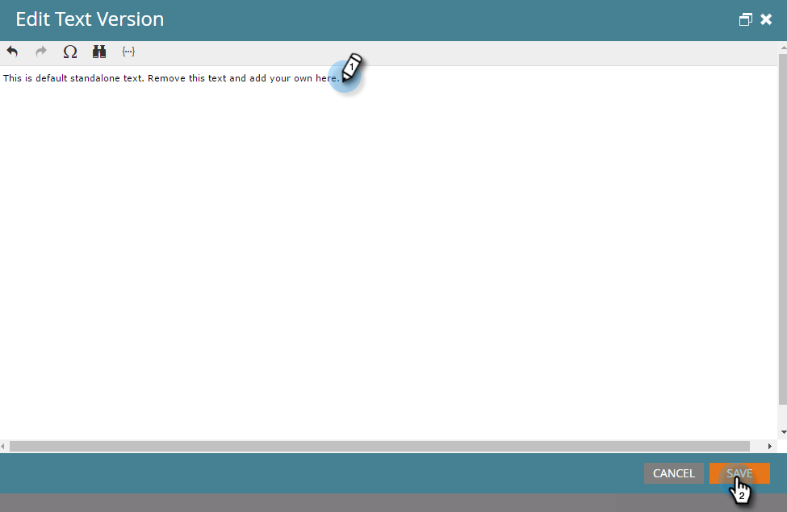

# 텍스트만 이메일 만들기 {#create-a-text-only-email}

텍스트 전용 이메일을 보내려는 경우 HTML 컨텐츠 없이 발송되는 이메일을 만드는 방법을 살펴봅니다.

>[!NOTE]
>
>수신자가 이메일 이미지(보이지 않는 추적 픽셀 포함)를 다운로드하는 동안 열기를 추적하므로 텍스트 전용 이메일에 대해 열 수 **없습니다** .

1. 마케팅 활동 **영역으로** 이동합니다.

   

1. 프로그램을 선택하고 **새로 만들기** 드롭다운을 클릭한 다음 **새 로컬 자산을 선택합니다**.

   

1. 이메일을 **선택합니다**.

   

1. 이름을 **입력하고**&#x200B;템플릿을 선택하고 만들기를 **클릭합니다**.

   

1. 이메일 편집기에서 **이메일 설정을 클릭합니다**.

   

1. 텍스트만 **을** 선택하고 **저장을 클릭합니다**.

   

   >[!CAUTION]
   >
   >링크는 텍스트 전용 이메일에서 자동으로 추적되지 않습니다. 텍스트 이메일에 추적된 링크 [추가 방법을 참조하십시오](../../../../product-docs/email-marketing/general/functions-in-the-editor/add-tracked-links-to-a-text-email.md).

   >[!TIP]
   >
   >기존 이메일을 편집하고 이 설정을 변경할 수도 있습니다. 초안 승인 잊지 마세요.

1. HTML에서 **자동 복사 확인란을** 선택 취소합니다.

   

   >[!NOTE]
   >
   >이메일의 HTML 섹션에 추가된 모든 컨텐츠는 전송 시 무시됩니다.

1. 텍스트 영역을 두 번 클릭합니다.

   

1. 텍스트를 편집하고 저장을 **클릭합니다**.

   

그렇게 간단합니다.
