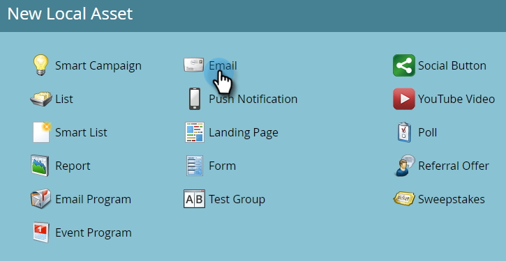

# 이메일 만들기 {#create-an-email}

Marketo에서 이메일을 만드는 방법에는 두 가지가 있습니다. 두 가지 모두를 살펴보겠습니다.

## Design Studio에서 이메일 만들기 {#create-an-email-in-the-design-studio}

1. **[!UICONTROL Design Studio]**(으)로 이동합니다.

   

1. **[!UICONTROL New]** 드롭다운을 클릭하고 **[!UICONTROL New Email]**&#x200B;를 선택합니다.

   

   >[!NOTE]
   >
   >[!UICONTROL Design Studio]에서 전자 메일을 만들면 &quot;[!UICONTROL Emails]&quot; 아래의 트리에서 찾을 수 있습니다.

간단해! 다른 방법은...

## 마케팅 활동에서 이메일 만들기 {#create-an-email-in-marketing-activities}

1. **[!UICONTROL Marketing Activities]**(으)로 이동합니다.

   

1. 전자 메일을 추가할 프로그램을 선택하고 **[!UICONTROL New]** 드롭다운을 클릭한 다음 **[!UICONTROL New Local Asset]**&#x200B;을(를) 선택합니다.

   

1. **[!UICONTROL Email]**&#x200B;를 클릭합니다.

   

   다 됐습니다!

어떤 방법을 선택하든 템플릿 선택기로 이동합니다.

1. 전자 메일 이름을 지정하고 사용할 템플릿을 클릭한 다음 **[!UICONTROL Create]**&#x200B;을(를) 클릭합니다.

   

   >[!NOTE]
   >
   >**[!UICONTROL My Templates]**&#x200B;을(를) 먼저 선택하고 동일한 단계를 수행하여 즉시 사용 가능한 응답형 전자 메일 템플릿 컬렉션 또는 저장한 템플릿 중에서 선택할 수 있습니다.

1. 제목 줄을 입력합니다. 권장되는 문자 길이는 50자로 제한됩니다.

   

   선택한 템플릿에 따라 이메일을 편집할 수 있는 다양한 옵션이 있습니다. 모듈이 있는 전자 메일의 경우 [전자 메일에 모듈 추가](/help/marketo/product-docs/email-marketing/general/email-editor-2/add-modules-to-your-email.md)를 확인하십시오.

이제 이메일이 만들어졌으니 편집해 가세요!

>[!MORELIKETHIS]
>
>[전자 메일 머리글 편집](/help/marketo/product-docs/email-marketing/general/creating-an-email/edit-your-email-header.md)
