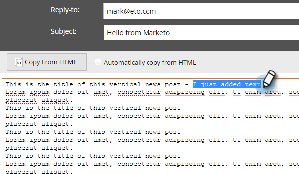

# 이메일 {#edit-the-text-version-of-an-email}의 텍스트 버전 편집

이메일을 만들 때 텍스트 버전이 HTML 버전과 다르게 표현되기를 원할 수 있습니다. 기본적으로 Marketing에서는 이메일에 있는 모든 리치 텍스트 요소의 텍스트 컨텐츠를 텍스트 버전으로 자동 복사합니다. 편집하는 방법

>[!NOTE]
>
>텍스트 전용 이메일 만들기에 대한 집필은 아닙니다. 자세한 내용은 [텍스트 전용 이메일 만들기](create-a-text-only-email.md)를 참조하십시오.

1. 이메일 편집기에서 이메일 아래쪽에 있는 **텍스트** 탭을 클릭합니다.

   

1. 선택을** HTML**에서 자동으로 복사하여 변경합니다.

   

1. 텍스트 영역을 두 번 클릭합니다.

   

1. 편집 완료되면 편집기를 닫거나 HTML 버전으로 돌아갑니다. 변경 사항이 자동으로 저장됩니다.

   \
   정적 컨텐트만 있는 경우 텍스트는 하나의 큰 블록(3단계에서 표시됨)에서 편집할 수 있습니다. 동적 컨텐츠가 있는 경우 텍스트는 다음과 같이 편집 가능한 여러 섹션으로 분할됩니다.

   

이제 너도 알잖아!
