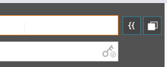
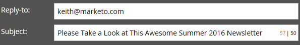

# 이메일 헤더 편집 {#edit-your-email-header}

Marketing To의 이메일 헤더는 사용자 지정이 가능합니다. 4개의 필드로 구성됩니다.

* **보낸 사람**  - 표시할 보낸 사람의 이름입니다.
* **보낸 사람**  주소 - 표시할 보낸 사람의 이메일 주소입니다.
* **회신 주소**  - 다른 사람의 회신을 받을 이메일 주소
* **제목**  - 이메일의 제목 줄

이러한 값을 편집하려면 각 필드를 클릭하고 정보를 입력합니다.

>[!TIP]
>
>기본 보낸 사람 이름 및 전자 메일 보낸 사람을 설정하려면 [전자 메일 및 레이블에서 기본값 변경](/help/marketo/product-docs/administration/email-setup/change-the-default-from-email-and-from-label.md)을 참조하십시오.

토큰을 사용하려면 먼저 원하는 필드 내부를 클릭한 다음 토큰 아이콘을 클릭합니다.

세그먼트를 사용하여 필드를 동적으로 만들 수도 있습니다.

보낸 사람 주소 필드의 맨 오른쪽에 있는 키 아이콘을 사용하여 사용자 지정 DKIM 서명을 사용하고 있는지 알 수 있습니다.

제목 필드의 맨 오른쪽에 있는 카운터를 사용하면 제목 줄을 권장 50자 제한 아래로 유지할 수 있습니다.

50자를 초과하는 경우 카운터가 빨간색으로 바뀌므로 경고가 표시됩니다.

>[!MORELIKETHIS]
>
>[이메일 편집기 v2.0 개요](/help/marketo/product-docs/email-marketing/general/email-editor-2/email-editor-v2-0-overview.md)
