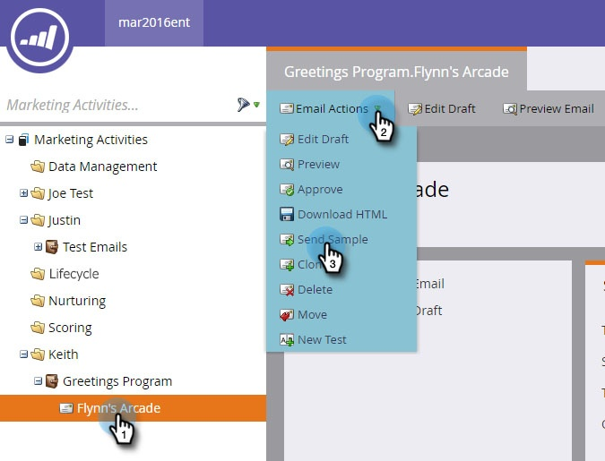

# 샘플 이메일 {#send-a-sample-email} 보내기

이메일 샘플을 빠르고 손쉽게 보낼 수 있습니다. 동적 콘텐츠 이메일을 보내려면 [동적 내용이 포함된 이메일 미리 보기](../../../../product-docs/email-marketing/general/functions-in-the-editor/preview-an-email-with-dynamic-content.md)를 참조하십시오.

>[!NOTE]
>
>샘플 이메일을 보내려면 **Access 데이터베이스 - 단일 흐름 작업 실행** 권한이 있어야 합니다.

## 샘플 이메일 {#send-a-sample-email-1} 보내기

1. 이메일을 찾아 선택합니다. **이메일 작업** 드롭다운을 클릭하고 **샘플 보내기**&#x200B;를 선택합니다.\
   

   >[!NOTE]
   >
   >내 토큰은 이메일 프로그램에 해당하는 값으로 확인됩니다.

1. 배달할 이메일 주소를 입력하고 **보내기**&#x200B;를 클릭합니다.

   

   >[!NOTE]
   >
   >**미리 알림**
   >
   >
   >여러 이메일 주소를 입력하려면 쉼표를 사용하여 구분합니다.

   >[!TIP]
   >
   >토큰을 특정 사람으로 확인하려면 2단계의 **사람 드롭다운**&#x200B;에서 해당 사람을 선택합니다.

## {#send-a-sample-email-while-editing} 편집 중 샘플 이메일 보내기

1. 이메일을 찾아 선택하고 **초안 편집** 탭을 클릭합니다.

   

1. **이메일 작업**&#x200B;을 클릭하고 **샘플 보내기**&#x200B;를 선택합니다.

   

1. 배달할 이메일 주소를 입력하고 **보내기**&#x200B;를 클릭합니다.

   

   >[!NOTE]
   >
   >트리거 필드는 [이메일 스크립팅](http://developers.marketo.com/documentation/velocity-script/)을 사용하는 사람에게만 적용됩니다.

## 세그먼트 {#send-a-sample-email-based-on-a-segment} 기반 샘플 이메일 보내기

>[!PREREQUISITES]
>
>[이메일에 세그멘테이션을 적용합니다](http://docs.marketo.com/display/public/DOCS/Using+Dynamic+Content+in+an+Email).

1. 이메일을 찾아 선택하고 **초안 편집** 탭을 클릭합니다.

   

1. **미리 보기**&#x200B;를 클릭합니다.

   

1. **보기 기준** 드롭다운을 클릭하고 **세그멘테이션**&#x200B;을 선택합니다.

   

1. 사용 가능한 세그먼트가 있는 드롭다운이 나타납니다. 클릭하고 원하는 것을 선택합니다.

   

1. 화살표를 사용하여 옵션을 스크롤합니다(이 경우 제목 줄을 동적으로 변경함).

   

1. **샘플 보내기**&#x200B;를 클릭하여 실제 세그먼트의 테스트 이메일을 받습니다.

   

   >[!TIP]
   >
   >이메일의 편집 모드에서 세그먼트를 기반으로 샘플 이메일을 보낼 수도 있습니다. **이메일 작업** 드롭다운을 클릭하고 **샘플 보내기**&#x200B;를 선택한 다음 세그먼트를 선택합니다.

캠페인을 시작하기 전에 컨텐츠를 샘플링하는 것은 매우 중요합니다. 두 번 측정하고 한 번 잘라라!
