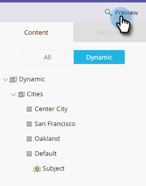

# 샘플 이메일 보내기 {#send-a-sample-email}

이메일 샘플을 빠르고 손쉽게 보낼 수 있습니다. 동적 컨텐츠 이메일을 전송하려면 동적 컨텐츠가 [포함된 이메일 미리 보기를 참조하십시오](../../../../product-docs/email-marketing/general/functions-in-the-editor/preview-an-email-with-dynamic-content.md).

>[!NOTE]
>
>**FYI**
>
>Marketing은 이제 모든 구독 간의 언어를 표준화하므로 구독에 리드/리드 및 docs.markto.com에 있는 사람/사람을 볼 수 있습니다. 이 용어는 같은 것을 의미한다.아티클 지침에는 영향을 주지 않습니다. 다른 변화도 있습니다 [자세한](http://docs.marketo.com/display/DOCS/Updates+to+Marketo+Terminology)내용

>[!NOTE]
>
>샘플 이메일을 전송하려면 **액세스 데이터베이스 - 단일 흐름 작업** 실행 권한이 있어야 합니다.

## 샘플 이메일 보내기 {#send-a-sample-email-1}

1. 이메일을 찾아 선택합니다. 이메일 작업 **드롭다운을** 클릭하고 샘플 **보내기를 선택합니다**.\
   

   >[!NOTE]
   >
   >내 토큰은 이메일 프로그램에 적합한 값으로 확인됩니다.

1. 배달할 이메일 주소를 입력하고 [보내기]를 **클릭합니다**.

   

   >[!NOTE]
   >
   >**미리 알림**
   >
   >
   >여러 이메일 주소를 입력하려면 쉼표를 사용하여 구분합니다.

   >[!TIP]
   >
   >토큰을 특정 사람으로 확인하려면 2단계의 **사람 드롭다운에서** 해당 사람을 선택합니다.

## 편집하는 동안 샘플 이메일 보내기 {#send-a-sample-email-while-editing}

1. 이메일을 찾아 선택한 다음 초안 **편집 탭을** 클릭합니다.

   

1. 이메일 **작업을**&#x200B;클릭하고 샘플 **보내기를 선택합니다**.

   

1. 배달할 이메일 주소를 입력하고 [보내기]를 **클릭합니다**.

   

   >[!NOTE]
   >
   >트리거 필드는 [이메일 스크립팅을 사용하는 사람에게만 적용됩니다](http://developers.marketo.com/documentation/velocity-script/).

## 세그먼트를 기반으로 샘플 이메일 보내기 {#send-a-sample-email-based-on-a-segment}

>[!PREREQUISITES]
>
>[이메일에 세그멘테이션을 적용합니다](http://docs.marketo.com/display/public/DOCS/Using+Dynamic+Content+in+an+Email).

1. 이메일을 찾아 선택한 다음 초안 **편집 탭을** 클릭합니다.

   

1. 미리 **보기를 클릭합니다**.

   

1. 보기 **기준** 드롭다운을 클릭하고 **세그멘테이션을 선택합니다**.

   

1. 사용 가능한 세그먼트가 있는 드롭다운이 나타납니다. 클릭하고 원하는 것을 선택합니다.

   

1. 화살표를 사용하여 옵션을 스크롤합니다(이 경우 제목 줄이 동적으로 변경됨).

   

1. [ **샘플** 보내기]를 클릭하여 현재 사용 중인 세그먼트의 테스트 이메일을 받습니다.

   

   >[!TIP]
   >
   >이메일의 편집 모드에서 세그먼트를 기반으로 샘플 이메일을 보낼 수도 있습니다. 이메일 **작업** 드롭다운 **을 클릭하고 샘플**&#x200B;보내기를 선택한 다음 세그먼트를 선택합니다.

캠페인을 시작하기 전에 컨텐츠를 샘플링하는 것은 매우 중요합니다. 두 번 측정, 한 번 컷!
