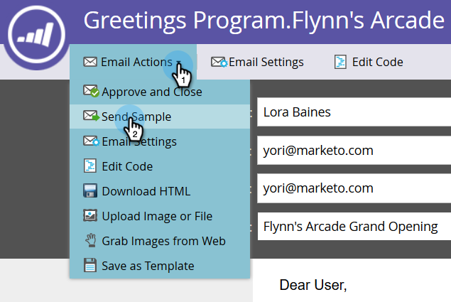

# 샘플 이메일 보내기 {#send-a-sample-email}

이메일 샘플을 빠르고 쉽게 보낼 수 있습니다. 다이내믹 콘텐츠 전자 메일을 보내려면 [다이내믹 콘텐츠로 전자 메일 미리 보기](/help/marketo/product-docs/email-marketing/general/functions-in-the-editor/preview-an-email-with-dynamic-content.md)를 참조하세요.

>[!NOTE]
>
>샘플 전자 메일을 보내려면 **Access 데이터베이스 - 단일 흐름 작업 실행** 권한이 있어야 합니다.

## 샘플 이메일 보내기 {#send-a-sample-email-1}

1. 이메일을 찾아 선택합니다. **[!UICONTROL Email Actions]** 드롭다운을 클릭하고 **[!UICONTROL Send Sample]**&#x200B;을(를) 선택합니다.
   

   >[!NOTE]
   >
   >내 토큰은 이메일 프로그램에 적절한 값으로 확인됩니다.

1. 게재할 이메일 주소를 하나 또는 여러 개 입력합니다. 여러 이메일 주소의 경우 쉼표를 사용하여 구분하십시오. 완료되면 **[!UICONTROL Send]**&#x200B;을(를) 클릭합니다.

   

   >[!IMPORTANT]
   >
   >여러 개의 이메일 주소를 입력하면 모든 수신자에게 표시됩니다. 처음 입력한 이메일은 기본 수신자가 되며 이후 이메일 주소는 CC 수신자가 됩니다.

   >[!TIP]
   >
   >토큰을 특정 사용자로 해결하려면 2단계의 **개인 드롭다운**&#x200B;에서 해당 사용자를 선택하십시오.

## 편집하는 동안 샘플 이메일 보내기 {#send-a-sample-email-while-editing}

1. 전자 메일을 찾아 선택하고 **[!UICONTROL Edit Draft]** 탭을 클릭합니다.

   

1. **[!UICONTROL Email Actions]**&#x200B;을(를) 클릭하고 **[!UICONTROL Send Sample]**&#x200B;을(를) 선택합니다.

   

1. 게재할 전자 메일 주소를 입력하고 **[!UICONTROL Send]**&#x200B;을(를) 클릭합니다.

   

   >[!NOTE]
   >
   >트리거 필드는 [전자 메일 스크립팅](https://experienceleague.adobe.com/en/docs/marketo-developer/marketo/email-scripting)을 사용하는 경우에만 적용할 수 있습니다.

## 세그먼트를 기반으로 샘플 이메일 보내기 {#send-a-sample-email-based-on-a-segment}

>[!PREREQUISITES]
>
>[전자 메일에 세그먼테이션 적용](/help/marketo/product-docs/email-marketing/general/functions-in-the-editor/using-dynamic-content-in-an-email.md).

1. 전자 메일을 찾아 선택하고 **[!UICONTROL Edit Draft]** 탭을 클릭합니다.

   

1. **[!UICONTROL Preview]**&#x200B;을(를) 클릭합니다.

   

1. **[!UICONTROL View By]** 드롭다운을 클릭하고 **[!UICONTROL Segmentation]**&#x200B;을(를) 선택합니다.

   

1. 사용 가능한 세그먼테이션과 함께 드롭다운이 표시됩니다. 클릭하여 원하는 항목을 선택합니다.

   

1. 화살표를 사용하여 옵션을 스크롤합니다(이 경우 제목 줄을 동적으로 변경함).

   

1. 작동 중인 세그먼트의 테스트 전자 메일을 받으려면 **[!UICONTROL Send Sample]**&#x200B;을(를) 클릭하십시오.

   

   >[!TIP]
   >
   >이메일의 편집 모드에서 세그먼트를 기반으로 샘플 이메일을 보낼 수도 있습니다. **[!UICONTROL Email Actions]** 드롭다운을 클릭하고 **[!UICONTROL Send Sample]**&#x200B;을(를) 선택한 다음 세그먼트를 선택합니다.

캠페인을 시작하기 전에 콘텐츠를 샘플링하는 것은 매우 중요합니다. 두 번 재서, 한 번 잘라라!
