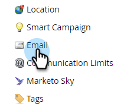
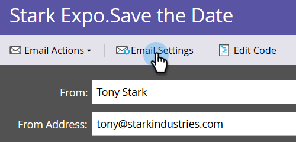

# 이메일 CC {#email-cc}

이메일 CC를 사용하면 Marketing을 통해 지정된 이메일을 전송하여 CC 수신자를 포함할 수 있습니다.

이 기능은 이메일 전송 방법(일괄 처리 또는 트리거 캠페인)에 상관없이 모든 Marketing to 이메일 자산에서 사용할 수 있습니다. CC 수신자는 선택한 마케팅 담당자에게 보내진 이메일의 정확한 사본을 수신하게 됩니다. 따라서 모든 참여 활동(열기, 클릭 등) 이 이메일의 &quot;받는 사람&quot; 행에 있는 마케팅 담당자의 활동 로그에 기록됩니다. 하지만 배달 활동(전송, 배달, 하드 바운스 등) _Marketing To Person에 대한 배달 이벤트를 CC 받는 사람과 구별할 수 없기 때문에 &quot;소프트 바운스&quot;_ 가  **** 아닌 다른 경우에는 등록되지 않습니다. Marketing Cloud는 한 번에 최대 10만 명의 CC를 사용할 수 있습니다. 스마트 목록이 100k를 초과하고 모든 사용자가 CC를 받아야 한다면 목록을 깨는 것이 좋습니다.

>[!NOTE]
>
>이메일 CC는 A/B 테스트에 사용되지 않도록 설계되었습니다. 필요하면 사용할 수 있지만 기술적으로 지원되지 않으므로 Marketing To Support에서 문제를 해결할 수 없습니다.

## 이메일 CC {#set-up-email-cc} 설정

1. 내 마켓플레이스에서 **관리**&#x200B;를 클릭합니다.

   

1. 트리에서 **이메일**&#x200B;을 선택합니다.

   

1. **이메일 CC 설정 편집**&#x200B;을 클릭합니다.

   

1. 이메일 내에서 CC 주소로 사용할 수 있도록 하려면 최대 25개의 마케팅 담당자 리드 또는 회사 필드(예: &quot;이메일&quot; 유형)를 선택합니다. 완료되면 **저장**&#x200B;을 클릭합니다.

   

## 이메일 CC 사용 {#using-email-cc}

1. 전자 메일을 선택하고 **초안 편집**&#x200B;을 클릭합니다.

   

1. **이메일 설정**&#x200B;을 클릭합니다.

   

1. CC 사람들에게 사용할 필드를 최대 5개까지 선택할 수 있습니다. 이 예에서는 리드 소유자 CC만 사용합니다.완료되면 **저장**&#x200B;을 클릭합니다.

   

   간단합니다! 위의 예에서 이메일을 보내면 선택한 수신자의 리드 소유자가 CC가 됩니다.

   >[!NOTE]
   >
   >잘못된 이메일 주소가 CC 필드에 있으면 해당 주소를 건너뜁니다.

   빠른 식별을 위해 이메일 요약 보기에는 이메일 CC 필드를 선택했는지 여부를 표시합니다.

   

   이메일이 승인되었지만 Marketing To 관리자가 전자 메일이 전송되기 전에 CC 필드 중 하나 이상을 비활성화하면 해당 사용자는 전자 메일&#x200B;**을(를) 받지 못합니다.** 이 시나리오에서는 이메일 요약 보기가 게시물 승인을 비활성화했지만 미리 전송한 모든 필드를 회색으로 표시합니다.

   

   >[!NOTE]
   >
   >이메일 초안의 이메일 설정 섹션에 위의 오류가 표시됩니다.

## {#after-the-send} 전송 후

* CC 수신자가 이메일에서 추적된 링크를 클릭하면 다른 모든 참여 활동과 마찬가지로 클릭 활동이 이메일의 기본 수신자와 연결됩니다. 또한 Marketing의 웹 추적 코드(munchkin.js)가 있는 페이지를 클릭스루하여 기본 수신자로 쿠키를 요청할 수 있습니다.

>[!TIP]
>
>이메일에서 일부 또는 모든 추적 링크](/help/marketo/product-docs/email-marketing/general/functions-in-the-editor/disable-tracking-for-an-email-link.md)를 비활성화하는 옵션이 있습니다.[

* 이메일 캠페인을 실행한 후 이메일 보내기 활동에는 각 수신자에 대해 포함된 모든 CC 주소 목록이 포함됩니다. 구독 취소로 인해 CC 주소를 건너뛰었을 경우 활동에도 표시됩니다.
* CC의 이메일에서 링크 및 페이지의 구독을 취소할 수 있습니다. 이를 통해 CC 수신자가 원하는 경우(스팸 방지 규정 준수) 구독을 성공적으로 해지할 수 있으며 이 작업의 레코드는 Marketing To 데이터베이스에 저장됩니다.
* Marketing To 데이터베이스에서 구독이 해제된 것으로 나열된 사람은 **not** CC를 통해 이메일을 수신합니다.
