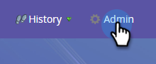

# 이메일 CC {#email-cc}

이메일 CC를 사용하면 지정된 이메일을 Marketo을 통해 전송하여 CC 수신자를 포함할 수 있습니다.

이 기능은 이메일 전송(배치 또는 트리거 캠페인)에 관계없이 모든 Marketo 이메일 에셋에서 사용할 수 있습니다. CC 수신자는 선택한 Marketo 개인에게 전송된 이메일의 정확한 사본을 받게 됩니다. 이에 따라 모든 참여 활동(열기, 클릭 등)은 이메일의 &quot;받는 사람&quot; 줄에 있는 Marketo 사용자의 활동 로그에 기록됩니다. 그러나 Marketo에서 Marketo 사용자에 대한 배달 이벤트를 CC 받는 사람 &#39;과 구분할 수 없으므로 게재 활동(전송, 배달, 하드 바운스 등) _&quot;소프트 바운스&quot;를 제외한_&#x200B;은(는) **등록되지 않습니다**. Marketo은 한 번에 최대 10만 명의 People을 CC로 처리합니다. 스마트 목록이 100k를 초과하고 모든 사람이 CC를 받아야 한다면 목록을 정리하는 것이 좋습니다.

>[!NOTE]
>
>이메일 CC는 A/B 테스트와 함께 사용하도록 디자인되지 않았습니다. 원하는 경우 사용할 수 있지만 기술적으로 지원되지 않으므로 Marketo 지원에서 문제 해결을 지원할 수 없습니다.

## 이메일 CC 설정 {#set-up-email-cc}

1. 내 Marketo에서 **[!UICONTROL Admin]**&#x200B;을(를) 클릭합니다.

   

1. 트리에서 **[!UICONTROL Email]**&#x200B;을(를) 선택합니다.

   

1. **[!UICONTROL Edit Email CC Settings]**&#x200B;를 클릭합니다.

   

1. 최대 25개의 Marketo 리드 또는 회사 필드(&quot;이메일&quot; 유형의)를 선택하여 이메일 내에서 CC 주소로 사용할 수 있도록 합니다. 완료되면 **저장**&#x200B;을 클릭합니다.

   

## 이메일 CC 사용 {#using-email-cc}

1. 전자 메일을 선택하고 **[!UICONTROL Edit Draft]**&#x200B;을(를) 클릭합니다.

   

1. **[!UICONTROL Email Settings]**&#x200B;를 클릭합니다.

   

1. 참조에 사용할 필드를 선택합니다. _이메일당 5개로 제한됩니다_. 이 예제에서는 Lead Owner CC 만 필요합니다. 완료되면 **저장**&#x200B;을 클릭합니다.

   

   그것은 그만큼 간단합니다! 위의 예에서 이메일을 보낼 때 선택한 수신자의 리드 소유자는 참조됩니다.

   >[!NOTE]
   >
   >잘못된 이메일 주소가 CC 필드에 있는 경우 건너뜁니다.

   빠른 식별을 위해 이메일 요약 보기에는 선택된 이메일 CC 필드가 표시됩니다.

   

   전자 메일이 승인되었지만 Marketo 관리자가 전자 메일을 보내기 전에 하나 이상의 참조 필드를 사용하지 않도록 설정한 경우 **해당 사용자가 전자 메일을 받지 못합니다**. 이 시나리오에서 이메일 요약 보기는 사후 승인이 비활성화되었지만 사전 전송된 모든 필드를 회색으로 표시합니다.

   

   >[!NOTE]
   >
   >전자 메일 초안의 전자 메일 설정 섹션에도 위의 오류가 표시됩니다.

## 전송 후 {#after-the-send}

* CC 수신자가 이메일에서 추적된 링크를 클릭하는 경우 클릭 활동(예: 다른 모든 참여 활동)이 이메일의 주요 수신자와 연결됩니다. 또한 Marketo의 웹 추적 코드(munchkin.js)가 있는 페이지를 클릭하여 주요 수신자로 요리될 수 있습니다.

>[!TIP]
>
>전자 메일에서 [일부 또는 모든 추적 링크를 비활성화하는](/help/marketo/product-docs/email-marketing/general/functions-in-the-editor/disable-tracking-for-an-email-link.md) 옵션이 있습니다.

* 이메일 캠페인이 실행되면 이메일 보내기 활동에는 메일링의 각 수신자에 대해 포함된 모든 CC 주소 목록이 포함됩니다. 구독 취소로 인해 건너뛰었던 CC 주소가 있으면 활동에도 표시됩니다.
* 구독 취소 링크 및 페이지는 일반적으로 CC 이메일에서 작동합니다. 이렇게 하면 CC 수신자가 원할 경우(스팸 방지 규정 준수) 성공적으로 구독을 취소할 수 있으며, 이 작업의 레코드가 Marketo 데이터베이스에 저장됩니다.
* Marketo 데이터베이스에 구독 취소로 나열된 사용자는 CC를 통해 이메일을 **받지**&#x200B;합니다.
