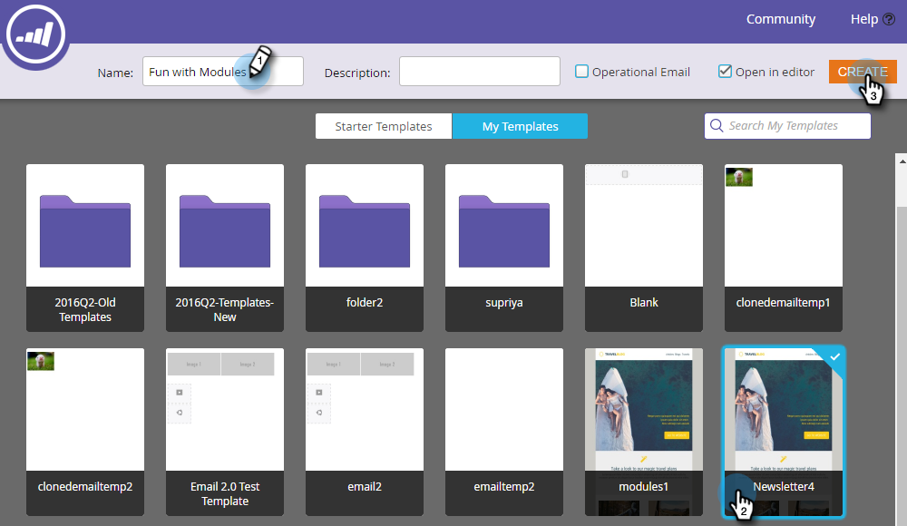

# {#add-modules-to-your-email} 전자 메일에 모듈 추가

이메일 편집기 2.0에서 모듈은 템플릿에 정의된 이메일 섹션입니다. 모듈은 요소, 변수 및 기타 HTML 컨텐츠의 조합을 포함할 수 있습니다. 이메일에 손쉽게 추가할 수 있습니다.

1. 이메일을 만듭니다. 모듈이 포함된 템플릿을 선택하거나 만들어야 합니다.

   

   >[!NOTE]
   >
   >대부분의 Marketing To 시작 템플릿에는 모듈이 포함되어 있습니다. [직접 ](http://docs.marketo.com/display/DOCS/Email+Template+Syntax#EmailTemplateSyntax-Modules)를 만들 수도 있습니다.

1. 이메일의 맨 오른쪽에서 **모듈**&#x200B;을 클릭합니다.

   

1. 추가할 모듈을 선택하고 이메일로 드래그합니다.

   

1. 모듈을 위로 드래그하면 다른 모듈 사이에 &quot;여기에 놓기&quot;가 표시됩니다. 원하는 위치에 새 모듈을 놓으십시오.

   

1. 잠시 기다리면 이메일이 자동으로 새로 고침되어 추가한 모듈이 표시됩니다.

   

## 이메일 {#moving-a-module-within-an-email} 내 모듈 이동

모듈을 이동하는 방법에는 두 가지가 있습니다.

1. 이동할 모듈을 식별합니다. 이것이 무엇인지 잘 모르는 경우 마우스를 올려 놓으면 오른쪽에 강조 표시됩니다.

   

1. 오른쪽에 있는 모듈 위로 마우스를 가져가 핸들을 표시합니다. 잡아...

   

1. ...모듈을 원하는 위치로 드래그합니다.

   

1. 다른 방법은 톱니바퀴 아이콘을 드러내며 이메일의 모듈을 클릭하여 선택하는 것입니다.

   

1. 기어 아이콘을 클릭하고 모듈을 이동할 위치에 따라 **위로 이동** 또는 **아래로 이동**&#x200B;을 선택합니다.

   

그게 전부야

>[!MORELIKETHIS]
>
>[이메일 템플릿 구문](email-template-syntax.md)

