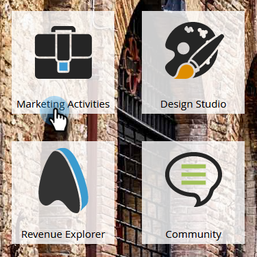

# 이메일 템플릿 만들기 {#create-an-email-template}

새 이메일 템플릿을 만들려면 다음 단계를 따르십시오.

>[!NOTE]
>
>Marketo 지원 은 사용자 지정 HTML 문제 해결을 지원하기 위해 설정되어 있지 않습니다. HTML 지원이 필요한 경우 웹 개발자에게 문의하십시오.

>[!CAUTION]
>
>사용하는 편집기는 색상 및 배경색 CSS 속성 값을 소문자로 변환하므로 카멜 대/소문자를 사용하지 말고 대신 소문자 이름이나 하이픈을 사용하십시오.

## 새 이메일 템플릿 만들기 {#create-a-new-email-template}

1. **[!UICONTROL Design Studio]**&#x200B;을(를) 클릭합니다.

   

1. **[!UICONTROL New]**&#x200B;을(를) 클릭한 다음 **[!UICONTROL New Email Template]**&#x200B;을(를) 선택합니다.

   

1. 새 템플릿에 이름을 지정하고 **[!UICONTROL Create]**&#x200B;을(를) 클릭합니다.

   

1. 새 템플릿 편집을 시작하려면 **[!UICONTROL Edit Draft]**&#x200B;을(를) 클릭합니다.

   

   >[!CAUTION]
   >
   >엄격한 제한은 없지만 이메일 템플릿을 500개 이상의 이메일에 사용하면 업데이트 후 해당 템플릿을 다시 승인하면 성능 문제가 발생할 수 있습니다. 이메일 템플릿에 500개의 이메일이 연결된 후 새 템플릿을 만드는 것이 좋습니다.

## 이메일을 템플릿으로 저장 {#save-an-email-as-a-template}

나중에 사용하기 위해 템플릿으로 저장할 이메일을 만든 경우 다음 간단한 단계를 따르십시오.

1. **[!UICONTROL Marketing Activities]**&#x200B;을(를) 클릭합니다.

   

1. 전자 메일을 찾아 선택한 다음 **[!UICONTROL Edit Draft]**&#x200B;을(를) 클릭합니다.

   

1. **[!UICONTROL Email Actions]** 드롭다운을 클릭하고 **[!UICONTROL Save as Template]**&#x200B;을(를) 선택합니다.

   

1. **[!UICONTROL Folder]** 드롭다운을 클릭하고 서식 파일을 저장할 위치를 선택한 다음 **[!UICONTROL Save]**&#x200B;을(를) 클릭합니다.

   

   다 됐습니다!

   >[!CAUTION]
   >
   >이메일을 템플릿으로 저장할 때 변수 값은 이월되지 않습니다. 변수는 기본 템플릿에 지정된 기본값을 계속 사용합니다. 이메일에 사용 가능한 모듈도 이메일 본문에 삽입되지 않은 경우 이전되지 않습니다.

이메일 템플릿을 사용자 지정하려면 아래 문서를 확인하십시오.

>[!MORELIKETHIS]
>
>[전자 메일 템플릿 구문](/help/marketo/product-docs/email-marketing/general/email-editor-2/email-template-syntax.md)
