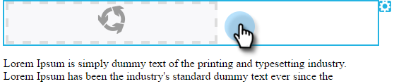

# 이메일에서 요소 편집 {#edit-elements-in-an-email}

이메일에는 네 가지 다른 요소가 포함될 수 있습니다. 리치 텍스트, 이미지, 코드 조각 및 비디오 각 항목을 편집하는 방법은 다음과 같습니다.

## 리치 텍스트 요소를 편집하는 방법 {#how-to-edit-the-rich-text-element}

1. 이메일을 찾아 선택하고 을(를) 클릭합니다 **초안 편집**.

   

1. 이메일 편집기가 열립니다. 리치 텍스트 를 선택하고 톱니바퀴 아이콘을 클릭하고 을 선택합니다 **편집**.

   

   오른쪽 창의 요소 위로 마우스를 가져가면 톱니바퀴 아이콘이 표시됩니다.

   

1. 텍스트를 추가/편집하고 키를 누릅니다 **저장**.

   

   >[!NOTE]
   >
   >이미지, 토큰, 표 및 기타 요소를 추가할 수도 있습니다. 자세한 내용은 [리치 텍스트 편집기 사용](/help/marketo/product-docs/email-marketing/general/understanding-the-email-editor/using-the-rich-text-editor.md).

   >[!CAUTION]
   >
   >웹 사이트나 Word 문서와 같은 서식 있는 텍스트 소스에서 텍스트를 복사하고 붙여넣는 것을 방지할 수 있습니다. 대신 메모장(Windows) 또는 TextEdit(Mac)과 같은 일반 텍스트 편집기에 리치 텍스트를 먼저 붙여넣습니다. &quot;청소&quot;되면 일반 텍스트 편집기에서 복사하여 이메일에 붙여넣을 수 있습니다.

## 이미지 요소를 편집하는 방법 {#how-to-edit-the-image-element}

1. 이미지 요소가 있는 모듈 내부를 클릭하여 선택합니다.

   

1. 편집할 이미지 요소를 클릭한 다음 톱니바퀴 아이콘을 클릭하고 을 선택합니다 **편집**.

   

   >[!NOTE]
   >
   >요소를 두 번 클릭하여 편집을 시작할 수도 있습니다.

1. 이미지 편집기가 표시됩니다.

   

   이미지를 삽입할 수 있는 세 가지 옵션이 있습니다. 각각 살펴봅시다.

   **외부 URL**

   >[!NOTE]
   >
   >Marketo 토큰을 사용하려면 이 옵션을 사용합니다. 토큰을 사용하면 이미지가 편집기에서 끊어진 것으로 표시되지만, 미리 보기 모드 및 샘플 보내기 이메일에서 렌더링됩니다.

   외부 URL을 사용하려면 먼저 이미지의 URL에 붙여넣습니다. 필요에 맞게 차원을 변경하고 일부 대체 텍스트 를 추가합니다(선택 사항). 그런 다음 키를 누릅니다 **교체**.

   

   **내 컴퓨터**

   컴퓨터에서 이미지를 업로드하려면 **찾아보기**.

   

   컴퓨터에서 이미지가 있는 위치로 이동하여 삽입합니다.

   

   필요에 맞게 차원을 변경하고 대체 텍스트(선택 사항)를 변경한 다음 키를 누릅니다 **교체**.

   

   >[!NOTE]
   >
   >이미지를 교체하는 경우 **기존 이미지 덮어쓰기** 이미지 URL/이름 아래에 표시되는 상자.

   **Design Studio**

   Design Studio에서 이미지를 삽입하려면 이미지를 찾습니다.

   

   ...삽입해 필요에 맞게 차원을 변경하고 대체 텍스트(선택 사항)를 변경한 다음 키를 누릅니다 **교체**.

   

## 코드 조각 요소를 편집하는 방법 {#how-to-edit-the-snippet-element}

1. 코드 조각 요소를 사용하여 모듈 내부를 클릭합니다.

   

1. 코드 조각 요소를 클릭한 다음 톱니바퀴 아이콘을 클릭하고 를 선택합니다 **편집**.

   

1. 코드 조각을 찾아서 선택한 다음 **저장**.

   

1. 그런 다음 코드 조각을 채웁니다.

   

## 비디오 요소를 편집하는 방법 {#how-to-edit-the-video-element}

1. 비디오 요소가 있는 모듈 내부를 클릭합니다.

   

1. 비디오 요소를 클릭한 다음 톱니바퀴 아이콘을 클릭하고 를 선택합니다 **편집**.

   

1. Vimeo 또는 YouTube의 비디오 URL에 붙여넣습니다. 그런 다음 미리 보기를 로드할 URL 상자 바깥쪽을 클릭합니다. 필요에 맞게 차원을 변경하고 대체 텍스트(선택 사항)를 추가한 다음 키를 누릅니다 **삽입**.

   

   >[!NOTE]
   >
   >YouTube 비디오의 경우 공유 옵션에 있는 바로 가기 URL이 아니라 주소 표시줄의 전체 URL을 사용합니다.

완벽한 이메일을 디자인하는 것을 재미있게 보세요!
