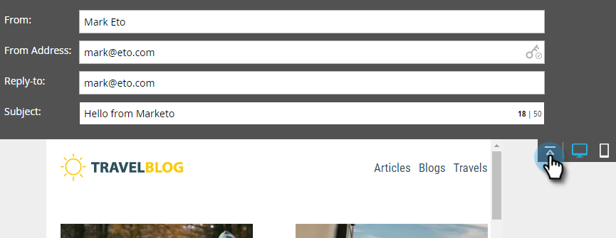

# 이메일 편집기 v2.0 개요 {#email-editor-v2-overview}

이메일 편집기 v2.0을 활성화하기로 하면 몇 가지 새로운 기능이 표시됩니다.

**이메일 템플릿 선택기**

새 이메일을 만들면 [이메일 템플릿 선택기](/help/marketo/product-docs/email-marketing/general/email-editor-2/email-template-picker-overview.md).

**이메일 편집기**

이메일 편집을 시작하면 편집기가 완전히 새로운 모양으로 되어 있음을 알 수 있습니다.

**모듈**

편집기의 오른쪽에 있는 이러한 항목을 모듈이라고 합니다. 방법 알아보기 [이메일에 모듈 추가](/help/marketo/product-docs/email-marketing/general/email-editor-2/add-modules-to-your-email.md).

**텍스트 버전**

이제 이메일의 HTML 버전과 텍스트 버전 간을 전환하면 맨 아래에 있는 편리한 탭에 있습니다. 방법 알아보기 [이메일의 텍스트 버전 편집](/help/marketo/product-docs/email-marketing/general/creating-an-email/edit-the-text-version-of-an-email.md).

**이메일 헤더**

디자인 공간이 더 필요하십니까? 완료 후 이메일 헤더를 숨길 수 있습니다. [편집 중](/help/marketo/product-docs/email-marketing/general/creating-an-email/edit-your-email-header.md). 이 아이콘을 클릭하기만 하면 됩니다.

...이고 헤더가 축소됩니다.

**이메일 미리 보기**

기본적으로 이메일은 강조 표시된 파란색 아이콘으로 표시된 대로 데스크탑에서 어떻게 보이는지 표시합니다. 오른쪽에 있는 아이콘을 클릭하면...

...모바일 디바이스에서 이메일이 렌더링되는 방식을 확인할 수 있습니다.

더 큰 미리 보기를 보려면 **미리 보기** 이메일 오른쪽 상단에서

기본 보기는 데스크톱입니다.

...하지만 모바일 디바이스에서 표시되는 모습도 확인할 수 있습니다. 텍스트 버전도 미리 볼 수 있습니다! 간단히 클릭 **초안 편집** 오른쪽 상단에서 편집을 다시 시작합니다.

**이메일 작업**

아래 **이메일 작업**&#x200B;그러면 몇 가지 새로운 기능이 표시됩니다. **이미지 또는 파일 업로드**, 및 **웹에서 이미지 가져오기**. 이메일 자체를 새 이메일 템플릿으로 저장할 수도 있습니다. 이름과 목적지를 지정하면 됩니다.

>[!CAUTION]
>
>이메일을 템플릿으로 저장할 때 변수 값은 이월되지 않습니다. 변수는 기본 템플릿에 지정된 기본값을 계속 사용합니다. 이메일에 있는 사용 가능한 모듈도 이메일 본문에 삽입하지 않으면 이전되지 않습니다.

>[!NOTE]
>
>**[웹에서 이미지 가져오기](/help/marketo/product-docs/demand-generation/images-and-files/grab-the-images-from-a-web-page.md)** Design Studio에서와 마찬가지로 작동합니다.

**열린 추적 비활성화** 아래 **이메일 설정**, 필요한 경우 열기 추적을 비활성화할 수 있습니다.

**이메일 설정**

프리 헤더를 추가할 수 있습니다. 프리헤더는 받은 편지함에서 전자 메일을 볼 때 제목 줄 다음의 짧은 요약 텍스트입니다.

>[!CAUTION]
>
>이메일 편집기를 사용할 때 토큰이 사전 헤더에서 작동하지 않습니다. 프리 헤더에서 토큰을 사용하려면 이메일 템플릿에서 자체 HTML을 통해 사용해야 합니다.

멋진 새로운 기능이 많이 있습니다! 재밌게 놀아!

>[!NOTE]
>
>더 깊이 알아보고 싶다면 다음을 확인하십시오. [비디오](https://nation.marketo.com/videos/1463).

>[!MORELIKETHIS]
>
>[이메일 템플릿 구문](/help/marketo/product-docs/email-marketing/general/email-editor-2/email-template-syntax.md)
